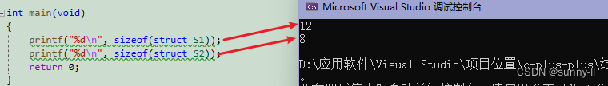

默认继承权限不同：class默认继承的是private继承，struct默认是public继承。<br>

Class还可用于定义模板参数，但是关键字struct不能同于定义模板参数，C++保留struct关键字，原因是保证与C语言的向下兼容性，为了保证百分百的与C语言中的struct向下兼容，，C++把最基本的对象单元规定为class而不是struct，就是为了避免各种兼容性的限制。

C++ 中的 struct 和 class 基本是通用的，唯有几个细节不同：
- class 中类中的成员默认都是 private 属性的。
- 而在 struct 中结构体中的成员默认都是 public 属性的。
- class 继承默认是 private 继承，而 struct 继承默认是 public 继承。
- class 可以用于定义模板参数，struct 不能用于定义模板参数。

# 联合体（Union） 和 结构体（Struct）
### 核心区别对比表

|   特性   | 结构体 (Struct)                                 | 联合体 (Union)                                   |
| :------: | ----------------------------------------------- | ------------------------------------------------ |
| 内存布局 | 所有成员占用独立的内存空间                      | 所有成员共享同一块内存空间                       |
| 内存大小 | >= 所有成员大小之和（可能有内存对齐带来的填充） | = 最大成员的大小（同样考虑内存对齐）             |
| 成员访问 | 所有成员可以同时被访问和修改                    | 所有成员不能同时有效，修改一个成员会覆盖其他成员 |
|   用途   | 将逻辑上相关但类型不同的数据组合在一起          | 在同一内存位置存储不同类型的数据，               |

## 内存布局（最根本的区别）
```c++
// 结构体
struct MyStruct {
    int id;       // 4字节
    char name[20]; // 20字节
    float score;   // 4字节
}; // 总大小很可能为 28 字节 (4+20+4，考虑对齐)

// 联合体
union MyUnion {
    int int_val;   // 4字节
    char str[20];  // 20字节
    float float_val; // 4字节
}; // 总大小为 20 字节 (取最大成员 char str[20] 的大小)
```
内存示意图：
```plaintext
结构体 MyStruct (约28字节)
+----+----------------------+----+
| id |        name          |score|
+----+----------------------+----+

联合体 MyUnion (20字节)
+----------------------+
|     共享内存区域       | <-- int_val, str[], float_val 都从这里开始
+----------------------+
```
- 你为 `MyStruct` 变量分配内存时，系统会分配足够放下所有三个成员的空间。

- 你为 `MyUnion` 变量分配内存时，系统只会分配一块足够放下最大成员（str[20]）的空间。所有成员都从这块内存的起始地址开始。

## 成员访问
```c++
union MyUnion u;

u.int_val = 0x12345678; // 向共享内存写入一个整数
printf("Integer: %x\n", u.int_val); // 输出: 12345678

u.float_val = 3.14;     // **覆盖**刚才的整数，写入一个浮点数
printf("Float: %f\n", u.float_val); // 输出: 3.140000
printf("Integer now: %x\n", u.int_val); // **输出是未定义的！** 你得到的是浮点数 3.14 的二进制解释，不是一个有效的整数。
```
**关键**：在联合体中，你最后一次写入的成员是唯一有效的成员。读取未最后写入的成员会导致未定义行为（垃圾值）。

而在结构体中，每个成员都是独立的：
```c++
struct MyStruct s;
s.id = 10;
s.score = 95.5;
// 修改 score 完全不会影响 id 和 name 的值
```

## 典型应用场景
### 结构体的应用场景（无处不在）
结构体用于将不同类型的数据打包成一个新的复合数据类型。

- 表示一个概念实体：如 Student, Employee, Point。

- 函数参数和返回值：将多个相关参数打包成一个结构体，方便传递。

- 数据结构：链表节点、树节点等。

- 与硬件或协议交互：定义与数据包格式、文件头等严格匹配的内存布局。

### 联合体的应用场景（节省内存、类型双关）
联合体通常用于一些特定的、需要节省内存或灵活解释数据的场景。

#### 1.节省内存（最主要用途）
当你有多个数据成员，但**同一时间只会使用其中一个时**，使用联合体可以极大节省内存。这在嵌入式开发中非常常见。
```c++
// 表示一个配置数据，它可以是整数、浮点数或字符串，但一次只使用一种
union ConfigValue {
    int int_value;
    float float_value;
    char string_value[20];
};

struct Setting {
    char name[50];
    enum ValueType type; // 用一个枚举来标记当前联合体中存储的是哪种类型
    union ConfigValue value; // 实际的值
};
```

#### 2.类型双关（Type Punning）
将同一段内存解释为不同的数据类型。常用于低级编程、协议解析、数据转换。
```c++
union Converter {
    uint32_t integer;
    uint8_t bytes[4];
    float float_num;
};

union Converter c;
c.integer = 0x12345678;
printf("Byte 0: %02x\n", c.bytes[0]); // 在小端机器上输出: 78
printf("Byte 1: %02x\n", c.bytes[1]); // 56
// 这允许我们轻松地访问一个整数的各个字节

c.float_num = 3.14;
printf("IEEE754 representation: %08x\n", c.integer);
// 这允许我们查看浮点数的底层二进制表示
```

#### 3.实现变体类型（Variant）
类似于上面的 ConfigValue 例子，是实现动态类型语言中“变量可以存储任何类型”的基础。


## 结构体内存对齐
```c++
struct S1 {
	char c1;
	int i;
	char c2;
};
 
struct S2 {
	char c1;
	char c2;
	int i;
};
 
int main(void)
{
	printf("%d\n", sizeof(struct S1));
	printf("%d\n", sizeof(struct S2));
	return 0;
}
运行本项目
```
通过运行可以发现两者是不一样的，这是为什么呢？如果你没有结构体内存对齐的相关知识，那相信你一定会这么去计算


### 结构体偏移量计算：offsetof

它的第一个参数是结构体类型，第二个参数是结构体成员
```c++
printf("%d\n", offsetof(struct S1, c1));
printf("%d\n", offsetof(struct S1, i));
printf("%d\n", offsetof(struct S1, c2));
```
最后，计算出来的结果分别是【0】【4】【8】，
可以看出，因为总的结构体大小为12B，可是在放完这3个成员后中间空出了三个位置，并且对于最后在c放完之后还没有到达12B，所以还得再浪费3个空间的废位置


### 规则介绍（重点！！）
- 第一个成员在与结构体变量偏移量为0的地址处
- 其他成员变量要对齐到某个数字（对齐数）的**整数倍的地址处**
对齐数 = 编译器默认的一个对齐数 与 该成员大小的较小值。
【VS中默认的值为8、Linux环境默认不设对齐数（对齐数是结构体成员自身的大小）】
- 结构体总大小为<b>最大对齐数（每个成员变量都有一个对齐数）的整数倍</b>
- 如果嵌套了结构体的情况，嵌套的结构体对齐到自己的**最大对齐数的整数倍处**，结构体的整体大小就是所有最大对齐数（含嵌套结构体的对齐数）的整数倍

### 结构体的大小该如何计算

- 假设我这里创建一个结构体变量叫做ss，它的起始地址就从0开始，所以根据第一条规则，第一个成员变量在与结构体变量偏移量为0的地址处，而且它的类型还是char，所以只占1个内存单元


- 接下去看第二个成员变量 i，其为整型所以在内存中就需要存储4个字节的大小，此时便要拿其和VS下默认对齐数8去进行比较，取较小的值4

- 算出来【4】之后便要对齐到4整数倍的地址处，那就是4这块空间，往下一直占用4个字节，这就是成员变量i在这个结构体中的内存占用分布

- 那既然这个 i是从4的位置开始放的，中间空出来的位置就不会再放置其他成员变量了，那么这个3个空间也就浪费了

- 接下去放置第三个成员变量c2，char类型的变量为1个字节，和8比较取小就是1，那就要将其放到1整数倍的地址处，那其实任何空间都是可以的，直接放到这个【8】的位置就行

- 那截止目前为止这个结构体中的所有成员变量都放置完了，此时去计算一个所占的内存空间就可以发现只有9个字节。但是在一开始我们计算的这个结构体的大小为12个字节，可是现在还差3个字节，所以最后就要去进行一个填充。但是，为什么呢？

- 这就要用到第三条规则了：**结构体总大小为最大对齐数的整数倍**
- 那在这么计算下来之后，就可以知道结构体中的最大对齐数为4，那么【9】、【10】、【11】都不是它的整数倍，只有【12】是它的整数倍的地址处（注意这里是地址处！），因此我们需要填充3个字节，此时从0 ~ 11就有12个字节了，便为4的整数倍 👉这就是【12】如何被计算出来的全过程