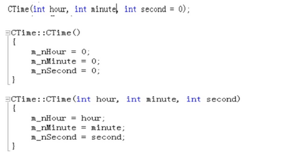

## 类的构造函数
1.构造函数是一种特殊的成员函数，不需要用户来调用，定义对象时被自动执行。

2.构造函数名字与类名相同，无返回类型。

3.可以由用户自己定义实现，根据需要设计对数据成员进行初始化，依旧可以设置函数的默认参数。

4.如果我们没有定义构造函数，系统会为我们自动定义一个无参的默认构造函数的，它不对成员属性做任何操作，如果我们自己定义了构造函数，系统就不会为我们创建默认构造函数了。

### 构造函数的重载
　　在一个类中可以有多个构造函数，它们构成了函数的重载。
　　下面两个构造函数构成了重载，我们可以在声明对象的时候传入不同的参数调用不同的构造函数。此时可以依旧像上一个章节那样对象不传入任何参数，也不需要再对它们一一初始化，这一切都有构造函数做了。对象在创建的时候会根据传入参数的类型来调用不同的构造函数，这和普通函数的调用是一致的。

## 类的析构函数
　　它的作用与构造函数相反，一般是执行对象的清理工作，<strong style="color:red">当对象的生命周期结束的时候，会自动的调用。</strong>

析构函数的作用并不是删除对象，在对象撤销它所占用的内存之前，做一些清理的工作。清理之后，这部分内存就可以被系统回收再利用了。

在设计这个类的时候，系统也会默认的提供一个析构函数。在对象的生命周期结束的时候，程序就会自动执行析构函数来完成这些工作。同构造函数，用户自己定义，系统自动调用。
1. 析构函数没有返回值，没有参数；
2. **没有参数，所以不能重载，一个类仅有一个析构函数；**
3. 析构函数除了释放工作，还可以做一些用户希望它做的一些工作，比如输出一些信息。

### 父类的构造函数和析构函数是否能为虚函数？这样操作导致的结果？
**构造函数不能为虚函数**,虚函数的调用是通过虚函数表来查找的，而虚函数表由类的实例化对象的vptr指针指向，该指针存放在对象的内部空间之中，需要调用构造函数完成初始化，**如果构造函数为虚函数，那么调用构造函数就需要去寻找vptr，但此时vptr还没有完成初始化，导致无法构造对象。**

**析构函数可以且经常为虚函数**：当我们使用父类指针指向子类时，只会调用父类的析构函数，子类的析构函数不会被调用，容易造成内存泄漏。

