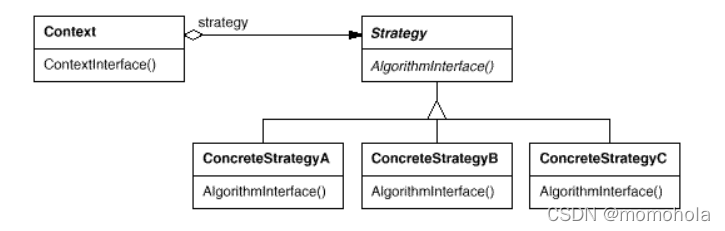

### Template 模式（模板模式）
在面向对象系统的分析与设计过程中经常会遇到这样一种情况：对于某一个业务逻辑（算法实现）在不同的对象中有不同的细节实现，但是逻辑（算法）的框架（或通用的应用算法）是相同的。Template 提供了这种情况的一个实现框架。Template 模式是采用继承的方式实现这一点：**将逻辑（算法）框架放在抽象基类中，并定义好细节的接口，子类中实现细节。**
### Strategy 模式（策略模式）
Strategy 模式和 Template 模式要解决的问题是相同（类似）的，都是为了给业务逻辑（算法）具体实现和抽象接口之间的解耦。

简而言之,Strategy 模式是对算法的封装。**处理一个问题的时候可能有多种算法,这些算法的接口(输入参数,输出参数等)都是一致的,那么可以考虑采用Strategy 模式对这些算法进行封装,在基类中定义一个函数接口就可以了。**

### State 模式（状态模式）
每个人、事物在不同的状态下会有不同表现（动作），而一个状态又会在不同的表现下转移到下一个不同的状态（State）。
**主要解决：**
1.  当状态数目不是很多的时候，Switch/Case 可能可以搞定。但是当状态数目很多的时候（实际系统中也正是如此），维护一大组的Switch/Case 语句将是一件异常困难并且容易出错的事情。
2.  状态逻辑和动作实现没有分离。在很多的系统实现中，动作的实现代码直接写在状态的逻辑当中。这带来的后果就是系统的扩展性和维护得不到保证。

### Observer 模式(观察者模式)
Observer 模式要解决的问题为：建立一个一（Subject）对多（Observer）的依赖关系，并且做到当“一”变化的时候，依赖这个“一”的多也能够同步改变。最常见的一个例子就是：对同一组数据进行统计分析时候，我们希望能够提供多种形式的表示（例如以表格进行统计显示、柱状图统计显示、百分比统计显示等）。**指多个对象间存在一对多的依赖关系，当一个对象的状态发生改变时，所有依赖于它的对象都得到通知并被自动更新。**
### Memento 模式（备忘录模式）
没有人想犯错误，但是没有人能够不犯错误。犯了错误一般只能改过，却很难改正（恢复）。世界上没有后悔药，但是我们在进行软件系统的设计时候是要给用户后悔的权利（实际上可能也是用户要求的权利：）），我们对一些关键性的操作肯定需要提供诸如撤销（Undo）的操作。那这个后悔药就是 Memento 模式提供的。
Memento 模式的关键就是要在不破坏封装行的前提下，**捕获并保存一个类的内部状态，这样就可以利用该保存的状态实施恢复操作。**
### Mediator 模式（中介者模式）
在面向对象系统的设计和开发过程中，对象之间的交互和通信是最为常见的情况，因为对象间的交互本身就是一种通信。在系统比较小的时候，可能对象间的通信不是很多、对象也比较少，我们可以直接硬编码到各个对象的方法中。但是当系统规模变大，对象的量变引起系统复杂度的急剧增加，对象间的通信也变得越来越复杂，这时候我们就要提供一个专门处理对象间交互和通信的类，这个中介者就是 Mediator 模式。所以Mediator 模式的实现关键就是将**对象 Colleague 之间的通信封装到一个类种单独处理。**
### Command 模式（命令模式）
- 请求以命令的形式包裹在对象中，并传给调用对象。调用对象寻找可以处理该命令的合适的对象，并把该命令传给相应的对象，该对象执行命令。
- Command 模式的最终目的就是将一个请求封装成一个对象，从而使您可以用不同的请求对客户进行参数化。

### Visitor 模式（访问者模式）
- 访问者模式（VisitorPattern），封装一些作用于某种数据结构的各元素的操作，它可以在不改变数据结构的前提下定义作用于这些元素的新的操作。
- 主要将数据结构与数据操作分离，解决 数据结构和操作耦合性问题
- 访问者模式的基本工作原理是：在被访问的类里面加一个对外提供接待访问者的接口
- 访问者模式主要应用场景是：需要对一个对象结构中的对象进行很多不同操作(这些操作彼此没有关联)，同时需要避免让这些操作"污染"这些对象的类，可以选用访问者模式解决
### Chain of Responsibility 模式（责任链模式）
责任链模式（Chain of Responsibility Pattern）为请求创建了一个接收者对象的链。这种模式给予请求的类型，对请求的发送者和接收者进行解耦。这种类型的设计模式属于行为型模式。
在这种模式中，通常每个接收者都包含对另一个接收者的引用。如果一个对象不能处理该请求，那么它会把相同的请求传给下一个接收者，依此类推。
**主要解决：**职责链上的处理者负责处理请求，客户只需要将请求发送到职责链上即可，无须关心请求的处理细节和请求的传递，所以职责链将请求的发送者和请求的处理者解耦了。
**何时使用：**在处理消息的时候以过滤很多道。

### Iterator 模式（迭代器模式）
迭代器模式，提供一种遍历集合元素的统一接口，用一致的方法遍历集合元素，不需要知道集合对象的底层表示，即：不暴露其内部的结构。**而且不管这些对象是什么都需要遍历的时候，就应该选择使用迭代器模式**
### Interpreter 模式（解释器模式）
- 在编译原理中，一个算术表达式通过词法分析器形成词法单元，而后这些词法单元再通过语法分析器构建语法分析树，最终形成一颗抽象的语法分析树。这里的词法分析器和语法分析器都可以看做是解释器
- 解释器模式（Interpreter Pattern）：是指给定一个语言(表达式)，定义它的文法的一种表示，并定义一个解释器，使用该解释器来解释语言中的句子(表达式)
