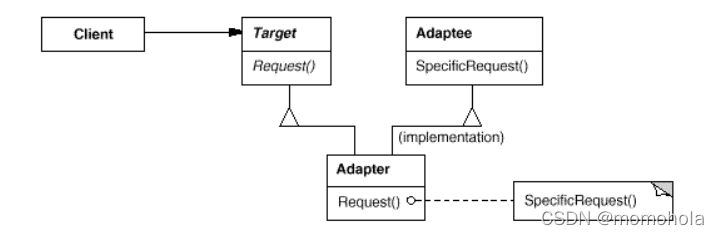
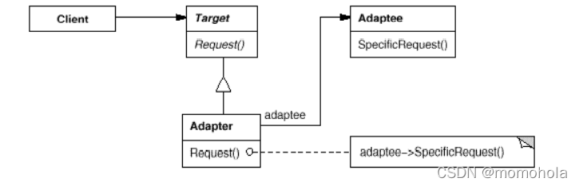
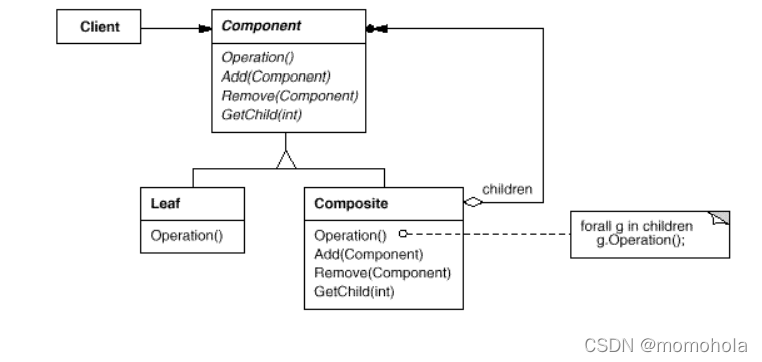
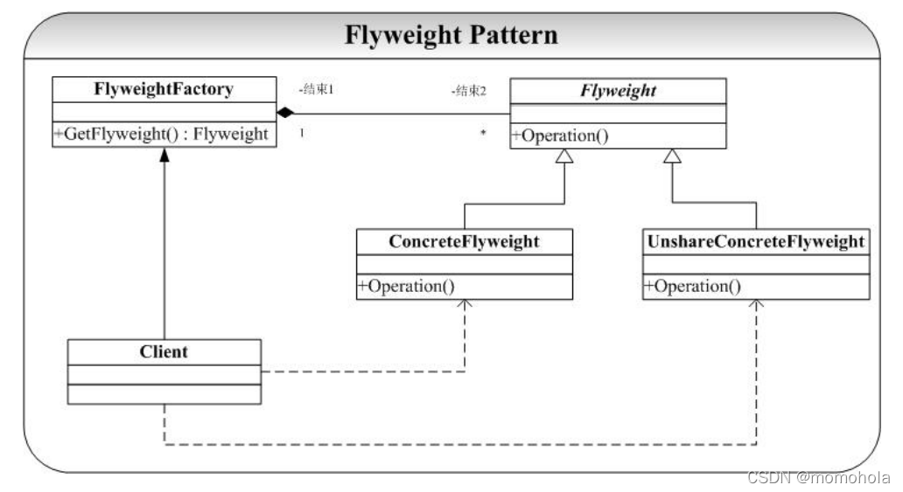

### Bridge 模式（桥接模式）
- 桥接模式实现了**抽象化与实现化**的脱耦。他们两个互相独立，不会影响到对方。
- 对于两个独立变化的维度，使用桥接模式再适合不过了。
- 分离抽象接口及其实现部分。提高了比继承更好的解决方案
### Adapter模式（适配器模式）
为了完成某项工作购买了一个第三方的库来加快开发。这就带来了一个问题：我们在应用程序中已经设计好了接口，与这个第三方提供的接口不一致，为了使得这些接口不兼容的类（不能在一起工作）可以在一起工作了**，Adapter 模式提供了将一个类（第三方库）的接口转化希望的接口**。
适配器模式分为类模式和对象模式。
**1)采用继承原有接口类的方式**

**2)采用组合原有接口类的方式**

在 Adapter 模式的结构图中可以看到，类模式的 Adapter 采用继承的方式复用 Adaptee的接口，而在对象模式的 Adapter 中我们则采用组合的方式实现 Adaptee 的复用。
### Decorator 模式（装饰器模式）
装饰器模式（Decorator Pattern）允许**向一个现有的对象添加新的功能，同时又不改变其结构**。
Component（被装饰对象的基类）
定义一个对象接口，可以给这些对象动态地添加职责。
ConcreteComponent（具体被装饰对象）
定义一个对象，可以给这个对象添加一些职责。
Decorator（装饰者抽象类）
维持一个指向Component实例的引用，并定义一个与Component接口一致的接口。
ConcreteDecorator（具体装饰者）
具体的装饰对象，给内部持有的具体被装饰对象，增加具体的职责。
### Composite 模式（组合实体模式）
将对象组合成树形结构以表示“部分-整体”的层次结构。Composite 使得**用户对单个对象和组合对象的使用具有一致性。**
**举例：**

### Flyweight 模式（享元模式）
如果一个应用程序使用了太多的对象，就会造成很大的存储开销。特别是对于大量轻量级（细粒度）的对象，比如在文档编辑器的设计过程中，我们如果为没有字母创建一个对象的话，系统可能会因为大量的对象而造成存储开销的浪费。例如一个字母“a”在文档中出现了100000 次，而实际上我们可以让这一万个字母“a”共享一个对象，当然因为在不同的位置可能字母“a”有不同的显示效果（例如字体和大小等设置不同），在这种情况我们可以为将对象的状态分为“外部状态”和“内部状态”，将可以被共享（不会变化）的状态作为内部状态存储在对象中，而外部对象（例如上面提到的字体、大小等）我们可以在适当的时候将外部对象最为参数传递给对象（例如在显示的时候，将字体、大小等信息传递给对象）。

Flyweight 模式中有一个类似 Factory 模式的对象构造工厂FlyweightFactory，当客户程序员（Client）需要一个对象时候就会向 FlyweightFactory 发出请求对象的消息 GetFlyweight（）消息，FlyweightFactory 拥有一个管理、存储对象的“仓库”（或者叫对象池，vector实现），GetFlyweight（）消息会遍历对象池中的对象，如果已经存在则直接返回给 Client，否则创建一个新的对象返回给 Client。
### Facade 模式（外观模式）
**外观模式是一个很重要、平常也用得很多的一个设计模式**
实际上在软件系统开发中也经常回会遇到这样的情况，可能你实现了一些接口（模块），而这些接口（模块）都分布在几个类中（比如 A 和 B、C、D）：A 中实现了一些接口，B 中实现一些接口（或者 A 代表一个独立模块，B、C、D 代表另一些独立模块）。然后你的客户程序员（使用你设计的开发人员）只有很少的要知道你的不同接口到底是在那个类中实现的，绝大多数只是想简单的组合你的 A－D 的类的接口，他并不想知道这些接口在哪里实现的。
下面举一个KTV的例子。假如KTV里面有电视机、电灯、音响、DVD、游戏机这些设备。平常KTV包厢里面没人时电灯都是打开的。电视机、音响、游戏机、DVD都是关闭的。当KTV里面有人了那么电灯关闭，其他东西打开。如果要一个一个开和关特别麻烦。这时候就可以使用外观模式，定义一个总开关。

### Proxy 模式（代理模式）
代理模式（Proxy Pattern）是指为其他对象提供一种代理，以控制对这个对象的访问。 代理对象在客服端和目标对象之间起到中介作用。
在生活中，我们经常见到这样的场景，如：租房中介、售票黄牛、婚介、经纪人、快递、 事务代理、非侵入式日志监听等，这些都是代理模式的实际体现
**注意事项：**
1、和适配器模式的区别：适配器模式主要改变所考虑对象的接口，而代理模式不能改变所代理类的接口。
2、和装饰器模式的区别：装饰器模式为了增强功能，而代理模式是为了加以控制。
**举例：**
现在有一个操作系统，只需要调用run（）就可以启动操作系统，但是进入操作系统之前必须要进行账户名和密码的认证。认证成功后这个代理才会让你进入操作系统，其中认证的这个过程就是一个代理。
