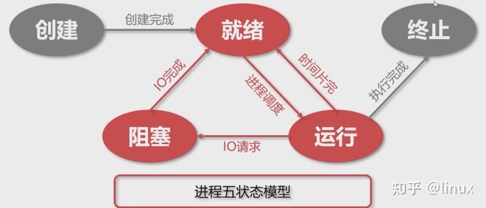

## 创建、就绪、终止、阻塞、运行

**就绪状态**：其他资源都准备好了，只差CPU资源的状态，只要在获得CPU使用权就可以随时被调度执行。

**创建状态**：创建进程是拥有PCB（进程控制块）但其他资源没有就绪为创建状态

- 先分配PCB（进程控制块）然后插入就绪队列。
- 操作系统提供fork函数接口创建进程

**终止状态**：进程结束有系统清理或者归还PCB的状态为终止状态。

**阻塞状态**：进程因为某种原因（其他设备没有就绪包括磁盘、网卡等）无法继续执行而放弃cpu的使用权，把cpu资源让给其他进程。

进程从就绪状态进行进程调度，分配cpu资源，然后到运行状态，当时间片用完之后进入就绪状态，而在运行状态时因为某些资源没有就绪比如IO请求包括网络IO、磁盘IO、都可能从运行状态切换到阻塞状态，当IO请求完成了进程从阻塞状态切换就绪状态。

## 阻塞、非阻塞、同步、异步。

**阻塞状态（同步）**：阻塞的话典型的就是`IO过程`，从调用到返回会经历一段时间。因为比如外围设备包括磁盘。网卡等，在**读写数据没有CPU快**，所以通常读取数据的时候会经历一段时间，这段时间就是属于阻塞状态。在调用结果返回之前，当前进程会被挂起，只有得到结果才会返回。

<b>同步：进程因为在这段时间并没有干其他事情，而是同步的等待数据返回</b>

**非阻塞状态（异步）**：**并没有一直等待数据的返回**，而是其他的工作，等到比如IO完成了会通知已经完成，进程再去返回IO任务去读取数据。

异步：<b>进程在IO之后没有进行同步等待，去干其他事情，并且等待IO这个过程准备好之后进行通知</b>，进程接收到通知ready之后再切换回去读取数据。
当一个异步的调用发出之后，调用并不会得到结果而是，被调用者通过状态或者通知，来通知进程获取结果。

总结：同步异步抢到消息通讯机制，阻塞非阻塞抢到进程在等待调用结果的状态。

## PCB是什么？（进程控制块）

PCB是**进程**的唯一标识，操作系统调度进程时就是**根据每个进程PCB中的信息进行调度的**，当决定执行 某个进程后，会根据该进程PCB中保存的信息去恢复上次执行的现场，当分配到的CPU时间片用完 后，需要将当前状态保存到PCB中，以便下次恢复。

PCB组织方式： 通过**链表**的方式组织成一个个队列，拥有相同状态的进程组成一个队列。 比如就绪进程就会组成就绪队列、因为某些事件而阻塞的进程组成阻塞队列。 也可以将相同状态的PCB按照其他策略排成多个链表

PCB包含进程的属性和状态信息：
- 进程标识符（进程ID）
- CPU状态信息（寄存器、PC）
- 进程调度信息（进程状态、进程优先级、进程已等待时间等）
- 进程控制信息（页表地址）