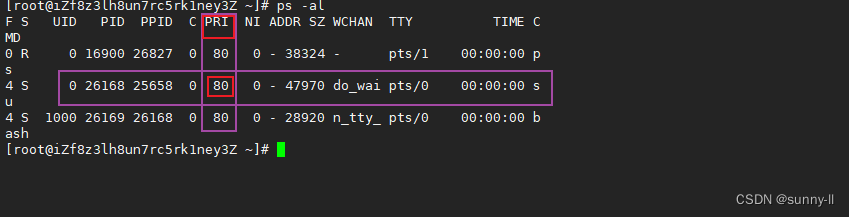
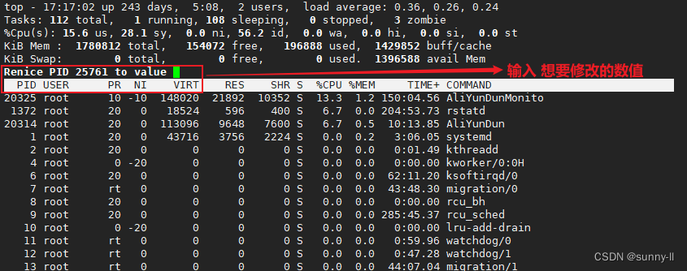
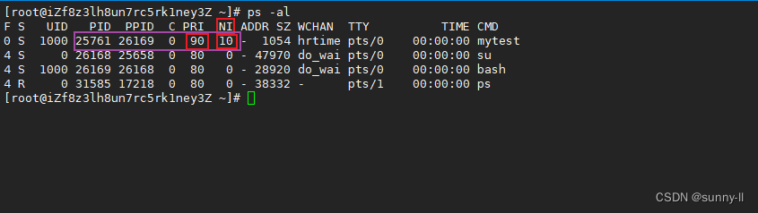

# 进程优先级
<b>一个 CPU 只能同时运行一个进程，</b>而进程是由很多个的，所以需要存在进程优先级来<b>确定进程获取 CPU 资源的顺序。</b>

<b>进程要访问某种资源，进程通过一定的方式（排队），确认享受资源的先后顺序。</b>

其实 **优先级** 和 **权限** 是有区别的：
权限决定的是 --- **能不能**的问题，
而优先级是决定  --- **先后顺序**的问题。

## Linux中如何查看并修改
我们可以对 `运行起来的进程` 使用下列指令去查看其优先级
```bash
ps -al
```
几个重要信息：
- `UID` : 代表执行者的身份
- `PID` : 代表这个进程的代号
- `PPID` ：代表这个进程是由哪个进程发展衍生而来的，亦即父进程的代号
- `PRI` ：代表这个进程可被执行的优先级，其**值越小越早被执行**
- `NI` ：代表这个进程的nice值

## PRI and NI 

对于 PRI 还是比较好理解的，即**进程的优先级**，或者通俗点说就是程序被CPU执行的先后顺序，**此值越小进程的优先级别越高**

那 NI 呢? 就是我们所要说的 nice 值了，其表示**进程可被执行的优先级的修正**通俗简单一点来讲呢，就是进程的 nice 值不是进程的优先级，他们不是一个概念，但是**进程nice值会影响到进程的优先级变化**。

### PRI
我们让改程序跑起来变为进程，我们使用如下命令查看 进程属性：
```bash
ps -la  #显示当前用户的所有进程
```


横着的紫色框是我们启动的进程，竖着的紫色框有一栏叫做 `PRI` 的数值，其实 `PRI` 就是 `priority` ，优先权的意思。 

竖着紫色里是优先级，而优先级具有数值，那么就一定是 `task_struct` 里的一个属性：  

```c++
struct task_struct
{
	int PRI;//优先级
	//...
}
```

Linux下优先级是**可以被修改**的，修改范围为 [60, 99] 这40范围内，且 进程的**默认权限值是80**。<b>而优先级数字越小，表示该进程的 优先级越高！ </b>

## NI
我们清楚了进程的优先级是什么，以及为什么，接下来我们看一下到底该怎么做？ 

运行上面的程序，打印出进程的pid，使用 top 命令进入到 Linux任务管理器
```bash
top #进入任务管理器
```
- 接下去按下` R/r `之后，就会跳出来下面这句话，这里的 `renice` 指的就是要重新修改进程，此时 `shell` 正在等待我们输入进程的 `PID `值，那我们就可以输入上方的 `5479`
```bash
PID to renice [default pid = 1]
```
- 然后呢，我们看到 `shell `又在等待我们输入需要更改的 `nice` 值
```bash
Renice PID 25761 to value
```


- 输入要修改的值即可，比如，这里我输入10


这个时候再使用ps查看，就会发现进程的PRI这一项变为了90，但是我们发现，不仅仅是PRI这一栏变了，还有一栏叫做 NI 的值也变了，而且还刚刚好是我们输入的数值！

其实，<b>Linux系统支持用户调整优先级，但并 不是让用户直接修改 pri 值，而是修改 nice 值。</b>而 nice 值 不是 优先级，而是 优先级的 修正数据。

所以真正的优先级应该是：```pri = pri(old) + nice ;```（old指老的优先级）
所以我们刚刚 修改的并不是优先级，而是nice值。

