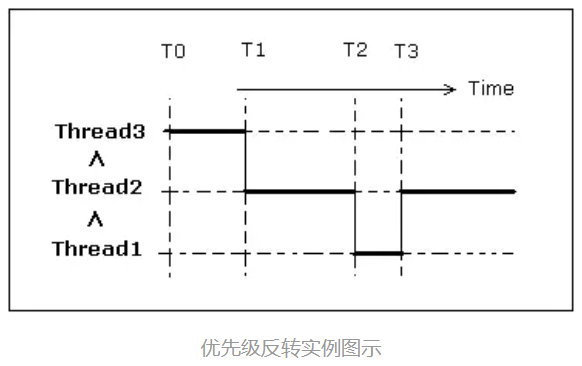
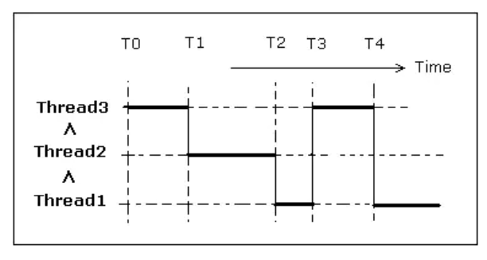

## 优先级反转（翻转）
优先级反转，是指在使用信号量时，可能会出现的这样一种**不合理**的现象，即：

<b>高优先级任务被低优先级任务阻塞，导致高优先级任务迟迟得不到调度。但其他中等优先级的任务却能抢到CPU资源。-- 从现象上来看，好像是中优先级的任务比高优先级任务具有更高的优先权。</b>

具体来说：当高优先级任务正等待信号量（此信号量被一个低优先级任务拥有着）的时候，一个介于两个任务优先之间的中等优先级任务开始执行——这就会导致一个高优先级任务在等待一个低优先级任务，而低优先级任务却无法执行类似死锁的情形发生。

### 优先级翻转的危害
实时性失效：本应立即响应的高优先级任务被莫名延迟，甚至错过实时响应窗口。

系统不可预测：调度变得复杂，问题难以复现和定位。

极端情况下可能导致死锁或任务“饿死”。

### 一个具体的例子：
假定一个进程中有三个线程Thread1(高）、Thread2（中）和Thread3（低），考虑下图的执行情况。


- T0时刻，Thread3运行，并获得同步资源SYNCH1；
- T1时刻，Thread2开始运行，由于优先级高于Thread3，Thread3被抢占（未释放同步资源SYNCH1），Thread2被调度执行；
- T2时刻，Thread1抢占Thread2；
- T3时刻，Thread1需要同步资源SYNCH1，但SYNCH1被更低优先级的Thread3所拥有，Thread1被挂起等待该资源
- 而此时线程Thread2和Thread3都处于可运行状态，Thread2的优先级大于Thread3的优先级，Thread2被调度执行。最终的结果是高优先级的Thread1迟迟无法得到调度，而中优先级的Thread2却能抢到CPU资源。

上述现象中，优先级最高的Thread1要得到调度，不仅需要等Thread3释放同步资源（**这个很正常**），而且还需要等待另外一个毫不相关的中优先级线程Thread2执行完成（**这个就不合理了**），会导致调度的实时性就很差了。

## 优先级继承
<b>优先级继承就是为了解决优先级反转问题而提出的一种优化机制。</b>其大致原理是让低优先级线程在获得同步资源的时候(如果有高优先级的线程也需要使用该同步资源时)，```临时提升其优先级```。以其能更快的执行并释放同步资源。释放同步资源后再恢复其原来的优先级。



与上图相比，到了T3时刻，Thread1需要Thread3占用的同步资源SYNCH1，操作系统检测到这种情况后，就把<b> Thread3的优先级提高到Thread1的优先级。</b>此时处于可运行状态的线程Thread2和Thread3中，Thread3的优先级大于Thread2的优先级，Thread3被调度执行。

Thread3执行到T4时刻，释放了同步资源SYNCH1，操作系统恢复了Thread3的优先级，Thread1获得了同步资源SYNCH1，重新进入可执行队列。处于可运行状态的线程Thread1和Thread2中，Thread1的优先级大于Thread2的优先级，所以Thread1被调度执行。

<b>通过优先级继承机制，可以有效解决优先级反转问题，使优先级最高的Thread1获得执行的时机提前。</b>

### 优先级继承的局限性
不是所有“优先级反转”都能100%彻底消除，比如多资源嵌套（嵌套优先级反转）、多个任务交叉持有等复杂情况。

优先级继承只在**互斥量机制**中生效，如果用普通信号量、事件组等同步机制，则无优先级继承。

在极复杂的资源访问/死锁场景下，优先级继承协议也有边界。

## 优先级天花板
优先级天花板 是为每个共享资源（如互斥锁）预先设定的一个“最高优先级值”，等于所有可能访问该资源的任务中**最高任务优先级**。

### 协议规则

当一个任务要访问互斥锁时，如果它的优先级 <b>高于当前系统中所有已被占用资源的优先级天花板，则允许它获得锁。</b>

如果它的优先级 <b>不高于某个已占用资源的天花板，即使这些资源它并不需要，也必须阻塞。</b>

这样可以防止死锁和复杂的优先级反转。

### 与优先级继承协议（PIP）的对比

优先级继承协议 (PIP)：低优先级任务持有锁时，会“继承”高优先级任务的优先级，以避免被中优先级任务打断。

优先级天花板协议 (PCP)：通过预先设定天花板和限制加锁条件，主动避免优先级反转和死锁，比 PIP 更严格。