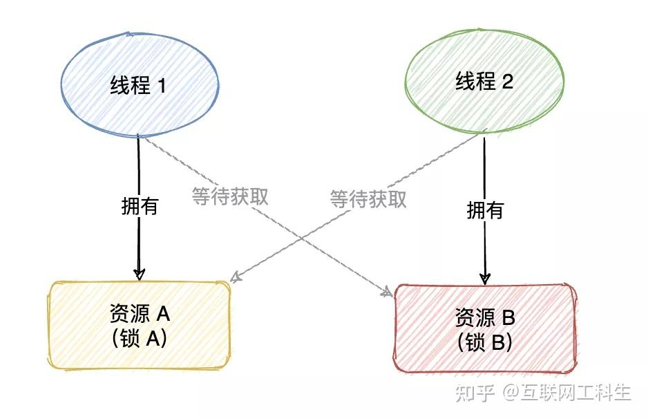

因为在多进程中易发生多进程对资源进行竞争，如果一个进程集合里面的每一个进程都在等待这个集合中的其他一个进程才能继续往下执行，若无外力他们将无法推进，这种情况就是死锁。**产生死锁的四个条件：互斥条件、请求和保持条件、不可剥夺条件、环路等待条件**。解决死锁的方法就是破坏上述任意一种条件。

#### 1、[互斥条件](https://zhida.zhihu.com/search?content_id=252013685&content_type=Article&match_order=1&q=%E4%BA%92%E6%96%A5%E6%9D%A1%E4%BB%B6&zhida_source=entity)
互斥即非此即彼，一个资源要不是我拥有，要不是你拥有，就是不能我们俩同时拥有。也就是互斥条件是指**至少有一个资源处于非共享状态**，一次只能有一个线程可以访问该资源。

#### 2、[占有并等待条件](https://zhida.zhihu.com/search?content_id=252013685&content_type=Article&match_order=1&q=%E5%8D%A0%E6%9C%89%E5%B9%B6%E7%AD%89%E5%BE%85%E6%9D%A1%E4%BB%B6&zhida_source=entity)
该条件是指一个线程**在拥有至少一个资源的同时还在等待获取其他线程拥有的资源**。

#### 3、[不可剥夺条件](https://zhida.zhihu.com/search?content_id=252013685&content_type=Article&match_order=1&q=%E4%B8%8D%E5%8F%AF%E5%89%A5%E5%A4%BA%E6%9D%A1%E4%BB%B6&zhida_source=entity)
该条件是指一个线程一旦获取了某个资源，则不可被强行剥夺对该资源的所有权，只能等待该线程自己主动释放。
#### 4、[循环等待条件](https://zhida.zhihu.com/search?content_id=252013685&content_type=Article&match_order=1&q=%E5%BE%AA%E7%8E%AF%E7%AD%89%E5%BE%85%E6%9D%A1%E4%BB%B6&zhida_source=entity)
循环等待是指线程等待资源形成的循环链，比如线程A等待资源B，线程B等待资源C，线程C等待资源A，但是资源A被线程A拥有，资源B被线程B拥有，资源C被线程C拥有，如此形成了依赖死循环，都在等待其他线程释放资源。

