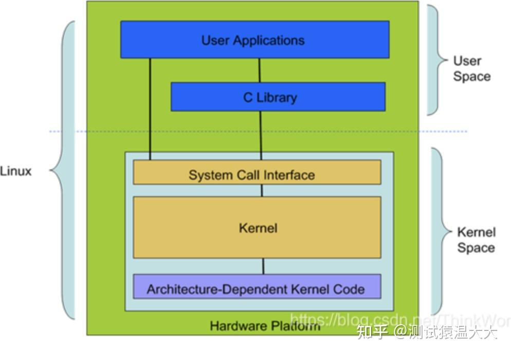

# 0.3 什么是 Linux 内核？
- Linux 系统的核心是内核。内核控制着计算机系统上的所有硬件和软件，在必要时分配硬件，并根据需要执行软件。
- 系统内存管理
- 应用程序管理
- 硬件设备管理
- 文件系统管理

# 0.4 Linux的基本组件是什么？
- 就像任何其他典型的操作系统一样，Linux拥有所有这些组件：内核，shell和GUI，系统实用程序和应用程序。Linux比其他操作系统更具优势的是每个方面都附带其他功能，所有代码都可以免费下载。

# 0.5 Linux 的体系结构
从大的方面讲，Linux 体系结构可以分为两块：

- <b>用户空间(User Space)</b> ：用户空间又包括用户的应用程序(User Applications)、C 库(C Library) 。

- <b>内核空间(Kernel Space)</b> ：内核空间又包括系统调用接口(System Call Interface)、内核(Kernel)、平台架构相关的代码(Architecture-Dependent Kernel Code) 。

## 为什么 Linux 体系结构要分为用户空间和内核空间的原因？
- 1、现代 CPU 实现了不同的工作模式，不同模式下 CPU 可以执行的指令和访问的寄存器不同。
- 2、Linux 从 CPU 的角度出发，为了保护内核的安全，把系统分成了两部分。
- 用户空间和内核空间是程序执行的两种不同的状态，我们可以通过两种方式完成用户空间到内核空间的转移：1）系统调用；2）硬件中断。

