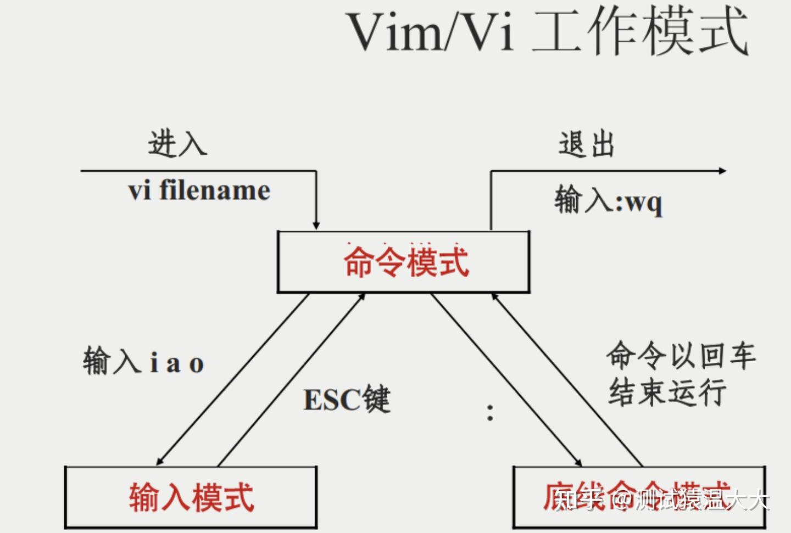

3.15 vim 命令
2025年4月15日
9:43

Vim是从 vi 发展出来的一个文本编辑器。代码补完、编译及错误跳转等方便编程的功能特别丰富，在程序员中被广泛使用。
- 打开文件并跳到第 10 行：vim +10 filename.txt 。
- 打开文件跳到第一个匹配的行：vim +/search-term filename.txt 。
- 以只读模式打开文件：vim -R /etc/passwd 。
- 基本上 vi/vim 共分为三种模式，分别是命令模式（Command mode），输入模式（Insert mode）和底线命令模式（Last line mode）。
一图胜千言：

**
