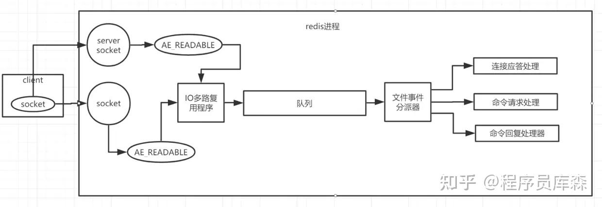
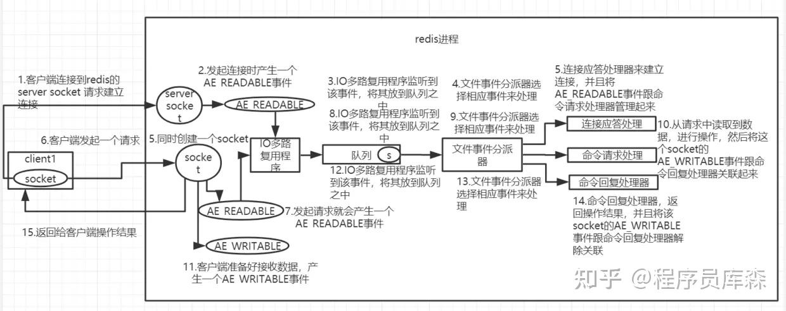

## 介绍下Redis的线程模型
Redis的线程模型包括Redis 6.0之前和Redis 6.0。

下面介绍的是Redis 6.0之前。

**Redis 是基于 reactor 模式开发了网络事件处理器，这个处理器叫做文件事件处理器（file event handler）。**
由于这个文件事件处理器是单线程的，所以 Redis 才叫做单线程的模型。采用 IO 多路复用机制同时监听多个 Socket，根据 socket 上的事件来选择对应的事件处理器来处理这个事件。

IO多路复用是 IO 模型的一种，有时也称为异步阻塞 IO，是基于经典的 Reactor 设计模式设计的。多路指的是多个 Socket 连接，复用指的是复用一个线程。多路复用主要有三种技术：Select，Poll，Epoll。

Epoll 是最新的也是目前最好的多路复用技术。

模型如下图：

文件事件处理器的结构包含了四个部分：
- 多个 Socket。Socket 会产生 AE_READABLE 和 AE_WRITABLE 事件：
- 当 socket 变得可读时或者有新的可以应答的 socket 出现时，socket 就会产生一个 AE_READABLE 事件
- 当 socket 变得可写时，socket 就会产生一个 AE_WRITABLE 事件。
### IO 多路复用程序
- 文件事件分派器
- 事件处理器。事件处理器包括：连接应答处理器、命令请求处理器、命令回复处理器，每个处理器对应不同的 socket 事件：
  - 如果是客户端要连接 Redis，那么会为 socket 关联连接应答处理器
  - 如果是客户端要写数据到 Redis（读、写请求命令），那么会为 socket 关联命令请求处理器
  - 如果是客户端要从 Redis 读数据，那么会为 socket 关联命令回复处理器

多个 socket 会产生不同的事件，不同的事件对应着不同的操作，IO 多路复用程序监听着这些 Socket，当这些 Socket 产生了事件，IO 多路复用程序会将这些事件放到一个队列中，通过这个队列，以有序、同步、每次一个事件的方式向文件时间分派器中传送。当事件处理器处理完一个事件后，IO 多路复用程序才会继续向文件分派器传送下一个事件。

下图是客户端与 Redis 通信的一次完整的流程：

- Redis 启动初始化的时候，Redis 会将连接应答处理器与 AE_READABLE 事件关联起来。
  
- 如果一个客户端跟 Redis 发起连接，此时 Redis 会产生一个 AE_READABLE 事件，由于开始之初 AE_READABLE 是与连接应答处理器关联，所以由连接应答处理器来处理该事件，这时连接应答处理器会与客户端建立连接，创建客户端响应的 socket，同时将这个 socket 的 AE_READABLE 事件与命令请求处理器关联起来。
  
- 如果这个时间客户端向 Redis 发送一个命令（set k1 v1），这时 socket 会产生一个 AE_READABLE 事件，IO 多路复用程序会将该事件压入队列中，此时事件分派器从队列中取得该事件，由于该 socket 的 AE_READABLE 事件已经和命令请求处理器关联了，因此事件分派器会将该事件交给命令请求处理器处理，命令请求处理器读取事件中的命令并完成。操作完成后，Redis 会将该 socket 的 AE_WRITABLE 事件与命令回复处理器关联。
  
- 如果客户端已经准备好接受数据后，Redis 中的该 socket 会产生一个 AE_WRITABLE 事件，同样会压入队列然后被事件派发器取出交给相对应的命令回复处理器，由该命令回复处理器将准备好的响应数据写入 socket 中，供客户端读取。
  
- 命令回复处理器写完后，就会删除该 socket 的 AE_WRITABLE 事件与命令回复处理器的关联关系。
