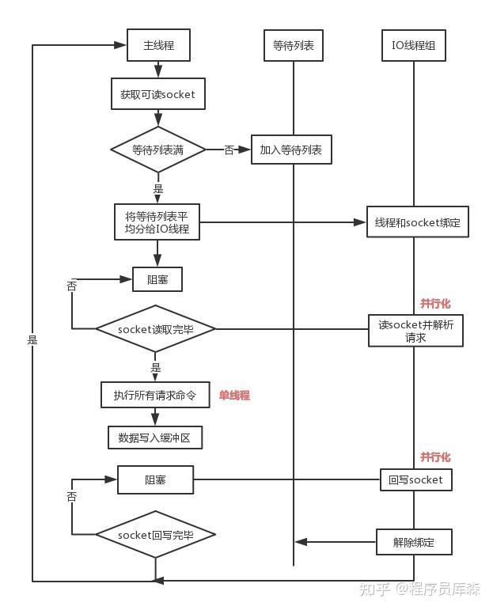

## Redis 6.0 多线程的实现机制？
Redis 的底层多线程指的是：**在数据读写、持久化、I/O 或特定命令执行等场景中引入多个线程并发处理**，而不是打破 Redis 的核心单线程命令执行模型。
#### 流程简述如下：
- 主线程负责接收建立连接请求，获取 Socket 放入全局等待读处理队列。
- 主线程处理完读事件之后，通过 RR（Round Robin）将这些连接分配给这些 IO 线程。
- 主线程阻塞等待 IO 线程读取 Socket 完毕。
- 主线程通过单线程的方式执行请求命令，请求数据读取并解析完成，但并不执行。
- 主线程阻塞等待 IO 线程将数据回写 Socket 完毕。

该设计有如下特点：
- IO 线程要么同时在读 Socket，要么同时在写，不会同时读或写。
- IO 线程只负责读写 Socket 解析命令，不负责命令处理。

## Redis核心命令单线程处理
### 1. 核心含义：一个“工作者”
想象一下，Redis 内部有一个单一的、永不疲倦的工人。这个工人的工作流程是一个永不停止的循环，我们称之为 “事件循环” (Event Loop)。

这个工人的待办事项清单（工作流程）非常固定：

1. 检查任务栏：使用 I/O 多路复用技术（如 epoll）检查成千上万个客户端连接，看看哪些连接有新的请求（数据可读）或可以发送回复（数据可写）。

2. 处理任务：

    - 如果某个客户端发来了一个命令请求（比如 SET name Redis 或 GET name），这个工人就会：

        - 读取网络缓冲区中的数据。

        - 解析命令（知道你要执行的是 SET 还是 GET）。

        - 执行命令（真正地去内存中设置或查找这个键值对）。

        - 准备回复数据。

3. 写下结果：将上一步准备好的回复数据放入该客户端的发送缓冲区，并标记这个连接为“可写”，以便在下次循环中尽快发送出去。

最关键的一点是： 上述流程中的第2步——“执行命令”——永远只有这一个工人在做。所有客户端的命令都必须在这个工人的工作台上<b>排队，一个接一个地被处理</b>。这就是“核心命令单线程处理”的最直观体现。

### 2. 为什么这么做？优势是什么？
这种设计看似简单甚至“落后”，但却是 Redis 成功的关键，带来了巨大的好处：

a) <b>无锁的极致性能 (Lock-Free)</b>

多线程编程最大的难题是<b>竞争条件 (Race Condition) 和锁 (Lock)。</b>如果多个线程同时操作同一块内存数据（比如一个哈希表），就必须用锁来保证数据正确性，而获取和释放锁本身是非常耗时的操作。
Redis 的单线程模型从根本上杜绝了竞争。因为所有命令都是串行执行的，不存在两个命令同时修改同一个键的情况。这就省去了所有加锁、解锁的开销，实现了极高的执行效率。

b) <b>绝对的原子性 (Atomicity)</b>

这是单线程模型带来的另一个巨大优势。每一个命令的执行都是不可分割的。在执行 INCR（自增）命令时，绝不会发生“读值”和“写回新值”中间被其他命令插队的情况。这使得所有Redis命令本身都是原子操作。即使是复杂的 Lua 脚本，在执行时也是以原子方式进行的，整个脚本在执行期间不会被其他命令打断。

c) <b>简单性 (Simplicity)</b>
单线程模型的实现、调试和维护都比多线程模型简单得多。它避免了线程切换、死锁、并发BUG等一系列令人头疼的问题。

## Redis 6.0 的多线程I/O（作为补充理解）
Redis 6.0 引入了一个可选的特性：**多线程网络I/O**。

它改变了什么？：改变了上面流程中的第1步（读数据）和第3步（写数据）。现在，读取客户端命令请求和发送回复结果这两个最耗时的I/O操作，可以由多个后台I/O线程并行完成。

它没改变什么？：**最关键的命令解析和执行（第2步）依然由那个单一线程（主线程）串行完成**。 多线程I/O线程只是帮主线程把数据从网络套接字中读出来，解析好放在一个队列里，或者把主线程已经处理好的结果发送出去。

你可以把它想象成：<b>原来那个工人（主线程）既要切菜、炒菜，还要端盘子。现在他雇了几个帮手（I/O线程），帮手只负责把客人点的菜单拿进来和把炒好的菜端出去，而核心的“炒菜”工作，依然由他一个人亲自完成，以保证味道（数据）的一致性和安全性。</b>