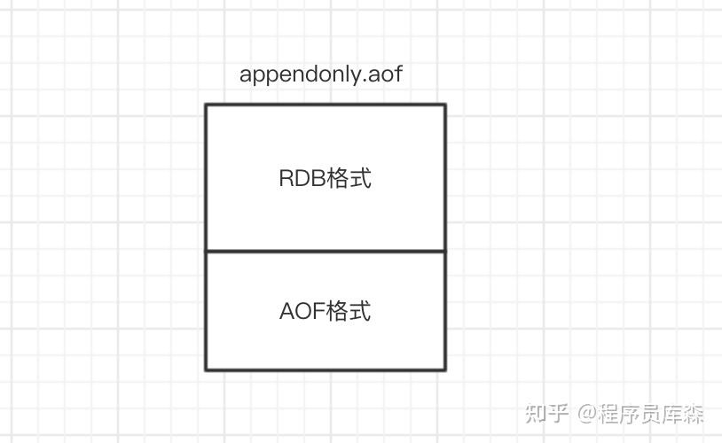

### 如何选择合适的持久化方式
如果是数据不那么敏感，且可以从其他地方重新生成补回的，那么可以关闭持久化。
- 如果是数据比较重要，不想再从其他地方获取，且可以承受数分钟的数据丢失，比如缓存等，那么可以只使用RDB。
- 如果是用做内存数据库，要使用Redis的持久化，建议是RDB和AOF都开启，或者定期执行bgsave做快照备份，RDB方式更适合做数据的备份，AOF可以保证数据的不丢失。
补充：Redis4.0 对于持久化机制的优化

Redis4.0相对与3.X版本其中一个比较大的变化是4.0添加了新的混合持久化方式。

简单的说：新的AOF文件前半段是RDB格式的全量数据后半段是AOF格式的增量数据，如下图：

优势：混合持久化结合了RDB持久化 和 AOF 持久化的优点， 由于绝大部分都是RDB格式，加载速度快，同时结合AOF，增量的数据以AOF方式保存了，数据更少的丢失。
劣势：兼容性差，一旦开启了混合持久化，在4.0之前版本都不识别该aof文件，同时由于前部分是RDB格式，阅读性较差。
