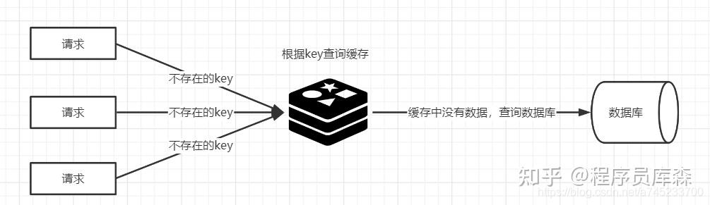

## 缓存异常
缓存异常有四种类型，分别是**缓存和数据库的数据不一致、缓存雪崩、缓存击穿和缓存穿透**。
### 如何保证缓存与数据库双写时的数据一致性？
背景：使用到缓存，无论是本地内存做缓存还是使用 Redis 做缓存，那么就会存在数据同步的问题，因为配置信息缓存在内存中，而内存时无法感知到数据在数据库的修改。这样就会造成数据库中的数据与缓存中数据不一致的问题。

共有四种方案：
1.  先更新数据库，后更新缓存
2.  先更新缓存，后更新数据库
3.  先删除缓存，后更新数据库
4.  先更新数据库，后删除缓存
  
第一种和第二种方案，没有人使用的，因为第一种方案存在问题是：并发更新数据库场景下，会将脏数据刷到缓存。

第二种方案存在的问题是：如果先更新缓存成功，但是数据库更新失败，则肯定会造成数据不一致。

目前主要用第三和第四种方案。

### 什么是缓存击穿?
缓存击穿跟缓存雪崩有点类似，**缓存雪崩是大规模的key失效**，而**缓存击穿是某个热点的key失效**。

**大并发集中对其进行请求，就会造成大量请求读缓存没读到数据，从而导致高并发访问数据库，引起数据库压力剧增**。这种现象就叫做缓存击穿。

从两个方面解决，第一是否可以考虑热点key不设置过期时间，第二是否可以考虑降低打在数据库上的请求数量。

解决方案：
- 在缓存失效后，**通过互斥锁或者队列来控制读数据写缓存的线程数量**，比如某个key只允许一个线程查询数据和写缓存，其他线程等待。这种方式会阻塞其他的线程，此时系统的吞吐量会下降
- **热点数据缓存永远不过期**。永不过期实际包含两层意思：
  - 物理不过期，针对热点key不设置过期时间
  - 逻辑过期，把过期时间存在key对应的value里，如果发现要过期了，通过一个后台的异步线程进行缓存的构建

### 什么是缓存穿透?
**缓存穿透是指用户请求的数据在缓存中不存在即没有命中，同时在数据库中也不存在，导致用户每次请求该数据都要去数据库中查询一遍**。如果有恶意攻击者不断请求系统中不存在的数据，会导致短时间大量请求落在数据库上，造成数据库压力过大，甚至导致数据库承受不住而宕机崩溃。

**缓存穿透的关键在于在Redis中查不到key值，它和缓存击穿的根本区别在于传进来的key在Redis中是不存在的**。假如有黑客传进大量的不存在的key，那么大量的请求打在数据库上是很致命的问题，所以在日常开发中要对参数做好校验，一些非法的参数，不可能存在的key就直接返回错误提示。

解决方法：
- 将无效的key存放进Redis中：
当出现Redis查不到数据，数据库也查不到数据的情况，我们就把这个key保存到Redis中，设置value="null"，并设置其过期时间极短，后面再出现查询这个key的请求的时候，直接返回null，就不需要再查询数据库了。但这种处理方式是有问题的，假如传进来的这个不存在的Key值每次都是随机的，那存进Redis也没有意义。
- <b>使用布隆过滤器：</b>
如果布隆过滤器判定某个 key 不存在布隆过滤器中，那么就一定不存在，如果判定某个 key 存在，那么很大可能是存在(存在一定的误判率)。于是我们可以在缓存之前再加一个布隆过滤器，**将数据库中的所有key都存储在布隆过滤器中，在查询Redis前先去布隆过滤器查询 key 是否存在，如果不存在就直接返回，不让其访问数据库，从而避免了对底层存储系统的查询压力。**

#### 布隆过滤器（Bloom Filter） 是由 Burton Howard Bloom 在 1970 年提出的一种概率型数据结构。

它被设计用来回答一个问题：“某个元素是否在一个集合中？”

但它的核心特点在于：

- 空间效率极高：它使用一个位数组（bit array）和一系列哈希函数，比存储所有原始数据要节省大量空间。

- 概率型答案：它的回答不是100%准确的。

简单来说，布隆过滤器可以用于快速排除绝对不在集合中的元素，但对于在集合中的元素，需要进一步确认。

**布隆过滤器主要包含两部分：**

- 一个长度为 m 的位数组（Bit Array）：初始时所有位都置为 0。

- k 个不同的哈希函数：每个函数都能将输入的元素映射到位数组的 k 个不同位置上。

**1. 添加元素 (Add)**

当要向过滤器中添加一个元素（例如字符串 "geek"）时：

将这个元素分别传入 k 个哈希函数进行计算。

得到 k 个哈希值，每个值对应位数组中的一个位置。

将位数组中这 k 个位置的值都设置为 1。

**2. 查询元素 (Query)**

当要查询一个元素（例如 "nerd"）是否存在于过滤器中时：

同样将这个元素传入那 k 个哈希函数进行计算。

得到 k 个哈希值，对应位数组中的 k 个位置。

检查这 k 个位置上的值：

如果其中任何一个位置的值为 0，那么可以肯定地说：“这个元素绝对不在集合中”。

如果这 k 个位置的值全部为 1，那么可以说：“这个元素可能在集合中”。

### 什么是缓存雪崩?
**如果缓在某一个时刻出现大规模的key失效，那么就会导致大量的请求打在了数据库上面，导致数据库压力巨大，如果在高并发的情况下，可能瞬间就会导致数据库宕机**。这时候如果运维马上又重启数据库，马上又会有新的流量把数据库打死。这就是缓存雪崩。

造成缓存雪崩的关键在于同一时间的大规模的key失效，主要有两种可能：第一种是Redis宕机，第二种可能就是采用了相同的过期时间。

解决方案：

1、事前：
- 均匀过期：设置不同的过期时间，让缓存失效的时间尽量均匀，避免相同的过期时间导致缓存雪崩，造成大量数据库的访问。如把每个Key的失效时间都加个随机值，setRedis（Key，value，time + Math.random() \* 10000）；，保证数据不会在同一时间大面积失效。
- 分级缓存：第一级缓存失效的基础上，访问二级缓存，每一级缓存的失效时间都不同。
- 热点数据缓存永远不过期。永不过期实际包含两层意思：
  - 物理不过期，针对热点key不设置过期时间
  - 逻辑过期，把过期时间存在key对应的value里，如果发现要过期了，通过一个后台的异步线程进行缓存的构建
- 保证Redis缓存的高可用，防止Redis宕机导致缓存雪崩的问题。可以使用 主从+ 哨兵，Redis集群来避免 Redis 全盘崩溃的情况。
2、事中：
- 互斥锁：在缓存失效后，通过互斥锁或者队列来控制读数据写缓存的线程数量，比如某个key只允许一个线程查询数据和写缓存，其他线程等待。这种方式会阻塞其他的线程，此时系统的吞吐量会下降
- 使用熔断机制，限流降级。当流量达到一定的阈值，直接返回“系统拥挤”之类的提示，防止过多的请求打在数据库上将数据库击垮，至少能保证一部分用户是可以正常使用，其他用户多刷新几次也能得到结果。
3、事后：
- 开启Redis持久化机制，尽快恢复缓存数据，一旦重启，就能从磁盘上自动加载数据恢复内存中的数据。

### 什么是缓存预热?
**缓存预热是指系统上线后，提前将相关的缓存数据加载到缓存系统。**
避免在用户请求的时候，先查询数据库，然后再将数据缓存的问题，用户直接查询事先被预热的缓存数据。

如果不进行预热，那么Redis初始状态数据为空，系统上线初期，对于高并发的流量，都会访问到数据库中， 对数据库造成流量的压力。

缓存预热解决方案：
- 数据量不大的时候，工程启动的时候进行加载缓存动作；
- 数据量大的时候，设置一个定时任务脚本，进行缓存的刷新；
- 数据量太大的时候，优先保证热点数据进行提前加载到缓存。
### 什么是缓存降级？
**缓存降级是指缓存失效或缓存服务器挂掉的情况下，不去访问数据库，直接返回默认数据或访问服务的内存数据。**
降级一般是有损的操作，所以尽量减少降级对于业务的影响程度。

在进行降级之前要对系统进行梳理，看看系统是不是可以丢卒保帅；从而梳理出哪些必须誓死保护，哪些可降级；比如可以参考日志级别设置预案：
- 一般：比如有些服务偶尔因为网络抖动或者服务正在上线而超时，可以自动降级；
- 警告：有些服务在一段时间内成功率有波动（如在95~100%之间），可以自动降级或人工降级，并发送告警；
- 错误：比如可用率低于90%，或者数据库连接池被打爆了，或者访问量突然猛增到系统能承受的最大阀值，此时可以根据情况自动降级或者人工降级；
- 严重错误：比如因为特殊原因数据错误了，此时需要紧急人工降级。
