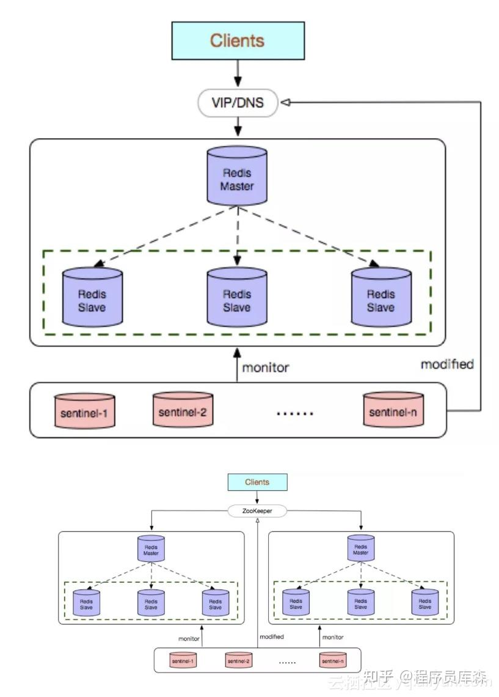

### 介绍下Redis Sentinel（哨兵）
主从模式下，当主服务器宕机后，需要手动把一台从服务器切换为主服务器，这就需要人工干预，费事费力，还会造成一段时间内服务不可用。这种方式并不推荐，实际生产中，我们优先考虑哨兵模式。

这种模式下，**master 宕机，哨兵会自动选举 master 并将其他的 slave 指向新的 master。**

Redis Sentinel是社区版本推出的原生高可用解决方案，其部署架构主要包括两部分：Redis Sentinel集群和Redis数据集群。
其中Redis Sentinel集群是由若干Sentinel节点组成的分布式集群，可以实现故障发现、故障自动转移、配置中心和客户端通知。Redis Sentinel的节点数量要满足2n+1（n\>=1）的奇数个。

**优点：**
- Redis Sentinel集群部署简单；
- 能够解决Redis主从模式下的高可用切换问题；
- 很方便实现Redis数据节点的线形扩展，轻松突破Redis自身单线程瓶颈，可极大满足Redis大容量或高性能的业务需求；
- 可以实现一套Sentinel监控一组Redis数据节点或多组数据节点。
  
**缺点：**
- 部署相对Redis主从模式要复杂一些，原理理解更繁琐；
- 资源浪费，Redis数据节点中slave节点作为备份节点不提供服务；
- Redis Sentinel主要是针对Redis数据节点中的主节点的高可用切换，对Redis的数据节点做失败判定分为主观下线和客观下线两种，对于Redis的从节点有对节点做主观下线操作，并不执行故障转移。
- 不能解决读写分离问题，实现起来相对复杂。
