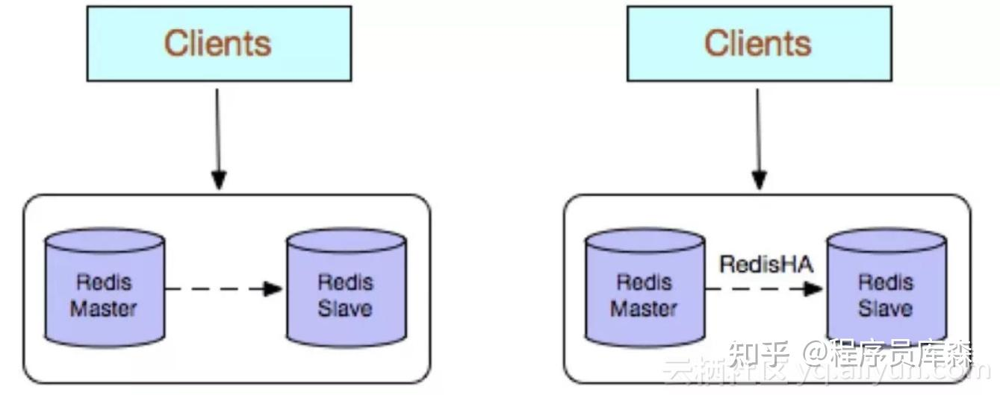

### 介绍下Redis多副本（主从）
Redis多副本，采用主从（replication）部署结构，**相较于单副本而言最大的特点就是主从实例间数据实时同步，并且提供数据持久化和备份策略。**
主从实例部署在不同的物理服务器上，根据公司的基础环境配置，可以实现同时对外提供服务和读写分离策略。

**优点：**
- 高可靠性：
  - 一方面，采用双机主备架构，能够在主库出现故障时自动进行主备切换，从库提升为主库提供服务，保证服务平稳运行；
  - 另一方面，开启数据持久化功能和配置合理的备份策略，能有效的解决数据误操作和数据异常丢失的问题；
- 读写分离策略：**从节点可以扩展主库节点的读能力**，有效应对大并发量的读操作。
  
**缺点：**
- 故障恢复复杂，如果没有RedisHA系统（需要开发），当主库节点出现故障时，需要手动将一个从节点晋升为主节点，同时需要通知业务方变更配置，并且需要让其它从库节点去复制新主库节点，整个过程需要人为干预，比较繁琐；
- 主库的写能力受到单机的限制，可以考虑分片；
- 主库的存储能力受到单机的限制，可以考虑Pika；
- 原生复制的弊端在早期的版本中也会比较突出，如：Redis复制中断后，Slave会发起psync，此时如果同步不成功，则会进行全量同步，主库执行全量备份的同时可能会造成毫秒或秒级的卡顿；又由于COW机制，导致极端情况下的主库内存溢出，程序异常退出或宕机；主库节点生成备份文件导致服务器磁盘IO和CPU（压缩）资源消耗；发送数GB大小的备份文件导致服务器出口带宽暴增，阻塞请求，建议升级到最新版本。
