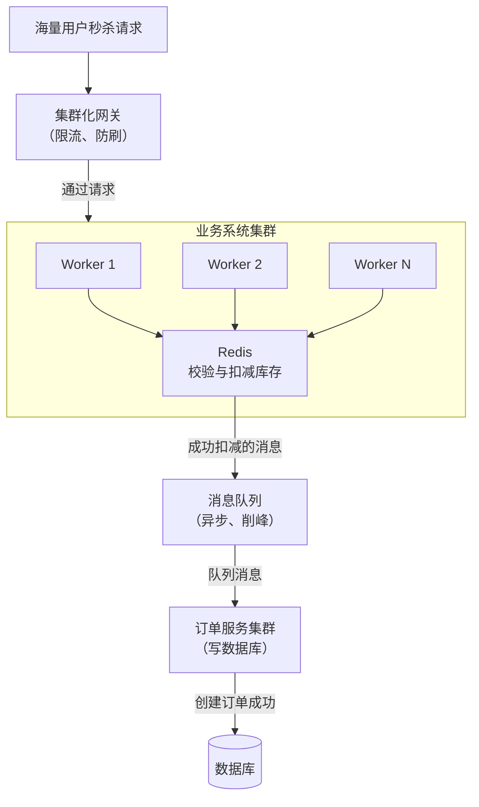

## 如果现在有个读超高并发的系统，用Redis来抗住大部分读请求，你会怎么设计？
如果是读高并发的话，先看读并发的数量级是多少，因为Redis单机的读QPS在万级，每秒几万没问题，使用一主多从+哨兵集群的缓存架构来承载每秒10W+的读并发，<strong style="color:red">主从复制，读写分离。</strong>

使用哨兵集群主要是提高缓存架构的可用性，解决单点故障问题。主库负责写，多个从库负责读，支持水平扩容，根据读请求的QPS来决定加多少个Redis从实例。如果读并发继续增加的话，只需要增加Redis从实例就行了。

如果需要缓存1T+的数据，选择Redis cluster模式，每个主节点存一部分数据，假设一个master存32G，那只需要n\*32G\>=1T，n个这样的master节点就可以支持1T+的海量数据的存储了。

`Redis单主的瓶颈不在于读写的并发，而在于内存容量`，即使是一主多从也是不能解决该问题，因为一主多从架构下，多个slave的数据和master的完全一样。假如master是10G那slave也只能存10G数据。所以数据量受单主的影响。 而这个时候又需要缓存海量数据，那就必须得有多主了，并且多个主保存的数据还不能一样。Redis官方给出的 Redis cluster 模式完美的解决了这个问题。

## redis实现秒杀系统
**核心挑战**

- **大并发 (High Concurrency)**：瞬间涌入数万甚至数十万的请求，数据库根本无法承受。

- **越界/超卖 (Overselling)**：库存只剩 1 件，但由于并发请求同时检查库存都看到 >0，于是都执行了扣减，导致库存变为负数，卖了远多于库存的商品。


### 支柱一：静态资源与限流（应对大并发）
**目标**：将绝大部分无效请求挡在系统上游，保护核心资源。

**1.CDN + 浏览器缓存**：将秒杀页面、图片、JS/CSS 等静态资源全部推送到 CDN 和用户浏览器缓存。用户请求根本不会回源到服务器。

**2.网关层限流 (Rate Limiting)**：

- 在 API 网关（如 Nginx, Spring Cloud Gateway）上针对用户 ID、IP 进行限流，例如每个用户 ID 每秒只能请求 1 次。

- 对总流量进行限制，例如每秒只放行 1 万个请求到后端服务，多余的直接返回“秒杀繁忙”。

- 这一步挡住了 90% 以上的无效流量。

### 支柱二：Redis 原子操作（解决超卖问题）
**目标**：在库存扣减这个最核心的环节，保证绝对的一致性。

这是最关键的一步，必须使用 Redis 的原子操作来实现库存查验和扣减。

<b>正确做法一：使用 Lua 脚本（最强推荐）</b>

将查验库存和扣减库存的操作写在一个 Lua 脚本中。因为 Redis 是单线程执行命令的，所以整个 Lua 脚本的执行是原子性的，不会被其他命令打断。

```lua
-- seckill.lua
local key = KEYS[1] -- 库存key，例如: 'seckill:stock:123'
local userId = ARGV[1] -- 用户ID，用于防重复购买

-- 1. 检查库存是否大于0
local stock = tonumber(redis.call('GET', key))
if (stock <= 0) then
    return 0 -- 库存不足
end

-- 2. 检查用户是否已经购买过（一人一单）
if (redis.call('SISMEMBER', key..':users', userId) == 1) then
    return 2 -- 重复购买
end

-- 3. 执行扣减库存
redis.call('DECR', key)
-- 4. 记录该用户已购买（Set集合）
redis.call('SADD', key..':users', userId)
return 1 -- 成功
```

### 支柱三：异步削峰与最终一致性
**目标**：将瞬间的峰值请求平滑处理，减轻数据库压力。

**1.成功信号入队**：当 Lua 脚本返回成功（1）时，并不意味着秒杀成功，只意味着你获得了购买资格。

**2.立即返回响应**：此时业务系统立即给用户返回“排队中”或“秒杀成功，正在创建订单...”。

**3.异步创建订单**：系统将用户ID和商品ID作为一个消息，发送到消息队列（如 RabbitMQ, Kafka, RocketMQ） 中。消息队列的特性是“削峰填谷”，可以平稳地处理高并发消息。

**4.订单服务消费**：后端的订单服务从消息队列中逐个消费消息，异步地、平稳地执行创建订单、扣减数据库库存等耗时操作。即使这里慢一点，用户也能接受，因为前端已经告诉他成功了。