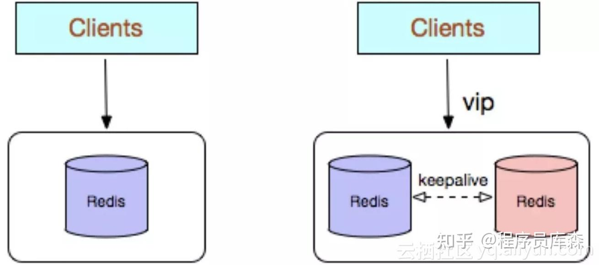

### 介绍下Redis单副本
Redis单副本，采用单个Redis节点部署架构，没有备用节点实时同步数据，不提供数据持久化和备份策略，适用于数据可靠性要求不高的纯缓存业务场景。

**优点：**
- 架构简单，部署方便；
- 高性价比：缓存使用时无需备用节点（单实例可用性可以用supervisor或crontab保证），当然为了满足业务的高可用性，也可以牺牲一个备用节点，但同时刻只有一个实例对外提供服务；
- 高性能。

**缺点：**
- 不保证数据的可靠性；
- 在缓存使用，进程重启后，数据丢失，即使有备用的节点解决高可用性，但是仍然不能解决缓存预热问题，因此不适用于数据可靠性要求高的业务；
- 高性能受限于单核CPU的处理能力（Redis是单线程机制），CPU为主要瓶颈，所以适合操作命令简单，排序、计算较少的场景。也可以考虑用Memcached替代。
