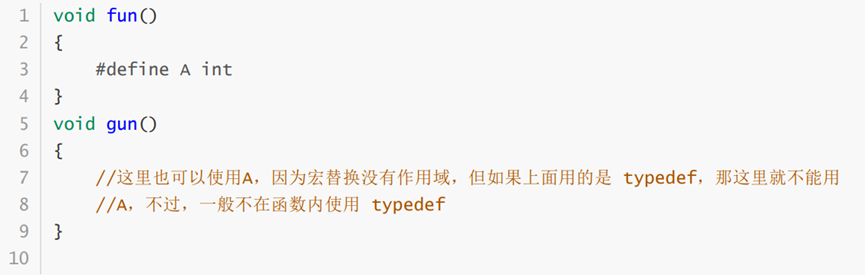
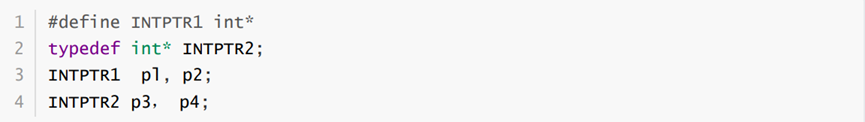
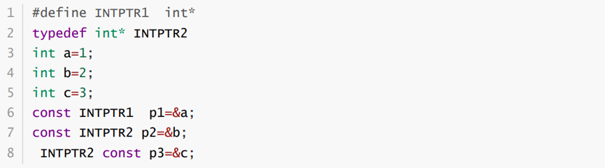

typedef与define都是替一个对象取一个别名，以此来增强程序的可读性，但是它们在使用和作用上也存在着以下4个方面的不同
**（a）原理不同**
\#define是C语言中定义的语法，它是预处理指令，在预处理时进行简单而机械的字符串替换，不做正确性检査，不管含义是否正确照样代入，只有在编译已被展开的源程序时，才会发现可能的错误并报错 例如， \# define Pl3.1415926 ，当程序执行 area=Pr \* r 语句时，PI会被替换为3.1415926于是该 语句被替换为 area=3.1415926*r*r 如果把# define语句中的数字9写成了g，预处理也照样代入，而不去检查其是否合理、合法
typedef是关键字，它在编译时处理，所以 typedef具有类型检查的功能它在自己的作用域内给一个已经存在的类型一个别名，但是不能在一个函数定义里面使用标识符 typedef例如，typedef int INTEGER ，这以后就可用 INTEGER来代替int作整型变量的类型说明了，例如：INTEGER a,b; 用 typedef定义数组、指针、结构等类型将带来很大的方便，不仅使程序书写简单而且使意义更为明确，因而增强了可读性例如： typedef int a\[10\]; 表示a是整型数组类型，数组长度为10然后就可用a说明变量，例如:语句a s1,s2；完全等效于语句 int s1\[10\],s2\[10\].同理， typedef void（\*p）（void)表示p是一种指向void型的指针类型
**（b）功能不同**
typedef用来定义类型的别名，这些类型不仅包含内部类型（int、char等），还包括自定义类型（如 struct），可以起到使类型易于记忆的功能
例如： typedef int (\*PF)(const char \*， const char\*) 定义一个指向函数的指针的数据类型PF，其中函数返回值为int，参数为 const char\*typedef还有另外一个重要的用途，那就是定义机器无关的类型例如，可以定义一个叫REAL的浮点类型，在目标机器上它可以获得最高的精度： typedef long double REAL ，在不支持 long double的机器上，该 typedef 看起来会是下面这样： typedef double real ，在 double都不支持的机器上，该 typedef看起来会是这样： typedef float REAL \#define不只是可以为类型取别名，还可以定义常量、变量、编译开关等
**（c）作用域不同**
 \#define没有作用域的限制，只要是之前预定义过的宏，在以后的程序中都可以使用，而 typedef有自己的作用域

**（d）对指针的操作不同**

INTPTR1 pl, p2和INTPTR2 p3，p4的效果截然不同 INTPTR1 pl, p2进行字符串替换后变成 int\*p1,p2 ，要表达的意义是声明一个指针变量p1和一个整型变量p2
而INTPTR2 p3，p4，由于 INTPTR2是具有含义的，告诉我们是一个指向整型数据的指针，那么p3和p4都为指针变量，这句相当于 int\*pl，\*p2 .从这里可以看出，进行宏替换是不含任何意义的替换，仅仅为字符串替换；而用 typedef 为一种数据类型起的别名是带有一定含义的。

上述代码中， const INTPTR1 p1表示p1是一个常量指针，即不可以通过p1去修改p1指向的内容，但是 p1可以指向其他内容而对于 const INTPTR2 p2，由于 INTPTR2表示的是个指针类型，因此用 const去 限定，表示封锁了这个指针类型，因此p2是一个指针常量，不可使p2再指向其他内容，但可以通过p2修 改其当前指向的内容 INTPTR2 const p3同样声明的是一个指针常量
