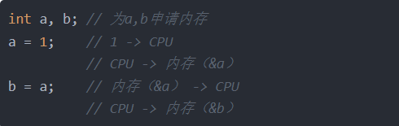
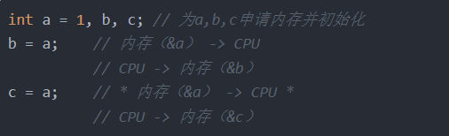

防止编译器对变量进行优化，即每次存取该变量的时候都要去从内存取而不是之前在寄存器中的备份
\(a\) 编译器优化
先理解CPU（寄存器）读取规则：
如下面程序段：

如上图代码所示，a = 1这个程序，先将1写入CPU，再从CPU中将1写入a所在的内存地址中；b = a是先从内存中将a的值取出到CPU，再从CPU将值存入b的内存地址中

如上图代码所示，上边的程序如果按第一段代码所说的顺序执行，则c = a语句在编译时是可以被编译器优化的，即注释部分（\* 内存（&a） -\> CPU \*）的内容不被执行，因为在b = a这个语句中，a已经被移入过寄存器（CPU），那么在执行c = a时，就直接将a在寄存器（CPU）中传递给c这样就减少了一次指令的执行，就完成了优化
上面就是编译器优化的原理过程，但是这个过程，有时会出现问题，而这个问题也就volatile存在的意义！

**（b）volatile的引入**
上边程序中，如果在执行完b =a后，a此时的值存放在CPU中但是a在内存中又发生了变化（比如中断改变了a的值），但是存在CPU中的a是原来未变的a，按理应该是已经变化后的a赋值给c，但是此时却导致未变化的a赋值给了c
这种问题，就是编译器自身优化而导致的为了防止编译器优化变量a，引入了volatile关键字，使用该关键字后，程序在执行时c = a时，就会先去a的地址读出a到CPU，再从CPU将a的值赋予给c这样就防止了被优化

**（c）哪些情况下使用volatile**
（1）并行设备的硬件寄存器存储器映射的硬件寄存器通常加volatile，因为寄存器随时可以被外设硬件修改当声明指向设备寄存器的指针时一定要用volatile，它会告诉编译器不要对存储在这个地址的数据进行假设
（2）一个中断服务程序中修改的供其他程序检测的变量volatile提醒编译器，它后面所定义的变量随时都有可能改变因此编译后的程序每次需要存储或读取这个变量的时候，都会直接从变量地址中读取数据如果没有volatile关键字，则编译器可能优化读取和存储，可能暂时使用寄存器中的值，如果这个变量由别的程序更新了的话，将出现不一致的现象
（3）多线程应用中被几个任务共享的变量

