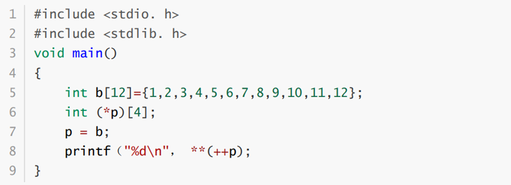

### 数组指针
表示的是一个指针，指向的是一个数组
例如， int（\*pa）\[8\] 声明了一个指针，该指针指向了一个有8个int型元素的数组下面给出一个数组指针的示例

 程序的输出结果为 5
上例中，p是一个数组指针，它指向一个包含有4个int类型数组的指针，刚开始p被初始化为指向数组b 的首地址，++p相当于把p所指向的地址向后移动4个int所占用的空间，此时p指向数组{5,6,7,8}，语句 \*（++p）； 表示的是这个数组中第一个元素的地址(可以理解p为指向二维数组的指针，｛1,2,3,4｝， ｛5,6,7,8｝，｛9,10,11,12｝p指向的就是｛1,2,3,4｝的地址， \*p 就是指向元素，｛1,2,3,4｝， \*\*p 指向的就是1，语句\*\*（++p）会输出这个数组的第一个元素5
### 指针数组
表示的是一个数组
### 

