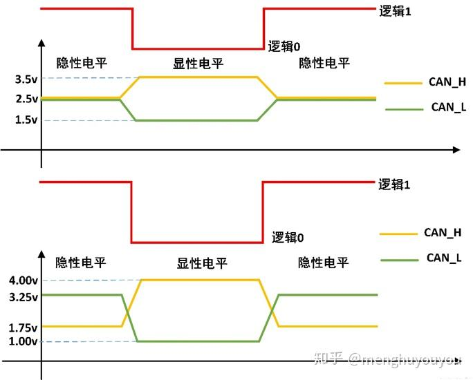
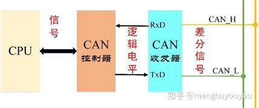
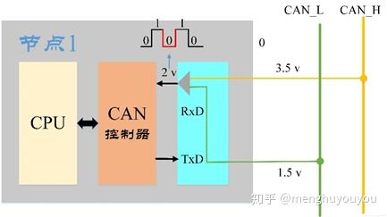
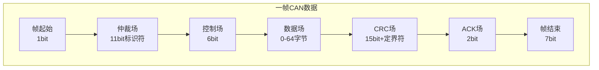

## CAN 是 Controller Area Network 的缩写（以下称为 CAN），是 ISO国际标准化的串行通信协议
### CAN总线架构简介
CAN总线是一种用于在不同的<b>ECU（电子控制单元）</b>之间传输数据的线，CAN总线协议是一种ISO 国际标准化的串行通信协议，有 ISO-11898 和 ISO-11519两个系列。其定义有：

- ISO-11898 定义了通信速率为 125 kbps ~1Mbps 的**高速 CAN 通信标准**，属于闭环总线，传输速率可达1Mbps，总线长度 ≤ **40米**，如图2。
- ISO11519 定义了通信速率为 10～125 kbps 的**低速 CAN 通信标准**，属于开环总线，传输速率为40kbps时，总线长度可达**1000米**，如图2。

### CAN总线信号
CAN总线上，信号表现为电压形式，通过CAN_H和CAN_L线上的电位差来表示CAN信号，分为显性电平(dominant)和隐性电平(recessive)两种类型。其中显性电平规定为逻辑0，隐性电平则为逻辑1。其具体定义可通过下图来理解。

### CAN信号传输
上述的电位差（差分电平）与逻辑电平由CAN收发器实现。在发送过程，CAN控制器将CPU传来的信号转换为逻辑电平。CAN收发器接收逻辑电平之后，再将其转换为差分电平输出到CAN总线上。

在接收过程，CAN收发器将CAN_H 和 CAN_L 线上传来的差分电平转换为逻辑电平输出到CAN控制器，CAN控制器再把该逻辑电平转化为相应的信号发送到CPU上。

通俗地讲，就是<b>发送方通过CAN收发器使总线电平发生变化，将其信息传递到CAN总线上。接收方通过监听总线电平，将总线上的消息读入自己的CAN收发器。</b>

由上可知：CAN总线有2种架构，CAN信号有2种形式，CAN信号发送和接收2个过程。

## 核心概念：它是什么？
CAN 是一种**多主、广播、串行、差分信号的通信总线协议**。它的设计初衷是用于汽车内部各电子控制单元（ECU）之间的可靠通信，以取代复杂的点对点布线。

**核心思想**：像一个大礼堂里的**自由辩论**。

**多主（Multi-master）**：任何人都可以随时上台发言（发起通信），只要台上没人。

**广播（Broadcast）**：一个人发言，礼堂里的所有人都能听到。

**仲裁（Arbitration）**：如果两个人同时站起来发言，**优先级高**的人（事先约定好的）继续讲，优先级低的人会主动坐下聆听，等待下次机会。这个过程不会丢失任何数据。

**抗干扰（Robustness）**：使用**差分信号**，就像两个人用嘈杂环境下的“暗号”对话，对外部噪音免疫力极强。

## 为什么需要CAN？它的优势是什么？
**多主模式与仲裁**：彻底避免了总线冲突和数据丢失。节点无需中央调度即可自主、高效地通信。

**极高的可靠性**：

- **差分信号（CAN_H & CAN_L）**：极强的抗电磁干扰（EMI）能力。

- **强大的错误处理**：包括CRC校验、位填充、帧检查、错误计数和自动重发等机制。

**成本效益**：只需要一对双绞线即可连接大量节点，极大简化了布线，降低了成本和重量。

**实时性**：基于优先级的仲裁机制保证了高优先级消息能获得极低的延迟。

## CAN协议的核心组件
### 物理层 (Physical Layer)
**总线拓扑**：所有节点都挂在一对**双绞线**上：`CAN_H`（高）和 `CAN_L`（低），线路两端各有一个120欧姆的终端电阻，用于阻抗匹配，消除信号反射。

**差分信号**：

- **显性位 (Dominant, 0)**：CAN_H 电压拉高 (~3.5V)，CAN_L 电压拉低 (~1.5V)，电压差 ~2V。

- **隐性位 (Recessive, 1)**：CAN_H 和 CAN_L 电压都处于中间电平 (~2.5V)，电压差 ~0V。

- **显性位优先**：只要有一个节点发送显性位0，总线上就是显性位。这是仲裁机制的物理基础。

### 数据链路层 (Data Link Layer) - 协议核心
这部分定义了数据的帧格式和仲裁、错误检测等规则。CAN有**两种帧格式**：

- **标准帧**：11位标识符（ID）

- **扩展帧**：29位标识符（ID）

|字段|	长度|	说明|
|-------------|-------------------|---------------------------|
|SOF (Start Of Frame)|	1 bit|	显性位0，标志着帧的开始，用于同步。
|Arbitration Field(仲裁场)	|11 bits + RTR|	这是CAN的核心。包含：Identifier (ID)：11位消息ID。ID值越小，优先级越高。RTR (Remote Transmission Request)：远程请求帧标志。数据帧中为显性0。
|Control Field(控制场)	|6 bits	|包含一个4位的DLC (Data Length Code)，指示数据场的字节数（0-8）。
|Data Field(数据场)	|0-8 bytes|	实际要传输的数据。CAN协议规定一帧最多8字节，保证了实时性。
|CRC Field(循环冗余校验场)	|15 bits + Delimiter|	发送端根据报文计算的CRC值。接收端会重新计算并比对，若不一致则抛出错误。
|ACK Field(应答场)	|2 bits	|任何接收到正确消息的节点，都会在ACK槽位发送一个显性位0，告诉发送者“我已收到”。如果发送者没收到ACK，它会认为传输失败并自动重发。
|EOF (End Of Frame)	|7 bits	|隐性位1，标志帧的结束。

## CAN总线如何工作？—— 以仲裁为例
假设有两个节点同时开始发送消息：

- Node A 要发送 ID = 0x201 (二进制 0100000001)

- Node B 要发送 ID = 0x305 (二进制 01100000101)

两个节点从ID的最高位开始逐位向总线上发送。

- 前两位：01 vs 01，总线状态为01（隐性），无冲突。

- 第三位：A发0(显性)，B发1(隐性)。**显性位0覆盖隐性位1**，总线状态为0。

- Node B 检测到总线上是0，而自己发的是1，意识到有更高优先级的节点在发送。

- **Node B 立即停止发送**，转为接收模式。

- Node A unaware of any conflict，继续完成整个帧的发送。

<b>结果：优先级高的节点（ID值小的）成功发送，没有任何数据损坏或浪费。</b>

## CAN协议的其他帧类型
除了**数据帧**，CAN总线还有三种重要的帧：

**远程帧 (Remote Frame)**：

- 用于请求另一个节点发送具有特定ID的数据帧。

- 它与数据帧结构相似，但没有数据场，且RTR位为隐性1。

**错误帧 (Error Frame)**：

- 任何节点检测到错误时，会立即向总线发送一个错误帧，强制中断当前传输，通知所有节点“刚才有错误发生”。

- 发送节点会增加错误计数，错误过多会进入“总线关闭”状态进行自我隔离，防止瘫痪整个网络。

**过载帧 (Overload Frame)**：

- 用于在节点处理不过来时，请求延迟下一帧数据的发送。类似于“等等，我还没准备好”。