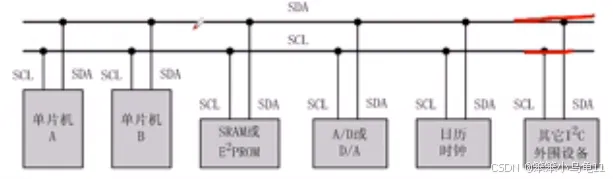
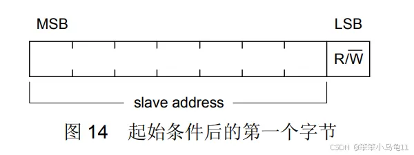
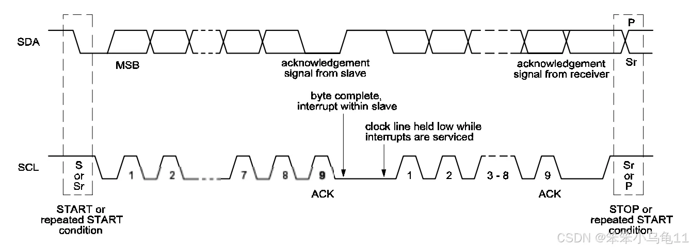

## I²C（Inter-Integrated Circuit）总线是由Philips公司（现NXP Semiconductors）开发的一种两线式同步串行总线协议
用于连接低速的微控制器、传感器、EEPROM、A/D转换器、D/A转换器、I/O扩展器等设备。I²C以其简单性、成本效益和多功能性而闻名，广泛应用于各种电子设备中，尤其是空间受限的便携式设备。

### I²C的信号线：
I²C总线使用两条双向信号线：
	
- **SDA（Serial Data）**：数据线，用于传输数据。
- **SCL（Serial Clock）**：时钟线，用于同步数据的发送和接收。

### I²C的工作原理：
I²C通信是基于主从架构的，其中至少有一台主设备和一台或多台从设备。主设备负责启动和终止数据传输，控制时钟信号，并选择从设备。从设备被动地响应主设备的请求。

### 数据传输：
数据传输是在SCL线处于高电平期间进行的，SDA线上的数据在SCL线的上升沿被采样。在数据传输过程中，SDA线的状态只能在SCL线处于低电平时改变。

### 起始和停止条件：
	
- 起始条件：当SCL线保持高电平时，SDA线从高电平变为低电平，这标志着一次I²C传输的开始。
- 停止条件：同样地，当SCL线保持高电平时，SDA线从低电平变为高电平，这标志着一次I²C传输的结束。

### 应答信号：
每次传输完一个字节后，接收方会发送一个应答信号（ACK）来确认数据是否正确接收。应答信号是在SCL线的第九个时钟周期的下降沿时在SDA线上产生的。如果SDA线在这个时钟周期内为低电平，则表示应答成功；如果SDA线为高电平，则表示应答失败。

### I²C的寻址：
每个I²C从设备都有一个唯一的7位地址，这使得主设备能够选择特定的从设备进行通信。地址通常在设备的规格书中给出。在数据传输开始时，主设备首先发送从设备的地址和读写方向的控制位，然后才能进行数据的读取或写入。

### I²C的时序：
- 总线在空闲状态 时，SCL和SDA都保持着高电平
- 当SDA由高电平转为低电平时且此时SCL为高电平，此时代表着产生了一个开始信号
- 当SDA由低电平转为高电平时且此时SCL为高电平，此时代表着产生了一个停止信号

### I²C的优点：
- 简洁性：仅使用两条信号线，减少了布线的复杂性和成本。
- 多从设备：可以连接多个从设备，只要它们具有不同的地址。
- 低功耗：适用于电池供电的设备。

### 传输速度
I2C协议定义了多种速度模式，以适应不同的应用场景。

|模式	|速率	|说明|
|---------------|-------------------|--------------------|
|标准模式 (Standard-mode)	|100 kbps	|最原始、最通用的模式。广泛用于读写传感器、EEPROM等不要求高速的设备。
|快速模式 (Fast-mode)	|400 kbps|	目前最常用的模式。在大多数微控制器和外设中默认支持。速度是标准模式的4倍。
|高速模式 (Fast-mode Plus)|	1 Mbps	|更快的版本，需要设备和控制器都支持。
|超快速模式 (Ultra Fast-mode)	|5 Mbps	|非官方叫法，主要用于特定类型的LED驱动等。它实际上是单向通信（只写），背离了I2C的标准。

<b>注意：上述速率是理论上的位时钟速率（Bit Rate）。实际的有效数据吞吐量（Data Throughput）会低于这个值，因为：</b>

**协议开销**：每个字节（8位）的传输都伴随着额外的ACK/NACK位、起始条件和停止条件。

**地址字节**：每次传输都必须先发送一个或多个地址和R/W位。

**时钟延展**：从设备如果来不及处理数据，可以通过拉低SCL线来暂停通信，直到它准备好为止。这会直接降低平均速度。

<b>因此，在400 kbps模式下，实际有效的数据传输速率大约在 200-300 kbps 左右。</b>

### 通信距离
I2C是为板级通信（Board-level）或机箱内通信（Box-level）而设计的，其通信距离非常有限。

|场景|	大致距离|	说明|
|------------|--------------|---------------|
|典型板级应用	|< 10 cm	|同一块PCB上的芯片之间通信。这是I2C最主流的使用场景。
|通过排线连接	|< 1 m	|通过扁平电缆连接到另一块子板或设备。
|长距离应用	|> 1 m|	不推荐！需要额外的措施，并且速度和可靠性会急剧下降。

#### 限制距离的主要因素
- **总线电容 (Bus Capacitance)**：这是限制I2C距离和速度的最主要因素。

    - 总线（SDA和SCL）不是理想的导线，它们与地之间存在寄生电容。连接设备越多、导线越长，总电容就越大。

    - 电容会减缓信号边沿的上升和下降速度（导致信号波形变圆）。

    - 当电容大到一定程度，信号变化太慢，无法在时钟周期内达到稳定的高/低电平，通信就会失败。

I2C协议规范规定了总线的最大容限，通常为 **400 pF**。

- **电阻和电感**：长导线带来的电阻和电感也会衰减信号。

- **抗干扰能力**：I2C使用**单端信号（参考地线）**，而非差分信号（如CAN、RS485）。它极易受到电磁干扰（EMI）的影响，长导线会像天线一样接收噪音，导致数据错误。

