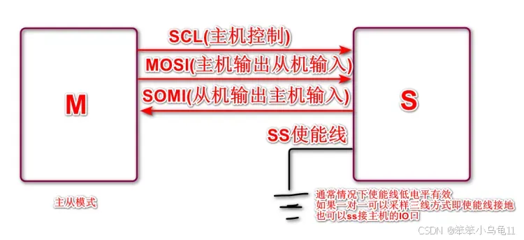

## SPI（Serial Peripheral Interface）是一种用于短距离、芯片间通信的同步串行通信协议
它是由Motorola公司开发的，并在许多微控制器、传感器、存储器和其他外设中得到了广泛应用。SPI协议的主要特点是其高速度、全双工通信能力和相对简单的接口设计。

### SPI的基本组成部分：
SPI接口通常包括以下四个信号线：
	
1. MOSI（Master Out Slave In）：这是主设备向从设备发送数据的信号线。
2. MISO（Master In Slave Out）：这是从设备向主设备发送数据的信号线。
3. SCK（Serial Clock）：这是**时钟信号线**，由主设备产生，用于同步数据的发送和接收。
4. SS/CS（Slave Select/Chip Select）：这是一个或多个信号线，用于选择特定的从设备。当一个从设备的SS/CS被激活（通常为低电平）时，它才参与通信。

### SPI的工作原理：
	
- SPI通信是基于主从架构的，其中至少有一台主设备和一台或多台从设备。主设备控制通信的时序和速率。
- 数据通过MOSI和MISO线同时传输，实现了全双工通信。
- 主设备通过SCK线提供时钟信号，从设备根据这个时钟信号同步接收和发送数据。
- SS/CS线用于选择具体的从设备，只有当SS/CS被激活时，相应的从设备才会响应。

**一主一从结构：**

**单主多从结构：**

**SPI时序图：**

### 传输速度
SPI没有官方标准定义严格的速度等级，其速度极限主要取决于主从设备硬件的能力和系统设计。

|级别	|大致速率范围	|说明|
|----------------|------------------|----------------|
|低速|	1 - 10 Mbps|	常见于简单的传感器、ADC/DAC转换器等。
|中速|	10 - 50 Mbps|	最常见的范围。多数MCU的SPI外设、SD卡、Flash存储器、显示屏等都工作在此区间。
|高速|	50 - 100+ Mbps|	高性能MCU（如STM32H7、ESP32）、专用SPI控制器、某些高速SRAM或QSPI Flash可以达到的速度。

### 通信距离 (Distance)
SPI的通信距离甚至比I2C还要短，通常严格限制在**板级范围内**。

|场景|	大致距离|	说明|
|-----------------|--------------------|-----------------|
|典型板级应用	|< 10 cm|	同一块PCB上的芯片之间通信。这是SPI最核心的使用场景。
|通过排线连接	|< 25 cm|	通过高质量的屏蔽排线（如FFC/FPC）连接到板载模块（如显示屏、摄像头）。
|长距离应用	|> 25 cm|	极度不推荐！ 几乎必然失败，或需要极端措施。

#### 限制距离的主要因素（比I2C更严重）
- 信号数量多：SPI需要至少4根线（MOSI, MISO, SCLK, SS），比I2C多一倍。长距离布线成本高，且所有线缆的延迟要尽可能一致。

- 单端信号，无应答机制：和I2C一样，SPI使用单端信号，抗干扰能力差。更糟糕的是，SPI没有硬件错误检测或确认机制（如I2C的ACK位）。主设备无法知道从设备是否正确接收到了数据，只要时钟在响，它就假设通信是成功的。长距离传输中一旦受到干扰，数据会静默出错。

- 时钟 skew (偏移)：

    - SCLK（时钟）、MOSI（数据输出）、MISO（数据输入）等信号在长电缆中传播速度会有微小差异。

    - 当时钟频率很高时，这种延迟差异（skew）会导致建立时间（Setup Time）和保持时间（Hold Time） 违规。接收方在时钟边沿采样时，数据可能还未稳定或已发生变化，导致采样错误。

- 电容负载：长导线带来的电容会减缓信号边沿（特别是高速时钟SCLK），导致信号波形失真，最终无法被正确识别。