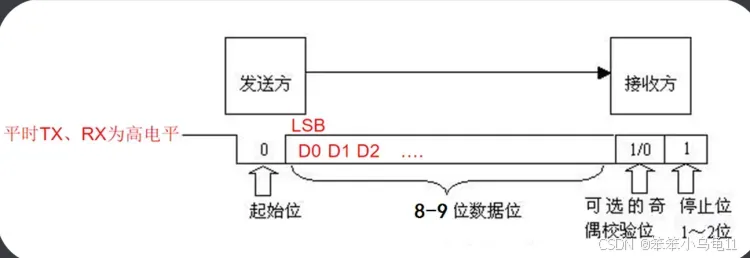
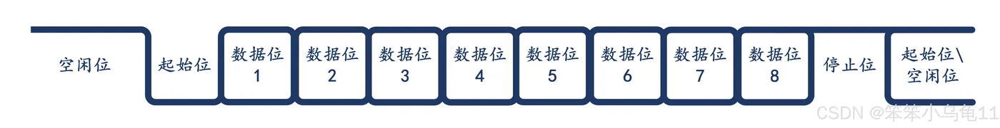
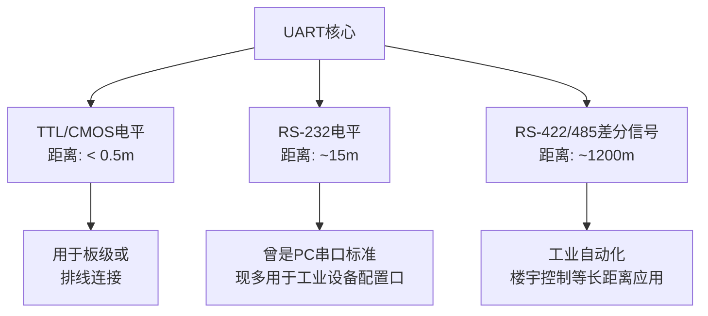

## UART（Universal Asynchronous Receiver/Transmitter）是一种用于异步串行通信的协议
常用于微控制器、计算机和外围设备之间的数据传输。UART允许设备通过**两条主要的信号线进行全双工通信**，这两条线分别是TXD（发送数据）和RXD（接收数据）。在更复杂的设置中，可能还会包含额外的控制和握手信号线。

### UART的特点：
	
**1.异步通信**：UART使用起始位和停止位来同步数据流，不需要外部时钟信号。这意味着发送方和接收方各自有独立的时钟，只要它们的时钟速率足够接近即可。
	
**2.串行数据传输**：数据一位接一位地发送，这与并行通信中同时发送多位数据不同。
	
**3.全双工操作**：UART支持**同时发送和接收数据**，这意味着TXD和RXD是独立的信号线。

### UART的通信过程：
	
- 起始位：一个低电平信号，表示数据传输的开始。
- 数据位：随后是数据位，通常为8位，每个位表示一个二进制数字（0或1）。
- 奇偶校验位（可选）：用于错误检测，可以是奇校验或偶校验。
- 停止位：一个高电平信号，表示数据传输的结束。停止位可以是1位、1.5位或2位长。

### UART的配置参数：
	
- 波特率：定义数据传输速率，单位是bits per second (bps)。例如，9600 baud意味着每秒传输9600个位。据搜索发现国际上好像有套标准，我一般会用9600，标准： 110、300、600、1200、1800、2400、4800、9600。
- 数据位：每个字符的位数，通常是5到8位。
- 奇偶校验：用于错误检测，可以是无校验、奇校验或偶校验。
- 停止位：停止位的数量，可以是1、1.5或2位。

<b>时序图（1/8NULL/1: 1个起始位，8个数据为，没有校验位，1个停止位）:</b>

### UART的传输速率
总的来说：<b>UART在速度和距离上提供了极大的灵活性，但其表现严重依赖于物理层转换芯片（如RS-232、RS-485等）。</b>

UART的速度由<b>波特率（Baud Rate）</b> 决定，即每秒传输的符号数。在UART中，1个符号通常代表1个比特（bit），因此波特率通常等于比特率（bps, bits per second）。

#### 标准波特率
UART支持非常广泛的波特率，常见标准值如下（单位：bps）：

|级别|	常见值|	说明|
|-----------------|------------------|-------------------|
|低速|	300, 600, 1200, 2400, 4800, 9600|	常用于老式调制解调器、与慢速MCU通信或长距离通信。
|中速	|19200, 38400, 57600|	现代嵌入式系统中非常常见的速率，是调试、GPS模块等的常用选择。
|高速|	115200, 230400, 460800, 921600|	高速应用，如MCU与Wi-Fi/蓝牙模块通信、高速数据日志传输。
|超高速	|1.5 Mbps, 3 Mbps, 4 Mbps+	|需要硬件UART和精确时钟支持，较少见。

注意：波特率必须**精确匹配**。通信双方必须设置为相同的波特率，否则会收到完全错误的数据。常见的误差容限在2-3% 以内。

### 通信距离

UART本身的**TTL/CMOS**电平版本通信距离极短，而它的真正实力在于与各种**物理层标准结合**后所能达到的距离。

|物理层标准	|典型距离|	说明|
|----------------|------------------|------------------|
|TTL/CMOS UART|	< 0.5 米|	直接使用MCU的引脚电平（通常0V为逻辑0，3.3V/5V为逻辑1）。抗干扰能力极差，只能用于同一块PCB或同一机箱内通过排线连接。
|RS-232	|~15 米|	使用负逻辑和高电压（通常±3V to ±15V）。+3V to +15V表示逻辑0，-3V to -15V表示逻辑1。较高的电压摆幅使其抗干扰能力比TTL强，曾是PC串口的标准。
|RS-422	|~1200 米 (低速时)	|使用全双工差分信号（一对线传输A、B）。抗共模干扰能力极强，可以实现长距离传输。一点对多点。
|RS-485	|~1200 米 (低速时)	|RS-422的变种，支持半双工/多点多主。只需两根线（A、B），是所有节点共享的总线。是工业环境长距离通信的绝对主力。

#### 限制距离的主要因素
- **信号衰减**：导线电阻导致长距离传输后信号电压下降。

- **电磁干扰 (EMI)**：长导线像天线一样会接收环境中的噪音，叠加在有用信号上。

- **地电位差**：在长距离通信中，通信两端的“地”可能存在电势差。这个电压会串入信号中，对于TTL/RS-232等参考地线的单端信号是致命的。**差分信号（RS-422/485）** 通过比较两条线间的电压差来抵消地电位差的影响。

- **波特率**：<b>波特率和距离是强相关的。</b>波特率越高，信号频率越高，越容易衰减和受干扰。要实现长距离通信，必须降低波特率。例如，RS-485在100米内可以达到10Mbps，而在1200米时，可能只能使用9600bps。