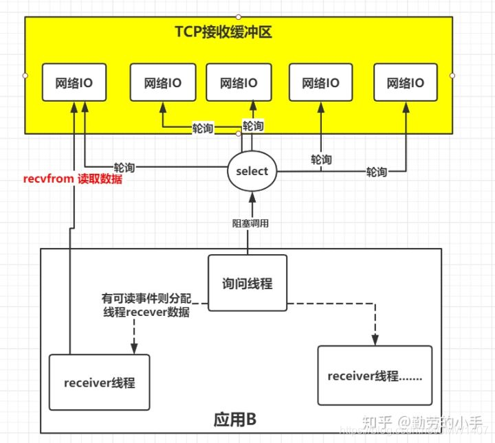
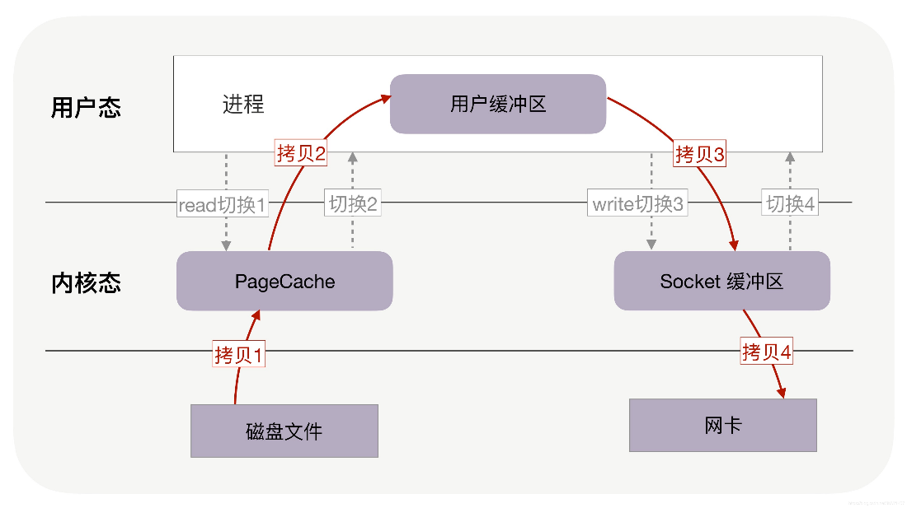
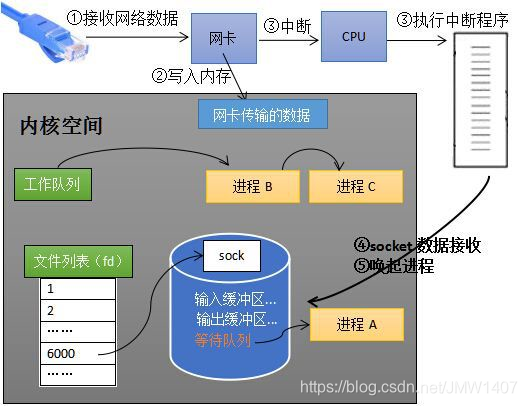
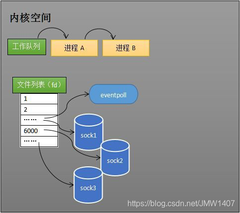
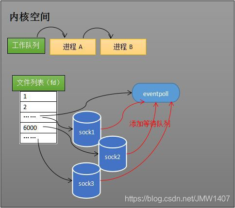
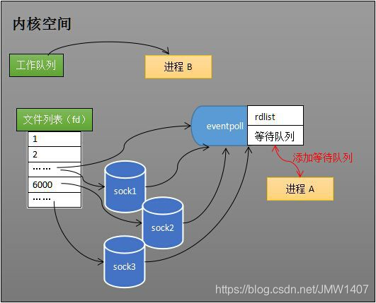
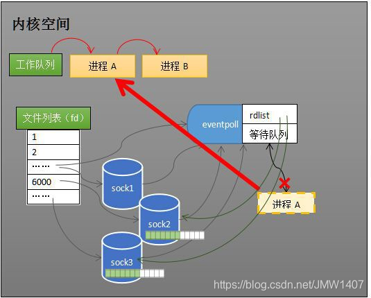

### 1、I/O 复用

I/O 复用模型的思路就是系统提供一种函数，`可以同时监听多个fd的操作`，（select、poll、epoll 等），应用线程通过调用该函数可以同时监控多个 fd，被监控的 fd 只要有任何一个数据状态准备就绪了，函数会返回可读状态，应用程序再调用 recvfrom 读取数据



事件：

**可读事件：** 文件描述符关联的内核读缓冲区可读，（内核缓冲区非空，有数据读取）

**可写事件：** 内核缓冲区不满，有空闲空间可写

通知机制：

事件发生的时候，主动通知。反面是轮询机制。

#### socket 和文件描述符

socket 也是文件，传输流程：

- 当 server 端监听到有连接时，应用程序会请求内核创建 socket
- socket 创建成功后会返回一个文件描述符给应用程序
- 当有数据包过来网卡时，内核会通过数据包的源端口，源 IP、目的端口等在内核维护的一个 ipcb 双向链表中找到对应的 socket，并将数据包赋值到该 socket 的缓冲区
- 应用程序请求读取 socket 中的数据时，内核会将数据拷贝到应用程序的内存空间，完成 socket 数据读取

服务器文件传输过程：server --\> client



内核接收网络数据：

- 计算机接收对端传送的数据（步骤 1）
- 数据经由网卡传送到内存（步骤 2）
- 网卡通过中断信号通知 CPU 有数据到达，CPU 执行中断程序（步骤 3）
  - 先将网络数据写入到对应 socket 的接收缓冲区里面（步骤 4）
  - 唤醒进程 A（步骤 5），再将进程 A 放入到工作队列
- 

epoll 是一种 I/O 事件通知机制，是 linux 内核实现 I/O 多路复用的实现，在一个操作里同时监听多个输入输出源，在其中一个或多个输入输出源可用的时候返回，进行读写操作。

## epoll_create：文件描述符的创建

- epoll 需要使用一个额外的文件描述符，来唯一标识内核中的事件表。
- epoll 把用户关心的文件描述符放在内核的一个事件表中，无须像 select 和 poll 那样每次调用都重复传入文件描述符集或事件集
- 调用 epoll_create，内核除了帮我们在 epoll 文件系统里建立 file 节点（epoll_create 创建的文件描述符），在内核 cache 里建红黑树用于存储 epoll_ctl 传来的 socket 外，还会建立一个 list 链表，用于存储事件就绪的事件（调用 epoll_create 方法，内核会跟着创建一个 eventpoll 对象）
- 
- eventpoll 对象和 socket 一样，也会有等待队列
- 创建一个代表 epoll 的 eventpoll 对象是必须的，内核要维护“就绪列表”等数据，“就绪列表”可以作为 eventpoll 的成员

```c++
struct eventpoll{

spin_lock_t lock; // 对本数据结构的访问

struct mutex mtx; // 防止使用时被删除

wait_queue_head_t wq; // sys_epoll_wait()使用的等待队列

wait_queue_head_t poll_wait; //file-\>poll()使用的等待队列

struct list_head rdlist; //事件满足条件的链表

struct rb_root rbr; // 用于管理所有fd的红黑树

struct epitem \*ovflist; // 将事件到达的fd进行链接起来发送至用户空间

}
```

epoll_create 创建额外的文件描述符，来唯一标识内核中的这个内核事件表（eventpoll 对象）

```c++
# include\<sys/epoll.h\>

int epoll_create(int size);

@size: size参数现在并不起作用，只是给内核一个提示，告诉内核应该如何为内部数据结构划分初始大小

@return: 文件描述符epollfd

```

注意：返回的文件描述符也会占用一个 fd 值，在 linux 下如果查看/proc/进程 id/fd，所以在使用完 epoll 后，必须调用 close()关闭，否则可能导致 fd 被耗尽。

## epoll_ctl: 注册监控事件

创建 epoll 对象后，可以用 epoll_ctl 添加或删除要监听的 socket。



```c++
\# include\<sys/epoll.h\>

int epoll_ctl(int epfd, int op, int fd, struct epoll_event \*event);

/\*

@epfd: epoll_create()的返回值

@op：指定操作类型。
- EPOLL_CTL_ADD: 注册新的fd到epfd中
- EPOLL_CTL_MOD: 修改已经注册的fd的监听事件
- EPOLL_CTL_DEL：从epfd中删除一个fd
@fd：需要监听的fd

@event：告诉内核需要监听的事件，是epoll_event结构指针类型。
```

其中 events 描述如下：

```c++
struct epoll_event{

\_uint32_t event; // Epoll事件

epoll_data_t data; // 用户数据

}
- EPOLLIN：可读取非高优先级数据（重要，必用）
- EPOLLPRI：可读取高优先级数据
- EPOLLOUT：普通数据可写（重要，必用）
- EPOLLHUP：本端描述符产生一个挂断事件，默认监测事件
- EPOLLET：采用边沿触发事件通知（重要）
- EPOLLONESHOT：在完成事件通知后禁用检查
- EPOLLRDHUP：套接字对端关闭
- EPOLLERR：有错误发生
```

data 成员用于存储用户数据，类型 epoll_data_t 的定义如下：

```c++
typedef union epoll_data{

void \*ptr; //指定与fd相关的用户数据

int fd; // 指定事件所从属的目标文件描述符

uint32_t u32;

uint64_t u64;

}epoll_data_t;

@return: 成功：0，失败：-1
```

socket 收到数据后，中断程序会操作 eventpoll 对象，而不是直接操作进程。

### epoll_wait: 事件等待，返回就绪事件

当 socket 收到数据后，中断程序会给 eventpoll 的“就绪队列”添加 socket 引用。

eventpoll 对象相当于是 socket 和进程之间的中介，socket 的数据接收不直接影响进程，而是通过改变 eventpoll 的就绪列表来改变进程状态。

当程序执行 epoll_wait 时，如果就绪列表（rdlist）已经引用 socket，epoll_wait 直接返回，如果 rdlist 为空，阻塞进程。

- 1、某时刻进程 A 运行到了 epoll_wait，内核会将进程 A 放入 eventpoll 的等待队列，阻塞进程
  
- 2、当 socket 接收到数据，中断程序一方面修改 rdlist，一方面唤醒 eventpoll 等待队列中的进程，进程 A 再次进入运行状态。因为 rdlist 的存在，进程 A 可以知道哪些 socket 发生变化
- 
  epoll_wait 在一段超时时间内等待一组文件描述符上的事件，阻塞等待注册的事件发生，返回事件的数目。

```c++
# include\<sys/epoll.h\>

int epoll_wait(int epfd, struct epoll_event \*events, int maxevents, int timeout);

@epfd：epoll_create()的返回值

@events：用来记录被触发的events，大小受制于maxevents

@maxevents：设定最多监听多少个事件，0~65535，16位无符号数

@timeout：函数调用中阻塞时间上限

timeout = -1：调用一直阻塞，直到有文件描述符进入ready状态或者捕获到信号才返回

timeout = 0：用于非阻塞检测是否有描述符处于ready状态，不管结果如何，调用都立即返回

timeout \> 0: 调用将最多持续timeout时间，如果期间检测对象变为ready或者捕获到信号则返回，否则直到超时。

@return：成功：返回就绪的文件描述符个数;失败：-1
```

timeout 设计：

- 1、设置为-1，程序阻塞，后续任务没法执行
- 2、设置为 0，程序能运行，但即使没事件，程序也在空转，十分占用 CPU 时间
- 3、设置为 1、每次循环都会浪费 1ms 的阻塞时间，多次循环后性能损失比较明显
  - 为了避免该现象，通常向 epoll 再添加一个 fd，有其他任务执行时，直接向该 fd 随便写一个字节，将 epoll 唤醒从而跳过阻塞时间。
  - int event(unsigned int initval, int flags)

### LT/ET 使用过程

#### LT 水平触发（level Triggered)

- socket 接收缓冲区不为空，说明有数据可读，读事件一直触发
- socket 发送缓冲区不满，可以继续写入数据，写事件一直触发
- epoll_wait 的返回事件是 socket 的状态

##### LT 的处理过程：

1、accept 连接，添加到 epoll 中监听 EPOLLIN 事件

2、EPOLLIN 事件到达时，read fd 中的数据并处理

3、当需要写出数据时，把数据 write 到 fd 中，如果数据较大，无法一次性写出，再 epoll 中监听 EPOLLOUT 事件

4、EPOLLOUT 事件到达时，继续把数据 write 到 fd 中，数据写出完毕，在 epoll 中关闭 EPOLLOUT 事件

//LT 模式的工作流程

```c++
void lt( epoll_event* events, int number, int epollfd, int listenfd )

{

char buf[ BUFFER_SIZE ];

for ( int i = 0; i < number; i++ )

{

int sockfd = events[i].data.fd;

if ( sockfd == listenfd )

{

struct sockaddr_in client_address;

socklen_t client_addrlength = sizeof( client_address );

int connfd = accept( listenfd, ( struct sockaddr\* )&client_address, &client_addrlength );

addfd( epollfd, connfd, false );

}

else if ( events\[i\].events & EPOLLIN )

{

//只要socket读缓存中还有未读出的数据，这段代码就被触发

printf( "event trigger once\n" );

memset( buf, '\0', BUFFER_SIZE );

int ret = recv( sockfd, buf, BUFFER_SIZE-1, 0 );

if( ret <= 0 )

{

close( sockfd );

continue;

}

printf( "get %d bytes of content: %s\n", ret, buf );

}

else

{

printf( "something else happened \n" );

}

}

}
```

#### ET 边沿触发

- socket 的接收缓冲区状态变化时触发读事件，空的接收缓冲区刚接收到数据时触发读事件（从无到有）
- socket 的发送缓冲区状态变化，（从有到无）
- 仅在状态变化时触发事件

##### ET 的处理过程：

1、accept 连接，添加到 epoll 中监听 EPOLLIN \| EPOLLOUT 事件

2、当 EPOLLIN 事件到达时，read fd 中的数据并处理，read 需要一直读，直到返回 EAGAIN 为止

3、当需要写数据时，把数据 write 到 fd 中，直到数据全部写完，或者 write 返回 EAGAIN

4、当 EPOLLOUT 事件到达时，继续把数据 write 到 fd 中，直到数据全部写完，或者 write 返回 EAGIN

ET 的要求是需要一直读写，直到返回 EAGAIN，否则就会遗漏事件。LT 的处理过程中，直到返回 EAGAIN 不是硬性要求，LT 比 ET 多了一个开关 EPOLLOUT 事件的步骤。

使用 ET 模式，需要按照以下规则设计：

1、在接到一个 I/O 事件通知后，立即处理该事件。程序在某个时刻应该在相应的文件描述符上尽可能多的执行 I/O

2、在 ET 模式下，在使用 epoll_ctl 注册文件描述符的事件时，应该把描述符设置为非阻塞的（重要）

程序采用**循环（`ET采用while循环，LT是if判断`）**来对文件描述符尽可能多的 I/O，若文件描述符被设置为可阻塞的，最终当没有更多的 I/O 可执行，I/O 系统调用会阻塞。因此，每个被检查的文件描述符通常应该设置为**非阻塞模式**。

//ET 模式的工作流程

```c++
void et( epoll_event* events, int number, int epollfd, int listenfd )

{

char buf[ BUFFER_SIZE ];

for ( int i = 0; i < number; i++ )

{

int sockfd = events[i].data.fd;

if ( sockfd == listenfd )

{

struct sockaddr_in client_address;

socklen_t client_addrlength = sizeof( client_address );

int connfd = accept( listenfd, ( struct sockaddr* )&client_address, &client_addrlength );

addfd( epollfd, connfd, true );

}

else if ( events[i].events & EPOLLIN )

{

//这段代码不会被重复触发，所以我们循环读取数据，以确保把socket读缓存中的所有数据读出

printf( "event trigger once\n" );

while( 1 )

{

memset( buf, '\0', BUFFER_SIZE );

int ret = recv( sockfd, buf, BUFFER_SIZE-1, 0 );

if( ret < 0 )

{

//对于非阻塞IO，下面条件成立表示数据已经全部读取完毕。

//此后，epoll就能再次触发sockfd上的EPOLLIN事件，已驱动下一次读操作

if( ( errno == EAGAIN ) || ( errno == EWOULDBLOCK ) )

{

printf( "read later\n" );

break;

}

close( sockfd );

break;

}

else if( ret == 0 )

{

close( sockfd );

}

else

{

printf( "get %d bytes of content: %s\n", ret, buf );

}

}

}

else

{

printf( "something else happened \n" );

}

}

}
```
