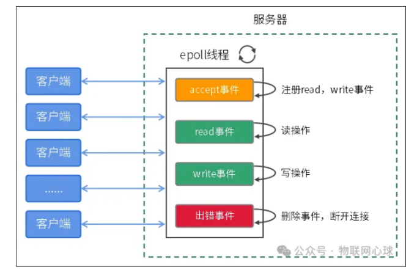
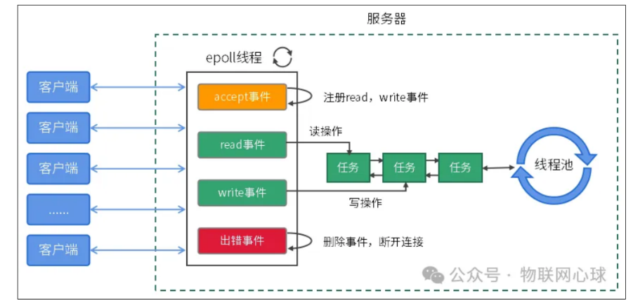
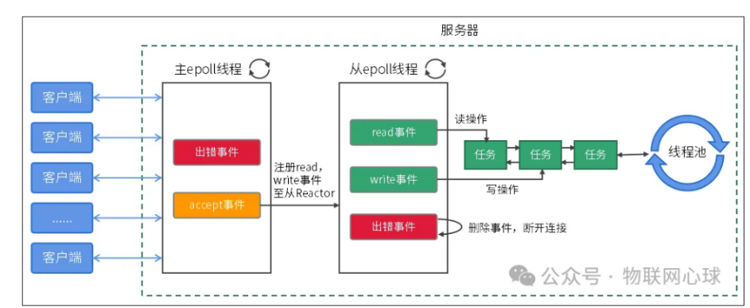

程序使用Reactor模型，并使用多线程提高并发度。为避免线程频繁创建和销毁带来的开销，使用线程池，在程序的开始创建固定数量的线程。使用epoll作为IO多路复用的实现方式。

百万并发是指一个系统能同时处理一百万以上的并发连接或请求。通常指网络服务器或应用程序能支持大量用户的同时访问而不会出现性能瓶颈或崩溃的情况。

### 百万并发性能瓶颈
#### （1）端口号限制
**TCP或UDP连接都涉及到一个概念：四元组**

包括：源IP、源端口、目的IP、目的端口


四元组信息是一个连接的身份信息。

理论上一台主机最多可以创建2^32\* 2^16 \* 2^32 \* 2^16个连接
#### 服务端
服务端绑定源IP（192.168.19.10）和源端口

服务端只有`目的IP和目的端口能够变化`，最大连接数为：

2^32 \* 2^16

#### 客户端
客户端绑定源IP、连接服务器IP和目标端口，只有**源端口**可以变化

实际源端口范围：1024 ~ 65535。

单主机测试百万连接，需要启动将近20万个不同源IP的客户端

#### （2）文件描述符限制

默认情况下，一个进程最多打开1024个文件描述符。

#### （3）内存限制

#### （4）线程数量限制

百万连接对应的客户端和服务端需要通过网络连接频繁的进行网络通信。

传统的做法是**每个连接创建一个线程，通过线程来进行数据收发**。

单主机完全不能支持100万个线程

1、一个线程默认需要8M栈空间，100万个连接需要7.6TB内存空间

2、CPU需要调度100万个线程，线程分不到时间片会饿死。

### Reactor模型
Reactor（反应堆）模型是一种<strong style="color:red;">基于事件驱动的</strong>设计模式。这种模式在处理大量并发请求时特别有效，允许一个或多个输入源（例如，客户端连接）被**非阻塞地处理**。

Reactor模式中，有一个或多个事件循环（Event Loop），负责调用注册地事件处理器，以响应发生地事件。

Netty，Nginx，Libevent，muduo等开源网络架构都应用了Reactor技术。

#### 分类：
单线程、多线程、主从、多进程。

多进程模型比较特殊，只有Nginx采用多进程模型。

##### （1）单线程Reactor模型



一个线程完成所有事件操作，对于Linux系统来说，**一个epoll线程**完成事件地监听、事件注册、读写操作、事件删除等操作。

缺点：只能使用处理器地一个CPU核，性能瓶颈在单个CPU核。

##### （2）多线程Reactor模型



在单线程模型的基础上改进，<strong style="color:red;">增加了线程池</strong>，通过线程池处理网络连接的读写操作。

`epoll线程负责事件监听和事件删除，将socket读写事件操作打包成任务插入任务队列，线程池不断从任务队列获取任务并异步执行任务`。

由于增加了线程池，可以通过设置线程池大小，合理的使用CPU核心。

缺点：单个epoll线程很容易成为性能瓶颈

##### （3）主从Reactor模型



**在多线程的基础上增加了更多的epoll进程。**

图所示是一主一从模式，也可以一主多从模式，`主epoll线程用来做事件监听，并添加读写事件至从epoll线程`。

从epoll线程监听到读写事件后，将读写事件插入任务队列，由线程池处理读写事件。

主从Reactor模型相对比较成熟，没有明显的性能瓶颈缺点。

#### 实现Reactor模型
Reactor模型可以拆分为：Reactor、事件管理器、线程池、任务队列

Reactor编程

##### （1）Reactor定义：
```c++
enumreactor_type {

MAIN_REACTOR,//主reactor

SUB_REACTOR,//从reactor

};

//reactor结构体

structreactor{

char\*name;//reactor名称

intefd;//epoll fd

enumreactor_type type;//reactor类型

};
```

reactor是一个struct reactor对象，对象成员efd用来绑定epoll，type用来区分reactor类型。

##### （2）事件管理器

// 事件处理函数类型
```c++
typedef void(*func)(void *arg);

// 事件定义

struct event{

struct list_head list;

int fd; // 事件绑定的socket

func handler; // 回调函数

void *arg; // 回调函数参数

};

// 新建事件

struct event* event_new(void){

return (struct event*)malloc(sizeof(struct event));

}

// 事件初始化

void event_init(struct event* ev, func handler, void *arg){

list_entry_init(&ev -> list);

ev->handler = handler;

ev->arg = arg;

}

// 删除事件

void event_free(struct event *ev){

if(ev->arg) free(ev->arg);

free(ev);

}
```
事件和socket绑定，epoll监听到新的socket连接时，创建struct event对象，对象的fd成员和socket进行绑定。

当epoll检测到EPOLLIN或EPOLLOUT时，需要通过socket确定struct event对象，在epoll注册事件时，需要将struct event对象地址传入epoll事件。
```c++
struct epoll_event ee;

ee.events = EPOLLIN \| EPOLLET;

ee.data.ptr = (void*)ev; // 将事件传入epoll
```
##### (3）线程池

##### 定义线程池
```c++
struct thread_pool{

struct list_head head; // 任务队列

uint32_t threads; // 线程池工作线程的数量

pthread_t *th;

pthread_mutex_t mutex;

pthread_cond_t cond;

bool done; // 线程池退出标志

};
```
##### 线程池处理函数
```c++
void *thread_proc(void *arg){

struct thread_pool *pool = (struct thread_pool*) arg;

while(!pool-\>done){

struct event* ev = thread_pool_get(pool);

if(!ev) continue;

ev->handler(ev->arg);

}

return NULL;

};

```
##### 线程池初始化

```c++
void thread_pool_init(struct thread_pool *pool,uint32_tthreads){

pool->done =false;

list_head_init(&pool->head);

pthread_mutex_init(&pool->mutex,NULL);

pthread_cond_init(&pool->cond,NULL);

pool->threads = threads;

pool->th = (pthread_t*)malloc(threads *sizeof(pthread_t));

for(inti =0; i < pool->threads; i++) {

pthread_create(&pool->th[i],NULL, thread_proc, (void*)pool);

}

}
```
##### 销毁线程池
```c++
void thread_pool_destroy(struct thread_pool *pool){

pool->done =true;

for(inti =0; i < pool->threads; i++) {

pthread_join(pool->th[i],NULL);

}

pthread_mutex_destroy(&pool->mutex);

pthread_cond_destroy(&pool->cond);

}
```
##### 线程池添加任务
```c++
voidthread_pool_add(struct thread_pool *pool, struct event* ev){

pthread_mutex_lock(&pool->mutex);

list_add(&ev->list, &pool->head);

pthread_cond_signal(&pool->cond);

pthread_mutex_unlock(&pool->mutex);

}
```
##### 从任务队列获取任务
```c++
struct event *thread_pool_get(struct thread_pool *pool){

pthread_mutex_lock(&pool->mutex);

while(is_empty(&pool->head) && !pool->done) {

structtimevalnow;

gettimeofday(&now,NULL);

structtimespecouttime;

outtime.tv_sec = now.tv_sec +1;

outtime.tv_nsec = now.tv_usec *1000;

pthread_cond_timedwait(&pool->cond, &pool->mutex, &outtime);

}

if(pool->done) {

pthread_mutex_unlock(&pool->mutex);

returnNULL;

}

structevent*ev= (structevent*)list_del(&pool->head);

pthread_mutex_unlock(&pool->mutex);

returnev;

}
```
##### （4）任务队列

任务队列是一个双向循环列表，用于缓存struct event对象
```c++
struct list_head{

struct list_head *prev, *next;

};

void list_entry_init(struct list_head *entry){

entry->prev = NULL;

entry->next = NULLl;

}

void list_head_init(struct list_head *head){

head->prev = head;

head->next = head;

}

// 添加
void list_add(struct list_head *new, struct list_head *head

{

struct list_head *next = head->next;

head->next =new;

new->prev = head;

new->next = next;

next->prev =new;

}

// 删除
struct list_head* list_del(struct list_head *head) {

if(head->prev == head)returnNULL;

struct list_head *prev = head->prev;

prev->prev->next = head;

head->prev = prev->prev;

returnprev;

}

bool is_empty(struct list_head *head) {

returnhead->next == head;

}
```
