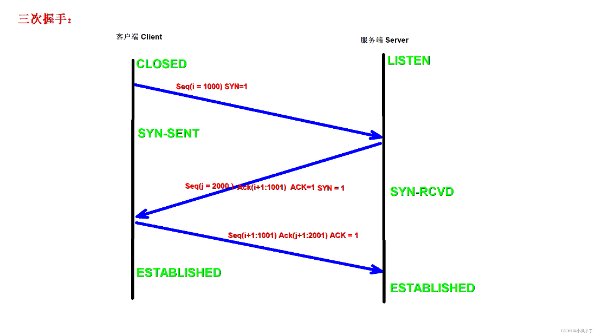
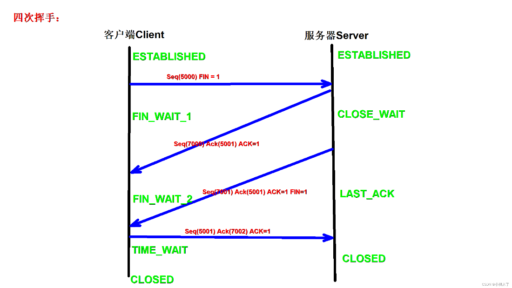

在建立和终止 TCP 连接时，使用了**三次握手和四次挥手**的机制。

### 三次握手（Three-Way Handshake）：

第一次握手：客户端发送一个`序列号为seq的带有SYN（建立连接）`标志的 TCP 包，指示客户端请求建立连接。

第二次握手：服务器收到客户端的请求后，发送`序列号带有SYN/ACk（建立连接/确认收到）`标志的 TCP 包，表示同意建立连接。

第三次握手：客户端收到服务器的确认后，再次发送一个带有`ACK（确认收到）`标志的 TCP 包，表示连接已经建立。

### 四次挥手（Four-Way Handshake）：

第一次挥手：当客户端想要终止连接时，发送一个带有`FIN（结束）`标志的 TCP 包，表示不再发送数据。

第二次挥手：服务器收到客户端结束通知后，发送一个带有`ACK（确认）`标志的 TCP 包，表示已经收到请求，并准备关闭连接。

第三次挥手：服务器结束发送数据，发送一个带有`FIN`标志的 TCP 包，表示服务器不再发送数据。

第四次挥手：客户端接收到服务器的结束通知后，发送一个带有`ACK`标志的 TCP 包，表示已经收到服务器的请求，并且同意关闭连接。

三次握手和四次挥手都是为了确保连接的可靠性和一致性，以及在建立和终止连接时的双向确认。
