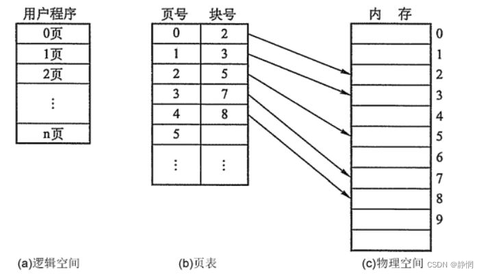

## 内存管理
操作系统的内存管理主要**负责内存的分配与回收**（`malloc` 函数：申请内存，`free`函数：释放内存），另外地址转换也就是将逻辑地址转换成相应的物理地址等功能也是操作系统内存管理做的事情

### 目的
最主要的就是**提高内存的利用率**，所谓的提高内存利用率，就是尽可能的在内存中多存储进程，这就涉及到为进程分配内存空间了。分配的方式主要是有两种——**连续分配和离散分配**。

### 分页系统地址映射
`内存管理单元（MMU）`管理着**地址空间和物理内存的转换**，其中的页表（`Page table`）存储着页（程序地址空间）和页框（物理内存空间）的映射表。<b>一个虚拟地址分成两个部分，一部分存储页面号，一部分存储偏移量。</b>

### 内存管理机制
内存管理机制可以简单分为**连续分配管理方式**和**非连续分配管理方式**这两种。

连续分配管理方式是指为一个用户程序分配一个连续的内存空间，常见的如 **块式管理** 。

同样地，非连续分配管理方式允许一个程序使用的内存分布在离散或者说不相邻的内存中，常见的如**页式管理** 和 **段式管理**。

- **块式管理**：远古时代的计算机操系统的内存管理方式。将内存分为几个固定大小的块，每个块中只包含一个进程。如果程序运行需要内存的话，操作系统就分配给它一块，如果程序运行只需要很小的空间的话，分配的这块内存很大一部分几乎被浪费了。这些在<b>每个块中未被利用的空间，我们称之为碎片。</b>
- **页式管理**：<b>把主存分为大小相等且固定的一页一页的形式</b>，页较小，相对相比于块式管理的划分力度更大，提高了内存利用率，减少了碎片。<b>页式管理通过页表对应逻辑地址和物理地址。</b>
- **段式管理**： 页式管理虽然提高了内存利用率，但是页式管理其中的页实际并无任何实际意义。 段式管理把主存分为一段段的，段是有实际意义的，<b>每个段定义了一组逻辑信息，</b>例如,有主程序段 MAIN、子程序段 X、数据段 D及栈段 S 等。 <b>段式管理通过段表对应逻辑地址和物理地址。</b>
- **段页式管理机制**：段页式管理机制结合了段式管理和页式管理的优点。简单来说段页式管理机制就是把主存先分成若干段，每个段又分成若干页，也就是说 段页式管理机制 中<b>段与段之间以及段的内部的都是离散的。</b>

### 什么是分页？
把内存空间划分为**大小相等且固定的块**，作为主存的基本单位。因为程序数据存储在不同的页面中，而页面又离散的分布在内存中，因此需要**一个页表来记录映射关系**，以实现从页号到物理块号的映射。

访问分页系统中内存数据需要**两次的内存访问** (一次是从内存中访问页表，从中找到指定的物理块号，加上页内偏移得到实际物理地址；第二次就是根据第一次得到的物理地址访问内存取出数据)。

### 什么是分段？
<b>分页是为了提高内存利用率，而分段是为了满足程序员在编写代码的时候的一些逻辑需求(比如数据共享，数据保护，动态链接等)。</b>

分段内存管理当中，<b>地址是二维的，一维是段号，二维是段内地址；其中每个段的长度是不一样的，而且每个段内部都是从0开始编址的。</b>由于分段管理中，每个段内部是连续内存分配，但是段和段之间是离散分配的，因此也存在一个逻辑地址到物理地址的映射关系，相应的就是段表机制。

### 分页和分段有什么区别？
- 分页对程序员是透明的，但是分段需要程序员显式划分每个段。
- 分页的地址空间是一维地址空间，分段是二维的。
- 页的大小不可变，段的大小可以动态改变。
- 分页主要用于实现虚拟内存，从而获得更大的地址空间；分段主要是为了使程序和数据可以被划分为逻辑上独立的地址空间并且有助于共享和保护

### 块表
为了**解决虚拟地址到物理地址的转换速度**，操作系统在**页表方案**（是一种特殊的数据结构，记录着页面和页框的对应关系）的基础之上引入了 **快表** 来加速虚拟地址到物理地址的转换。我们可以把快表理解为一种特殊的高速缓冲存储器（`Cache`），其中的内容是页表的一部分或者全部内容。作为页表的 `Cache`，它的作用与页表相似，但是提高了访问速率。

由于采用页表做地址转换，读写内存数据时 CPU 要访问两次主存。有了快表，有时只要访问一次高速缓冲存储器，一次主存，这样可加速查找并提高指令执行速度。

#### 转换流程
- 根据虚拟地址中的页号查快表；
- 如果该页在快表中，直接从快表中读取相应的物理地址；
- 如果该页不在快表中，就访问内存中的页表，再从页表中得到物理地址，同时将页表中的该映射表项添加到快表中；
- 当快表填满后，又要登记新页时，就按照一定的淘汰策略淘汰掉快表中的一个页。

### 多级页表
引入多级页表的主要目的是**为了避免把全部页表一直放在内存中占用过多空间**，特别是那些根本就不需要的页表就不需要保留在内存中。<b>多级页表属于时间换空间的典型场景。</b>

为了提高内存的空间性能，提出了多级页表的概念；但是提到空间性能是以浪费时间性能为基础的，因此<b>为了补充损失的时间性能，提出了快表（即 TLB）的概念</b>。 不论是快表还是多级页表实际上都利用到了程序的局部性原理，局部性原理在后面的虚拟内存这部分会介绍到。

### 逻辑地址和物理地址
我们编程一般只有可能和逻辑地址打交道，比如在 C 语言中，<b>指针里面存储的数值就可以理解成为内存里的一个地址</b>，这个地址也就是我们说的逻辑地址，逻辑地址由操作系统决定。物理地址指的是真实物理内存中地址，更具体一点来说就是<b>内存地址寄存器中的地址。物理地址是内存单元真正的地址。</b>

### CPU寻址
现代处理器使用的是一种称为 **虚拟寻址(Virtual Addressing)** 的寻址方式。<b>使用虚拟寻址，CPU 需要将虚拟地址翻译成物理地址，这样才能访问到真实的物理内存。</b> 实际上完成虚拟地址转换为物理地址转换的硬件是 CPU 中含有一个被称为 内存管理单元（Memory Management Unit, MMU） 的硬件。如下图所示：

### 为什么要有虚拟地址空间呢？
没有虚拟地址空间的时候，<b>程序都是直接访问和操作的都是物理内存</b>

会存在以下的问题：

- 用户程序可以访问任意内存，寻址内存的每个字节，这样就很容易（有意或者无意）破坏操作系统，造成操作系统崩溃。
- 想要同时运行多个程序特别困难，比如你想同时运行一个微信和一个 QQ 音乐都不行。为什么呢？举个简单的例子：微信在运行的时候给内存地址 1xxx 赋值后，QQ 音乐也同样给内存地址 1xxx 赋值，那么 QQ 音乐对内存的赋值就会覆盖微信之前所赋的值，这就造成了微信这个程序就会崩溃。

<b>如果直接把物理地址暴露出来的话会带来严重问题，比如可能对操作系统造成伤害以及给同时运行多个程序造成困难。</b>

<b>通过虚拟地址访问内存有以下优势：</b>

程序可以使用<b>一系列相邻的虚拟地址来访问物理内存中不相邻的大内存缓冲区。</b>

程序可以使用一系列虚拟地址来访问大于可用物理内存的内存缓冲区。当物理内存的供应量变小时，内存管理器会将物理内存页（通常大小为4 KB）保存到磁盘文件。数据或代码页会根据需要在物理内存与磁盘之间移动。

<b>不同进程使用的虚拟地址彼此隔离。</b>一个进程中的代码无法更改正在由另一进程或操作系统使用的物理内存。