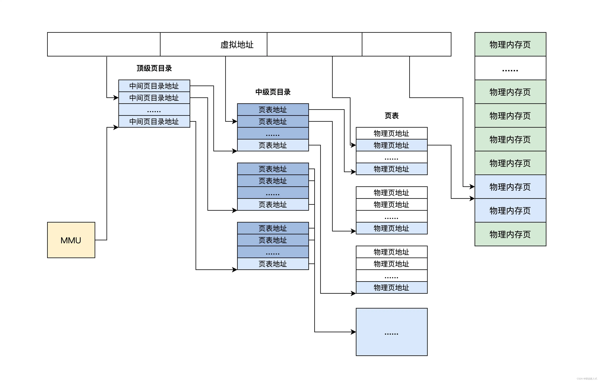
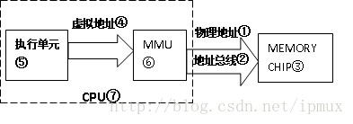
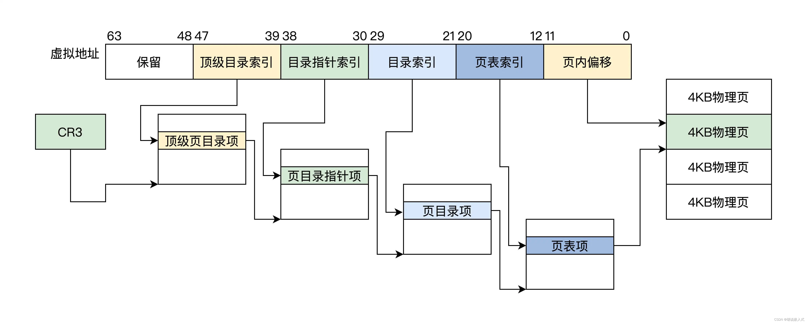

## 页表
它描述了**虚拟地址到物理地址的转换关系**，也可以说是虚拟页到物理页的映射关系，所以称为页表。

为了增加灵活性和节约物理内存空间（因为页表是放在物理内存中的），所以页表中并不存放虚拟地址和物理地址的对应关系，只存放物理页面的地址，<b>MMU 以虚拟地址为索引去查表返回物理页面地址，</b>而且页表是分级的，总体分为三个部分：一个顶级页目录，多个中级页目录，最后才是页表，逻辑结构图如下.

从上面可以看出，<b>一个虚拟地址被分成从左至右四个位段。</b>

第一个位段索引顶级页目录中一个项，该项指向一个中级页目录，

然后用第二个位段去索引中级页目录中的一个项，该项指向一个页表，

再用第三个位段去索引页表中的项，该项指向一个物理页地址，
最后用第四个位段作该物理页内的偏移去访问物理内存。

<b>这就是 MMU 的工作流程。</b>

## 虚拟地址/物理地址
如果处理器没有MMU，CPU内部执行单元产生的内存地址信号将直接通过地址总线发送到芯片引脚，被内存芯片接收，这就是物理地址(physical address)，简称PA。英文physical代表物理的接触，所以PA就是与内存芯片physically connected的总线上的信号。

如果MMU存在且启用，CPU执行单元产生的地址信号在发送到内存芯片之前将被MMU截获，这个地址信号称为虚拟地址（virtual address），简称VA，MMU会负责把VA翻译成另一个地址，然后发到内存芯片地址引脚上，即VA映射成PA，如下图:

<b>所以物理地址①是通过CPU对外地址总线②传给Memory Chip③使用的地址;而虚拟地址④是CPU内部执行单元⑤产生的，发送给MMU⑥的地址。</b>

硬件上MMU⑥一般封装于CPU芯片⑦内部，所以虚拟地址④一般只存在于CPU⑦内部，到了CPU外部地址总线引脚上②的信号就是MMU转换过的物理地址①。

软件上MMU对用户程序不可见，在启用MMU的平台上（没有MMU不必说，只有物理地址，不存在虚拟地址），<b>用户C程序中变量和函数背后的数据/指令地址等都是虚拟地址，这些虚拟内存地址从CPU执行单元⑤发出后，都会首先被MMU拦截并转换成物理地址，然后再发送给内存。</b>

也就是说用户程序运行*pA =100;"这条赋值语句时，假设debugger显示指针pA的值为0x30004000（虚拟地址），但此时通过硬件工具（如逻辑分析仪）侦测到的CPU与外存芯片间总线信号很可能是另外一个值,如0x8000（物理地址）。

当然对一般程序员来说，只要上述语句运行后debugger显示0x30004000位置处的内存值为100就行了，根本无需关心pA的物理地址是多少。但进行OS移植或驱动开发的系统程序员不同，他们必须清楚软件如何在幕后辅助硬件MMU完成地址转换。

## 页/页帧/页表/页表项(PTE)
<b>MMU是负责把虚拟地址映射为物理地址，</b>但凡"映射"都要解决两个问题：映射的最小单位（粒度）和映射的规则。

MMU中VA到PA<b>映射的最小单位称为页(Page)</b>，<b>映射的最低粒度是单个虚拟页到物理页，</b>页大小通常是`4K`，即一次最少要把4K大小的VA页块整体映射到4K的PA页块（从0开始4K对齐划分页块），页内偏移不变，如VA的一页0x30004000~0x30004fff被映射到PA的一页 0x00008000~0x00008fff，当CPU执行单元访问虚拟地址0x30004008，实际访问的物理地址是0x00008008（0x30004008和0x00008008分别位于虚实两套地址空间，互不相干，不存在重叠和冲突）。

以页为最小单位，就是不能把VA中某一页划分成几小块分别映射到不同PA，也不能把VA中属于不同页的碎块映射到PA某一页的不同部分，必须页对页整体映射。

<b>页帧（Page Frame）是指物理内存中的一页内存</b>，MMU虚实地址映射就是寻找物理页帧的过程，对这个概念了解就可以了。

MMU软件配置的核心是**页表（Page Table）**，它描述MMU的映射规则，<b>即虚拟内存哪(几)个页映射到物理内存哪(几)个页帧。</b>

页表由一条条代表映射规则的记录组成，每一条称为一个页表条目（Page Table Entry,即PTE），整个页表保存在片外内存，MMU通过查找页表确定一个VA应该映射到什么PA，以及是否有权限映射。

但如果MMU每次地址转换都到位于外部内存的页表上查找PTE，转换速度就会大大降低，于是出现了TLB

## TLB
TLB (Translation Lookaside Buffers)即**转换快表**，又简称快表，可以理解为MMU内部专用的存放页表的cache，保存着最近使用的PTE乃至全部页表。

MMU接收到虚拟地址后，首先在TLB中查找，如果找到该VA对应的PTE就直接转换，找不到再去外存页表查找，并置换进TLB。

TLB属于片上SRAM，访问速度快，通过TLB缓存PTE可以节省MMU访问外存页表的时间，从而加速虚实地址转换。TLB和CPU cache的工作原理一样，只是TLB专用于为MMU缓存页表。

## MMU的内存保护功能
既然所有发往内存的地址信号都要经过MMU处理，那让它只单单做地址转换，岂不是浪费了这个特意安插的转换层?显然它有能力对虚地址访问做更多的限定(就像路由器转发网络包的同时还能过滤各种非法访问)，比如**内存保护**。

<b>可以在PTE条目中预留出几个比特，用于设置访问权限的属性，如禁止访问、可读、可写和可执行等。</b>设好后，CPU访问一个VA时，MMU找到页表中对应PTE，把指令的权限需求与该PTE中的限定条件做比对，若符合要求就把VA转换成PA，否则不允许访问，并产生异常。

## 多级页表
直接看下面这张图吧，以64位的虚拟地址为例，其中CR3是CPU的一个寄存器，从图中也可以看出来用来存放顶级页目录项。所以MMU开启之后，首先就是读取CR3寄存器的内容

至于为啥要采取这种多级页表的形式：你想想，如果一个虚拟地址对应一个物理地址，我们把这种映射关系直接用一个映射表存起来，这是很占内存的，而且查询速度也很慢

## 操作系统和MMU
实际上MMU是为满足操作系统越来越复杂的内存管理而产生的。OS和MMU的关系简单说：
- 系统初始化代码会在内存中生成页表，然后把页表地址设置给MMU对应寄存器，使MMU知道页表在物理内存中的什么位置，以便在需要时进行查找。之后通过专用指令启动MMU，以此为分界，之后程序中所有内存地址都变成虚地址，MMU硬件开始自动完成查表和虚实地址转换。
- os初始化后期，创建第一个用户进程，这个过程中也需要创建页表，把其地址赋给进程结构体中某指针成员变量。<b>即每个进程都要有独立的页表。</b>

## MMU映射失败的几种情况
- 访问了受内核保护的页面，或者访问了只读的页面（比如c语言中存储字符串字面量和const变量的段），此时内核会抛出段错误
- 页面和页框没有产生映射关系，但是数据页已经被其他进程加载到内存中了，此时只需要建立页面和页框的映射关系，称为次级缺页中断
- 页面和页框没有产生映射关系，数据页也没有被加载到内存中（在磁盘上），此时需要发生磁盘io从磁盘中加载页到内存中，还需要建立页面和页框的映射关系，称为严重缺页中断。
除了第一点，第二第三都会以内核降低自身运行速度来修复，也就是老师说的，通过中断形成页表映射，然后再重新执行引起中断的命令（此时数据页已经在内存中并且建立映射关系了）。

## 总结
所以说，虚拟地址到物理地址的转换，最核心的是什么？是**页表**，无论中间转多少个弯(那些页目录项啥的)，最终都会指向页表，而<b>页表中存放着物理页地址</b>

这里扩展一点，所以说，进程空间的隔离是怎么做到呢？我们知道每个进程享有互不干扰的4GB的虚拟空间，按我们上面说的，可以推测到，<b>不同进程最终经过MMU地址转换，会指向不同的页表，从而完成了地址的隔离</b>