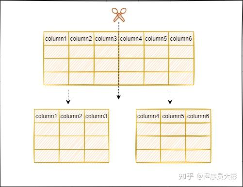
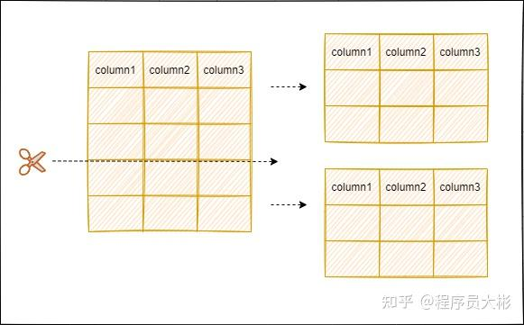

### MySQL主要分为 Server 层和存储引擎层：
- Server 层：主要包括连接器、查询缓存、分析器、优化器、执行器等，所有跨存储引擎的功能都在这一层实现，比如存储过程、触发器、视图，函数等，还有一个通用的日志模块 binglog 日志模块。
- 存储引擎： 主要负责数据的存储和读取。server 层通过api与存储引擎进行通信。
### Server 层基本组件
- 连接器：当客户端连接 MySQL 时，server层会对其进行身份认证和权限校验。
- 查询缓存:执行查询语句的时候，会先查询缓存，先校验这个 sql 是否执行过，如果有缓存这个 sql，就会直接返回给客户端，如果没有命中，就会执行后续的操作。
- 分析器:没有命中缓存的话，SQL 语句就会经过分析器，主要分为两步，词法分析和语法分析，先看 SQL 语句要做什么，再检查 SQL 语句语法是否正确。
- 优化器：优化器对查询进行优化，包括重写查询、决定表的读写顺序以及选择合适的索引等，生成执行计划。
- 执行器：首先执行前会校验该用户有没有权限，如果没有权限，就会返回错误信息，如果有权限，就会根据执行计划去调用引擎的接口，返回结果。
### 分库分表
当单表的数据量达到1000W或100G以后，优化索引、添加从库等可能对数据库性能提升效果不明显，此时就要考虑对其进行切分了。切分的目的就在于减少数据库的负担，缩短查询的时间。

**数据切分可以分为两种方式：垂直划分和水平划分。**
#### 垂直划分
垂直划分数据库是根据业务进行划分，例如购物场景，可以将库中涉及商品、订单、用户的表分别划分出成一个库，通过降低单库的大小来提高性能。同样的，<strong style="color:red">分表的情况就是将一个大表根据业务功能拆分成一个个子表</strong>，例如商品基本信息和商品描述，商品基本信息一般会展示在商品列表，商品描述在商品详情页，可以将商品基本信息和商品描述拆分成两张表。

优点：**行记录变小**，数据页可以存放更多记录，在查询时减少I/O次数。

缺点：
- 主键出现冗余，需要管理冗余列；
- 会引起表连接JOIN操作，可以通过在业务服务器上进行join来减少数据库压力；
- 依然存在单表数据量过大的问题。
#### 水平划分
水平划分是根据一定规则，例如时间或id序列值等进行数据的拆分。比如根据年份来拆分不同的数据库。每个数据库结构一致，但是数据得以拆分，从而提升性能。

优点：**单库（表）的数据量得以减少，提高性能**；切分出的表结构相同，程序改动较少。

缺点：
- 分片事务一致性难以解决
- 跨节点join性能差，逻辑复杂
- 数据分片在扩容时需要迁移
### 什么是分区表？
分区是把一张表的数据分成N多个区块。分区表是一个独立的逻辑表，但是底层由多个物理子表组成。

当查询条件的数据分布在某一个分区的时候，查询引擎只会去某一个分区查询，而不是遍历整个表。在管理层面，如果需要删除某一个分区的数据，只需要删除对应的分区即可。

分区一般都是放在单机里的，用的比较多的是时间范围分区，方便归档。只不过分库分表需要代码实现，分区则是mysql内部实现。分库分表和分区并不冲突，可以结合使用。
