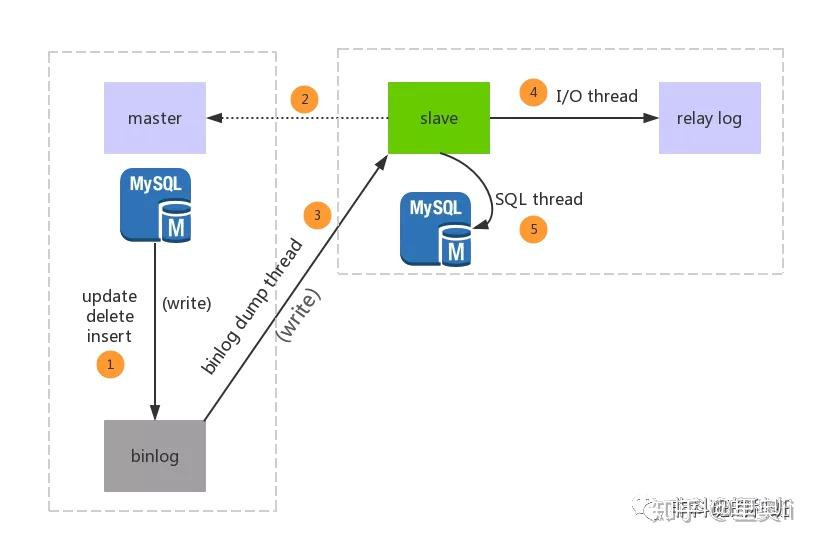

### 主从复制简介
MySQL主从复制的核心就是二进制日志binlog

二进制日志（BINLOG）记录了<strong style = "color:red">所有的 DDL（数据定义语言，创建库、表）语句和 DML（数据操纵语言，增删改）语句</strong>

在实际的生产中，为了解决Mysql的单点故障已经提高MySQL的整体服务性能，一般都会采用「主从复制」。

比如：在复杂的业务系统中，有一句sql执行后导致锁表，并且这条sql的的执行时间有比较长，那么此sql执行的期间导致服务不可用，这样就会严重影响用户的体验度。

**主从复制中分为「主服务器（master）「和」从服务器（slave）」，「主服务器负责写，而从服务器负责读」，Mysql的主从复制的过程是一个「异步的过程」。**

这样读写分离的过程能够是整体的服务性能提高，即使写操作时间比较长，也不影响读操作的进行。
### 主从复制的原理
首先放一张Mysql主从复制的原理图，总的来说Mysql的主从复制原理还是比较好理解的，原理非常的简单。

Mysql的主从复制中主要有三个线程：master、slave（I/O thread、SQL thread），**Master一条线程和Slave中的两条线程。**

master（binlog dump thread）主要负责`Master库中有数据更新的时候，会按照binlog格式，将更新的事件类型写入到主库的binlog文件中。`
并且，Master会创建log dump线程通知Slave主库中存在数据更新，这就是为什么<strong style="color:red">主库的binlog日志一定要开启的原因。</strong>

I/O thread线程在Slave中创建，该线程用于`请求Master，Master会返回binlog的名称以及当前数据更新的位置、binlog文件位置的副本。`

然后，将binlog保存在「`relay log（中继日志）」`中，中继日志也是记录数据更新的信息。

SQL线程也是在Slave中创建的，当`Slave检测到中继日志有更新，就会将更新的内容同步到Slave数据库中，这样就保证了主从的数据的同步。`

以上就是主从复制的过程，当然，主从复制的过程有不同的策略方式进行数据的同步，主要包含以下几种：
1. 同步策略：Master会等待所有的Slave都回应后才会提交，这个主从的同步的性能会严重的影响。
2. 半同步策略：Master至少会等待一个Slave回应后提交。
3. 异步策略：Master不用等待Slave回应就可以提交。
4. 延迟策略：Slave要落后于Master指定的时间。

对于不同的业务需求，有不同的策略方案，但是**一般都会采用最终一致性，不会要求强一致性**，毕竟强一致性会严重影响性能。

