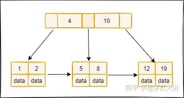
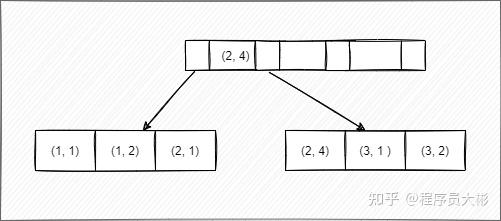

# 什么是索引？
索引是存储引擎用于提高数据库表的访问速度的一种数据结构。它可以比作一本字典的目录，可以帮你快速找到对应的记录。
索引一般存储在磁盘的文件中，它是占用物理空间的。

### 主键和索引的联系
**主键一定是索引，索引不一定是主键。**
#### 主键（Primary Key）是 数据库中唯一标识一行数据的字段组合
- 不能重复；
- 不能为 NULL；
- 一个表只能有一个主键；
- 自动带有唯一索引（B+树索引）。
**举例：**
CREATE TABLE user (  
id INT PRIMARY KEY, -- 主键  
name VARCHAR(100)  
);id 字段自动有一个唯一索引，供快速查找、排序。
#### 索引（Index）是 提高查询效率的辅助结构
- 可用于任何字段；
- 可是**唯一的（UNIQUE）或非唯一的**；
- 可建多个；
- 有助于加快 WHERE、ORDER BY、JOIN 等查询。
**举例：**
CREATE INDEX idx_name ON user(name);
给 name 字段建索引，提高按名字查询的效率。
**延伸：InnoDB 中的特殊关系**
- InnoDB 引擎下，**主键索引叫聚簇索引（Clustered Index）**；
- 表数据按主键顺序物理存储；
- 所有**二级索引（普通索引）都会引用主键值**作为回表依据。

### 索引的优缺点
优点：
- 加快数据查找的速度
- 为用来排序或者是分组的字段添加索引，可以加快分组和排序的速度
- 加快表与表之间的连接
缺点：
- 建立索引需要占用物理空间
- 会降低表的增删改的效率，因为每次对表记录进行增删改，需要进行动态维护索引，导致增删改时间变长

### 索引的作用
数据是存储在磁盘上的，查询数据时，如果没有索引，会加载所有的数据到内存，依次进行检索，读取磁盘次数较多。有了索引，就不需要加载所有数据，因为**B+树的高度一般在2-4层**，最多只需要读取2-4次磁盘，查询速度大大提升。

B+树索引通常只有2-4层，核心在于**磁盘I/O次数。**
数据库索引存在的首要目的，**就是为了减少查找数据时需要访问磁盘的次数**。磁盘I/O（输入/输出）相对于内存访问来说，速度极慢（相差几个数量级）。因此，**数据库设计的核心优化目标就是最小化磁盘I/O次数。**
B+树之所以高效，是因为一次磁盘I/O可以读取一个完整的节点（页），这个节点内包含了大量的键（Key）。树的高度直接决定了从根节点遍历到叶子节点所需的最大磁盘I/O次数。
树的高度 = 查询时最大的磁盘 I/O 次数
所以，B+树被设计成又宽又矮的“胖树”，而不是又窄又高的“瘦树”。2-4层的高度意味着最多只需要2到4次磁盘I/O就能在数十亿条记录中找到任何一条数据，这性能是极其恐怖的。
**为什么不能设计得更矮？（比如只有1层）**
1层B+树就是一个平铺的数组。虽然一次查询可能只需要1次I/O，但插入、删除和范围查询的效率会极低，因为需要操作整个巨大的数组，完全失去了树状结构的优势。**B+树的“矮”是在保证了高效增删改查能力前提下的最优解。**
### 什么情况下需要建索引？
1.  经常用于查询的字段
2.  经常用于连接的字段建立索引，可以加快连接的速度
3.  经常需要排序的字段建立索引，因为索引已经排好序，可以加快排序查询速度

# 什么情况下不建索引？
1.  where条件中用不到的字段不适合建立索引
2.  表记录较少。比如只有几百条数据，没必要加索引。
3.  需要经常增删改。需要评估是否适合加索引
4.  参与列计算的列不适合建索引
5.  区分度不高的字段不适合建立索引，如性别，只有男/女/未知三个值。加了索引，查询效率也不会提高。

### 索引的数据结构
索引的数据结构主要有**B+树和哈希表**，对应的索引分别为**B+树索引和[哈希索引](https://zhida.zhihu.com/search?content_id=238751921&content_type=Article&match_order=1&q=%E5%93%88%E5%B8%8C%E7%B4%A2%E5%BC%95&zhida_source=entity)**。
InnoDB引擎的索引类型有B+树索引和哈希索引，默认的索引类型为B+树索引。

## B+树索引
B+ 树是基于B 树和叶子节点顺序访问指针进行实现，它具有B树的平衡性，并且通过顺序访问指针来提高区间查询的性能。
在 B+ 树中，节点中的key从左到右递增排列，如果某个指针的左右相邻key分别是 keyi 和 keyi+1，则该指针指向节点的所有key大于等于 keyi 且小于等于 keyi+1。

进行查找操作时，首先在根节点进行二分查找，找到key所在的指针，然后递归地在指针所指向的节点进行查找。直到查找到叶子节点，然后在叶子节点上进行二分查找，找出key所对应的数据项。
MySQL 数据库使用最多的索引类型是BTREE索引，底层基于B+树数据结构来实现。

## 哈希索引
哈希索引是基于哈希表实现的，对于每一行数据，存储引擎会对索引列进行哈希计算得到哈希码，并且哈希算法要尽量保证不同的列值计算出的哈希码值是不同的，将哈希码的值作为哈希表的key值，将指向数据行的指针作为哈希表的value值。这样查找一个数据的时间复杂度就是O(1)，一般多用于精确查找。
#### Hash索引和B+树索引的区别？
- 哈希索引不支持排序，因为哈希表是无序的。
- 哈希索引不支持范围查找。
- 哈希索引不支持模糊查询及多列索引的最左前缀匹配。
- 因为哈希表中会存在哈希冲突，所以哈希索引的性能是不稳定的，而B+树索引的性能是相对稳定的，每次查询都是从根节点到叶子节点。
#### 为什么B+树比B树更适合实现数据库索引？
- **由于B+树的数据都存储在叶子结点中，叶子结点均为索引**，方便扫库，只需要扫一遍叶子结点即可，但是B树因为其分支结点同样存储着数据，我们要找到具体的数据，需要进行一次中序遍历按序来扫，所以B+树更加适合在区间查询的情况，而在数据库中基于范围的查询是非常频繁的，所以通常B+树用于数据库索引。
- B+树的节点只存储索引key值，具体信息的地址存在于叶子节点的地址中。这就使以页为单位的索引中可以存放更多的节点。减少更多的I/O支出。
- B+树的查询效率更加稳定，任何关键字的查找必须走一条从根结点到叶子结点的路。所有关键字查询的路径长度相同，导致每一个数据的查询效率相当

# 索引有什么分类？
1、**主键索引**：名为primary的唯一非空索引，不允许有空值。
2、**唯一索引**：索引列中的值必须是唯一的，但是允许为空值。唯一索引和主键索引的区别是：唯一索引字段可以为null且可以存在多个null值，**而主键索引字段不可以为null**。
- 唯一索引的用途：唯一标识数据库表中的每条记录，主要是用来防止数据重复插入。创建唯一索引的SQL语句如下：
ALTER TABLE table_name  
ADD CONSTRAINT constraint_name UNIQUE KEY(column_1,column_2,...);
3、**组合索引**：在表中的多个字段组合上创建的索引，只有在查询条件中使用了这些字段的左边字段时，索引才会被使用，使用组合索引时需遵循最左前缀原则。
4、全文索引：只能在==CHAR==、==VARCHAR==和==TEXT==类型字段上使用全文索引。
5、普通索引：普通索引是最基本的索引，它没有任何限制，值可以为空。

## 什么是最左匹配原则？
如果 SQL 语句中用到了组合索引中的最左边的索引，那么这条 SQL 语句就可以利用这个组合索引去进行匹配。当遇到范围查询(==\>==、==\<==、==between==、==like==)就会停止匹配，后面的字段不会用到索引。
对==(a,b,c)==建立索引，查询条件使用 a/ab/abc 会走索引，使用 bc 不会走索引。
对==(a,b,c,d)==建立索引，查询条件为==a = 1 and b = 2 and c \> 3 and d = 4==，那么a、b和c三个字段能用到索引，而d无法使用索引。因为遇到了范围查询。
如下图，对(a, b) 建立索引，a 在索引树中是全局有序的，而 b 是全局无序，局部有序（当a相等时，会根据b进行排序）。直接执行==b = 2==这种查询条件无法使用索引。

当a的值确定的时候，b是有序的。例如==a = 1==时，b值为1，2是有序的状态。当==a = 2==时候，b的值为1，4也是有序状态。 当执行==a = 1 and b = 2==时a和b字段能用到索引。而执行==a \> 1 and b = 2==时，a字段能用到索引，b字段用不到索引。因为a的值此时是一个范围，不是固定的，在这个范围内b值不是有序的，因此b字段无法使用索引。

## 什么是聚集索引？
InnoDB使用表的**主键构造主键索引树，同时叶子节点中存放的即为整张表的记录数据。**
- 每个表只能有一个聚集索引
- 主键默认
**优点**：
- 范围查询性能极佳
- 减少I/O操作（相关数据物理上相邻）
- 对于ORDER BY和GROUP BY操作效率高
**缺点**：
- 更新代价高（可能导致数据物理移动）
- 如果基于非连续键（如GUID），会导致大量碎片
聚集索引叶子节点的存储是逻辑上连续的，使用双向链表连接，叶子节点按照主键的顺序排序，因此对于主键的排序查找和范围查找速度比较快。
聚集索引的叶子节点就是整张表的行记录。InnoDB 主键使用的是聚簇索引。聚集索引要比非聚集索引查询效率高很多。
对于==​InnoDB​==来说，聚集索引一般是表中的主键索引，如果表中没有显示指定主键，则会选择表中的第一个不允许为==​NULL​==的唯一索引。
如果没有主键也没有合适的唯一索引，那么==​InnoDB​==内部会生成一个隐藏的主键作为聚集索引，这个隐藏的主键长度为6个字节，它的值会随着数据的插入自增。
<table>
<colgroup>
<col style="width: 100%" />
</colgroup>
<thead>
<tr class="header">
<th>
-- 创建带有聚集索引的表（主键自动成为聚集索引）

CREATE TABLE Employees (

EmployeeID INT PRIMARY KEY, -- 聚集索引

Name VARCHAR(100),

Department VARCHAR(50)

);

-- 或者显式指定聚集索引

CREATE CLUSTERED INDEX IX_Employees_Department ON Employees(Department);
</th>
</tr>
</thead>
<tbody>
</tbody>
</table>

# 什么是覆盖索引？
**一个包含查询所需所有字段的索引，查询可以完全通过索引完成而无需访问表数据。**
**特点**：
- **包含所有查询列**：索引包含SELECT、WHERE、JOIN、ORDER BY等子句中用到的所有列
- 避免回表：不需要从数据页中查找数据（Index-Only Scan）
- 可以是非聚集：覆盖索引可以是二级索引（非聚集索引）
**优点**：
- 极大减少I/O操作（不需要访问数据页）
- 提高查询性能（特别是对大型表）
- 减少锁争用（不需要锁定数据行）
**缺点**：
- 增加存储空间（索引包含更多列）
- 增加插入/更新开销（需要维护更大的索引）

<table>
<colgroup>
<col style="width: 100%" />
</colgroup>
<thead>
<tr class="header">
<th>
-- 创建覆盖索引

CREATE INDEX IX_Employees_Covering ON Employees(Department) INCLUDE (Name);

-- 查询可以被该索引覆盖

SELECT Name FROM Employees WHERE Department = 'IT';
</th>
</tr>
</thead>
<tbody>
</tbody>
</table>

| 特性         | 聚集索引               | 覆盖索引                 |
|--------------|------------------------|--------------------------|
| **数量限制** | 每表只能有一个         | 每表可以有多个           |
| **存储内容** | 包含整个数据行         | 只包含索引列和包含列     |
| **物理排序** | 决定数据物理存储顺序   | 不影响数据物理存储       |
| **查询性能** | 对范围查询特别高效     | 对特定查询避免回表操作   |
| **更新代价** | 高（可能导致数据重排） | 中等（需要维护更大索引） |
| **典型用途** | 主键、频繁范围查询的列 | 优化特定查询的列组合     |

