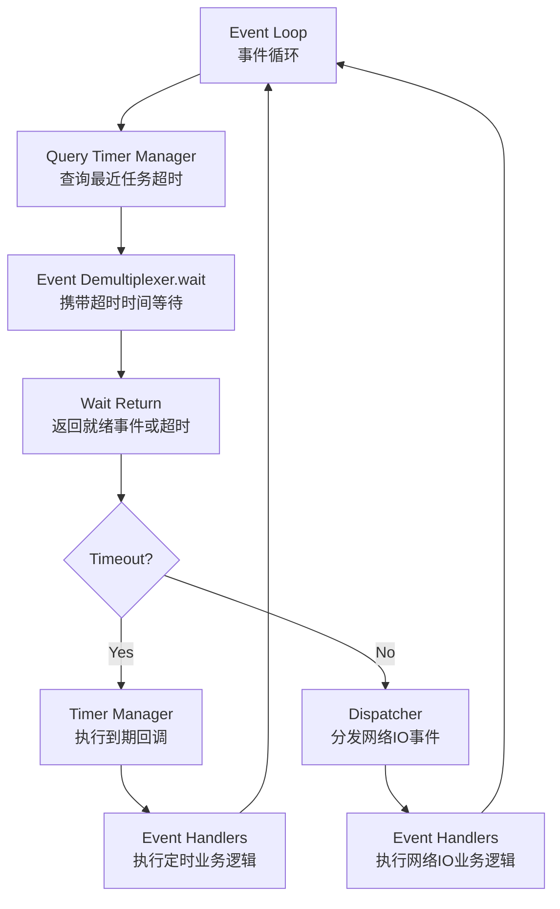

## 事件驱动

将**连接**和**业务线程**分开处理，当连接层有事件触发时提交给业务线程，避免了业务线程因网络数据处于准备中导致的长时间等待问题，节省线程资源

**核心**是以事件为连接点，有 IO 事件准备就绪时，以事件的形式通知相关线程

IO 读写线程、业务线程工作时，必有数据可操作执行，不会在 IO 等待上浪费资源

## 为什么要使用 reactor

事实上，epoll 只是高效的 IO 多路复用工具，而不是完整的架构，只会告诉你哪些 socket 可以读写，但不会处理**接下来怎么做**
Reactor 模型负责**事件分发与处理**，将 epoll 的**通知**变为**反应处理**

## Reactor 模型

**Reactor 是事件驱动模型的一种实现**

## Reactor中的组件

|组件	|角色比喻	|核心职责	|不可缺少的原因|
|------|----------|---------------|-------------------|
|事件多路分解器|	引擎	|高效等待大量IO事件|	实现高并发的技术基础|
|事件循环	|心脏|	驱动整个流程循环|	模式的运行框架和调度中心|
|定时器管理器|	闹钟|	管理所有定时任务	|提供时间管理能力，支撑超时、心跳等关键功能|
|事件分发器|	路由器|	关联和分派事件到处理器	|解耦事件检测与处理，保持架构清晰
|事件处理器|	肌肉	|实现具体业务逻辑	|模式产生实际价值的最终体现

### 单线程模型

所有 IO 操作（包括连接建立、数据读写、事件分发等）、业务处理都是由一个线程完成的。

**缺点：**
- 一个线程支持处理的连接数非常有限，
- 多个事件同时触发时，只要有一个事件没有处理完，其他后面的事件就无法执行，会造成消息积压以及请求超时
- 在处理 IO 操作时，无法同时处理建立、事件分发等操作
- 如果 IO 一直处于满负荷状态，很可能造成服务端节点不可用

### 多线程模型

将**业务逻辑**交给多个线程进行处理。
**使用一个线程池来处理业务操作，建立连接、IO 事件读写以及事件分发都是由一个线程完成**

**缺点：无法处理大量新连接、IO 就绪事件**

- 连接建立、IO 事件读取以及事件分发完全由单线程处理；
- 某个连接通过系统调用正在读取数据，则对于其他事件来说，完全阻塞。

### 主从 Reactor 模型

分为主 Reactor 和从 Reactor，分别处理**新建立的连接**和**IO 读写事件/事件分发**

- 主 Reactor 可以解决同一时间大量新连接，将其注册到从 Reactor 上进行 IO 事件监听处理
- IO 事件监听更加耗时，采用线程池处理。

| **策略类型** | **分发逻辑** | **适用场景** |
  |----|----|----|
  | **轮询（Round Robin）** | 顺序分发给下一个从 Reactor | 简单有效，负载相对均衡 |
  | **连接数最少** | 分给当前管理连接最少的从 Reactor | 更合理分配负载，避免热点 |
  | **哈希分发** | 按用户 ID、IP 地址、fd 哈希分给某个从 Reactor | 保持连接“粘性”，减少线程间迁移 |
  | **CPU 亲和性** | 结合线程绑定 CPU 核心，按核心分发 | 高性能系统（如游戏网关） |

### 多个子 reactor 会将任务放至同一个线程池中，产生资源争抢、线程不均衡，怎么处理？

**1. 每个 Sub Reactor 对应一个线程池（绑定池设计）**

- 给每个 Sub Reactor 分配独立的线程池，避免多个 Sub Reactor 向同一线程池提交任务造成抢占。
- 避免线程池“过载某一部分”，提升可控性与任务局部性。
  缺点：资源占用高、线程池规模不容易统一调整。

**2. 使用 无锁队列/消息队列 交给线程池异步处理**
- 每个 Sub Reactor 将任务封装成事件，通过 消息队列（或任务队列） 投递给线程池；
- 避免在 Reactor 线程中执行耗时逻辑；
- 可结合 工作窃取（Work Stealing）策略 平衡线程负载。
  
**3. 引入任务调度器，控制任务流向（Task Dispatcher）**
- 主线程/中间件加入调度层：
- 接收来自各 Sub Reactor 的任务
- 根据当前线程池负载或优先级进行任务分发
  
**4. 线程池自身采用负载均衡机制（如 Netty 的 event loop group）**
- 典型如 Netty、libuv 等底层库：
- 每个 IO 线程处理 N 个 channel
- 内部根据 CPU 核心数动态扩容线程池
- 并使用 Round-Robin、Least Busy 等方式调度任务
