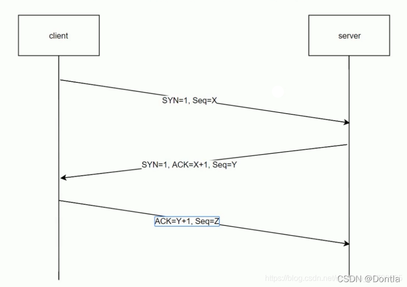

## 三次握手

**目的**

1.  确认双方的收发能力正常（SYN 和 ACK 机制）
2.  同步初始序列号（ISN），防止历史连接的干扰
3.  避免资源浪费（防止旧的重复 SYN 报文占用连接）A
    为了准确无误将数据送达目标。TCP 协议将数据包发送出去后，会向对方确认是否成功送达。握手过程使用了 TCP 的标志--**SYN(synchronize，同步)**和**ACK(ackonwledgement，确认)**。
    
  
### 握手过程：
#### 第一次握手 (SYN)
- 客户端发送一个TCP数据包给服务器。

- 这个包的关键标志位 <b>SYN 设置为 1（表示请求同步/建立连接）。</b>

- 客户端会<b>随机选择一个初始序列号 (Sequence Number, 比如 seq=100) 放在包里。</b>

此时： 这个包纯粹是握手包，里面没有任何应用层数据（比如HTTP请求内容）。**携带数据是不允许的**。

#### 第二次握手 (SYN-ACK)

- 服务器收到SYN包后，回复一个数据包给客户端。

- 这个包的关键标志位 <b>SYN 和 ACK 都设置为 1。</b>

  - ACK 是确认标志，表示“我收到了你的SYN”。

- 服务器也会随机选择一个自己的初始序列号 (比如 seq=500)。

- 同时，服务器将`客户端的序列号+1（100+1=101）作为确认号 (Acknowledgment Number) 发送回去`，意思是“我收到了你的序列号100，我下一个期望收到序列号101的数据”。

此时： 这个包也纯粹是握手包，里面同样没有任何应用层数据。

#### 第三次握手 (ACK) + [数据传输]

- 客户端收到服务器的SYN-ACK包后，连接在客户端的视角已经建立了。

- 客户端必须再发送一个确认包给服务器。

- 这个包的关键标志位 <b>ACK 设置为 1。</b>

- 客户端将服务器的序列号+1（500+1=501）作为确认号发送回去。

- **最关键的时刻到了**：

  - 在这个ACK包里，客户端就可以顺带发送应用数据了！ 因为连接已经建立，客户端可以立即开始发送信息（比如HTTP请求的GET /index.html ...）。

  - 这个ACK包不再是“纯粹”的握手包，它变成了一个 “ACK包 + 数据包” 的复合体。

  - 序列号也从这里开始真正承载数据（seq=101，因为上一个包是SYN，占了一个序号）。

### 为什么不能两次握手？

- **防止历史连接干扰**：如果客户端发送的 SYN 因网络延迟而滞留，后续重传的 SYN 可能先到达，两次握手无法区分新旧连接
- **确保双方收发能力正常**：两次握手只能保证客户端知道服务器能收能发，但服务器无法确认客户端能正常接收数据