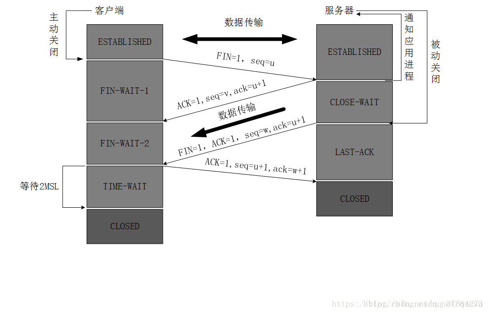

## 四次挥手

**目的**

1.  TCP 是全双工的，双方可以独立关闭自己的发送通道
2.  FIN 报文仅表示“不再发送”，但可能还要接收数据，所以不能像 SYN 合并
    
  
### 挥手过程
#### 第一次挥手 (FIN from Client)

- 发送方：客户端

- 报文内容：设置<b>标志位 FIN=1 (Finish)，</b>并包含一个<b>序列号（Sequence Number, 比如 seq = u）</b>。这个序列号是`客户端之前发送的最后一个字节的序列号+1`。

含义：客户端告诉服务器：“我（客户端）已经没有数据要发送给你了，我想关闭从我这到你那边的数据通道。但是，如果你还有数据要发给我，我仍然可以接收。”

#### 第二次挥手 (ACK from Server)

- 发送方：服务器

- 报文内容：设置<b>标志位 ACK=1</b>，并将`确认号（Acknowledgment Number）设置为 u + 1（即客户端的FIN序列号+1）`。同时携带自己的序列号（比如 seq = v）。

含义：服务器告诉客户端：“我收到了你的FIN断开请求。” 此时，从客户端到服务器方向的通道就关闭了，客户端不能再发送数据（但可以接收）。

**注意**：这个时候，服务器可能还有数据没有发送完。所以第二次和第三次挥手不能合并。服务器需要先确认客户端的FIN，然后继续处理并发送它自己的剩余数据。

**场景**：客户端发送FIN后，只表示客户端没数据发了，但服务器可能还有数据要发送给客户端。服务器在收到FIN后，先回一个ACK确认。<b>如果服务器此时恰好有数据要发给客户端，它完全可以把这个数据放在同一个TCP包里，与ACK标志一起发回去。这称为“捎带确认”（Piggybacking）</b>，和三次握手时捎带数据一样，是为了提高效率。

#### 第三次挥手 (FIN from Server)

- 发送方：服务器

- 报文内容：设置标志位 <b>FIN=1 和 ACK=1。</b>确认号依然是 <b>ack = u + 1</b>，并携带一个新的序列号（比如 seq = w，w 可能比 v 大，因为中间服务器可能又发送了一些数据）。

含义：服务器告诉客户端：“我（服务器）这边也没有数据要发送了，我也要关闭从我这边到你那边的数据通道。” 至此，服务器也发起了关闭。

#### 第四次挥手 (ACK from Client)

- 发送方：客户端

- 报文内容：设置标志位 ACK=1，并将确认号设置为 w + 1（即服务器的FIN序列号+1）。序列号为 u + 1。

含义：客户端告诉服务器：“我收到了你的FIN断开请求。” 服务器收到这个ACK后，就会完全关闭连接。

之后：客户端在发出这个ACK后，还会等待一段名为 <b>TIME_WAIT</b> 的时间（通常是2倍的MSL，报文最大生存时间），以确保服务器确实收到了这个ACK。如果服务器没收到，它会重发第三次挥手的FIN包，客户端可以再次回应ACK。等待结束后，客户端才最终彻底关闭连接。

## 为什么不能是三次挥手？

1.  **TCP 是全双工的**，客户端和服务端可以独立关闭自己的发送方向
    - 客户端先发**FIN 表示”不再发送数据“**，但可能还要接收数据
    - 服务端可能还有数据要发送，不能立即 FIN，所以先 ACK，等数据发完再 FIN
2.  如果合并 ACK+FIN，会强制服务器立即关闭，可能丢失数据


## 为什么连接的时候三次握手，关闭的时候是四次挥手？

**是由于 TCP 的全双工通信特性和连接/断开的不同状态需求决定**
当 server 端收到 client 端的 SYN 连接请求报文后，可以直接发送 SYN+ACK 报文，其中 ACK 报文用来应答，SYN 报文用来同步。
但是关闭连接时，当 server 端收到 FIN 报文时，不会立即关闭 socket，先回复 ACK 报文，当 server 端报文发送完后，才会发送 FIN 报文。

## 为什么 TIME_WAIT 状态要等 2MSL？

### 什么是 TIME_WAIT 状态？
**核心目的**：

- **可靠地终止TCP连接**：确保最后一个ACK能到达对端。如果这个ACK丢失，被动关闭方（服务器）会重发它的FIN包。处于TIME_WAIT状态的客户端可以再次回应一个ACK，从而保证连接能安全关闭。如果没有这个状态，客户端在发完ACK后就消失，服务器重传的FIN将得不到响应，服务器会一直重试而非正常关闭。

- **让“旧”的重复报文在网络中消散**：防止之前连接延迟的、重复的数据包被之后新建的、恰好相同四元组（源IP、源端口、目的IP、目的端口）的新连接错误地接收。TIME_WAIT状态持续一段时间（2MSL），足以让网络中的旧报文过期失效。

### 大量 TIME_WAIT 的影响和根源
虽然TIME_WAIT状态本身是正确且必要的，但过多会导致问题：

1. **资源消耗**：

- 每个TIME_WAIT连接都占用一个**文件描述符**、一部分内存和CPU时间。如果数量极大（数万以上），会消耗可观的操作系统资源。

2. <b>限制连接建立（最主要的问题）：</b>

- 一个连接由**四元组**（客户端IP、客户端端口、服务器IP、服务器端口）唯一标识。

- 客户端端口号是有限的（通常默认范围是32768~60999，约2.8万个）。

- 当一个连接处于TIME_WAIT状态时，这个**四元组组合在2MSL时间内是无法被重用的**。

- **后果**：如果你的客户端程序以非常高的频率（短时间内在同一个端口上）向同一个服务器发起并关闭大量连接，可用的端口号会很快被耗尽的TIME_WAIT连接占满，导致无法创建新的连接，出现 Cannot assign requested address 之类的错误。

**根本原因**： 应用程序使用了短连接（而非连接复用）与后端服务通信，并且并发量非常高。

- 反面模式：每次HTTP请求都new Socket() -> connect() -> 发送数据 -> close()。每次`close()`都会导致一次主动关闭，产生一个TIME_WAIT。

- 正确模式：使用**连接池或长连接**（HTTP的Keep-Alive），一个连接处理多次请求，从而大幅减少连接的创建和销毁次数。


## 如果服务端不发送 FIN，会怎么样？

- 客户端会一直处于 FIN_WAIT_2 状态，可能导致连接泄漏（可以通过 SO_LINGER 优化）

## 为什么 SYN 可以合并 ACK，但 FIN 不能

- SYN 是连接初始化，没有数据发送，可以立即 SYN+ACK
- FIN 是关闭连接，可能还有数据发送，不能立即 FIN

## 如果已经建立了新连接，但是客户端故障怎么办？

TCP 设有保活计时器，服务端每次收到一次客户端的连接请求都会重新复位这个计时器，
在设定时间内还没有响应，服务端会发送探测报文，若发送 10 次后仍然没有响应，服务端会认为客户端故障，关闭连接
## close_wait堆积(被连接断开方--server)
要理解这个问题，我们需要回顾一下四次挥手中服务器的流程：

1. 客户端发送FIN包，表示它要断开连接。

2. 服务器内核的TCP协议栈收到这个FIN包后，会**自动回复ACK**，并将该连接的状态从<b>ESTABLISHED</b>改为<b>CLOSE_WAIT</b>。

  - <b>至此，所有操作都是由内核自动完成的，与应用进程无关。</b>

3. 进入CLOSE_WAIT状态意味着：“客户端已经不会再发送数据了，但我（服务器）可能还有数据要发送。我正在等待应用程序来读取最后的数据并关闭这个Socket。”

<b>关键就在这里：从CLOSE_WAIT状态转移到下一步（发送FIN包）的指令，必须由服务器的应用程序主动发出。</b>

具体来说，应用程序必须调用类似 close() 或 shutdown(SHUT_WR) 这样的系统调用，来通知内核：“我这边也处理完了，你可以发送FIN包给客户端了。”

如果应用程序因为某种原因没<b>有调用close()来释放Socket资源</b>，那么服务器的内核就会一直傻傻地等着，这个连接也就永远卡在CLOSE_WAIT状态。

#### 导致应用程序不调用 close() 的常见原因
- **连接泄漏 (Connection Leak)**：

    - 最常见的原因。应用程序在通过Socket处理完请求后，没有在代码的`所有路径（正常路径和异常路径）`上都正确地关闭Socket。

    - 例子：在try-catch块中打开了Socket，在try块末尾写了close()，但在中间处理时抛出了异常，直接跳到了catch块，导致close()语句被跳过。正确的做法是在finally块中执行关闭操作。

- **应用程序繁忙或阻塞**：

    - 应用程序的线程正在处理一个非常耗时的任务，或者在某些操作上（如等待锁、进行复杂的数据库查询）被阻塞，无法继续执行到调用close()的那一步代码。

- **死锁 (Deadlock)**：

    - 多个线程对资源（如Socket、共享对象）的竞争形成了死锁，持有Socket的线程无法继续执行，自然也无法释放它。

- **长连接场景下的设计误解**：

    - 程序设计为使用长连接，但逻辑上错误地认为连接应该由客户端始终负责关闭，服务器永远不主动关。

- **资源耗尽**：

    - 应用程序本身已经资源耗尽（如线程池满、内存溢出），导致处理新请求或执行关闭操作的线程无法被调度。

```bash
# Linux/Unix/Mac
netstat -an | grep CLOSE_WAIT
```
