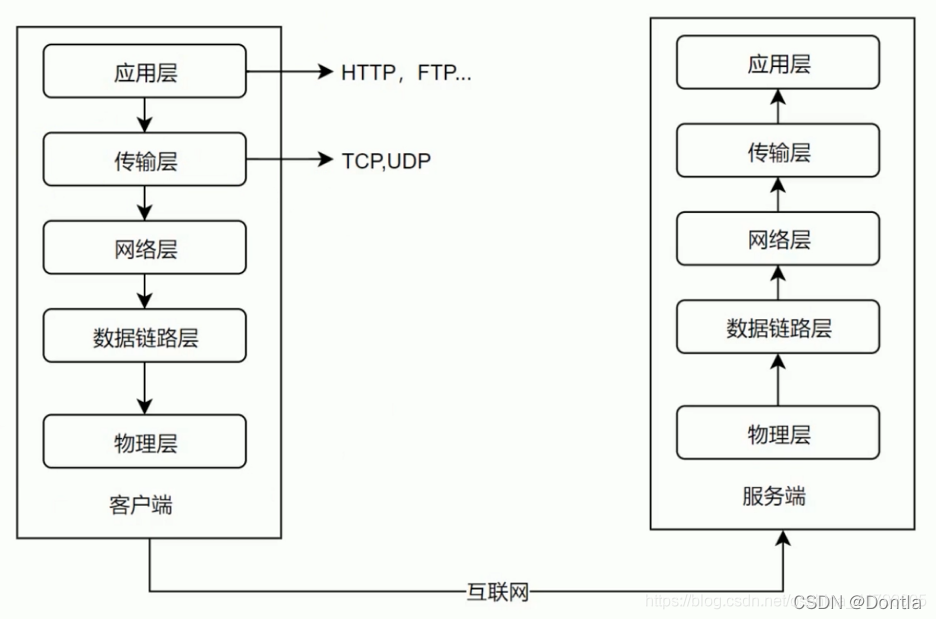
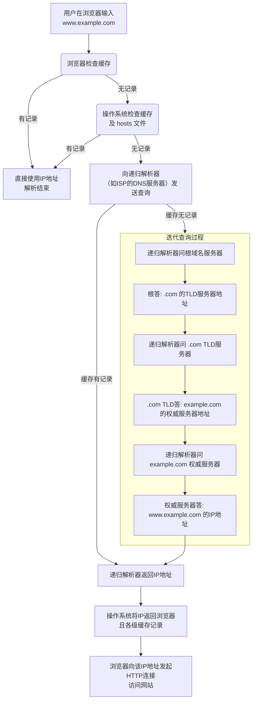
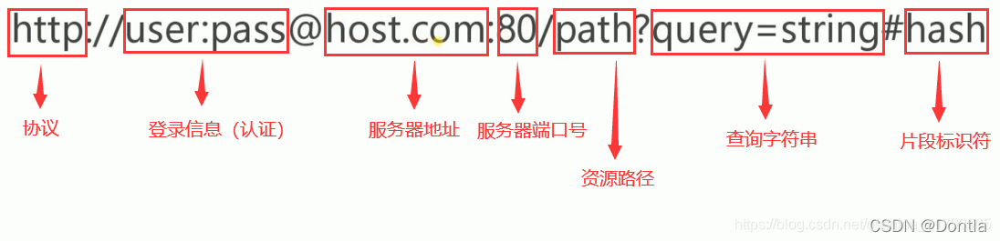
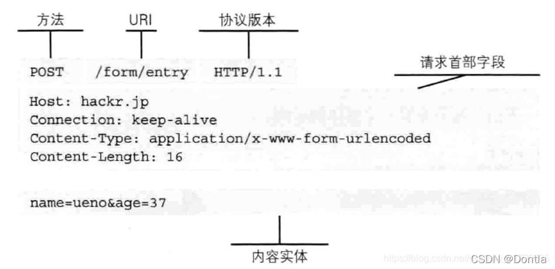
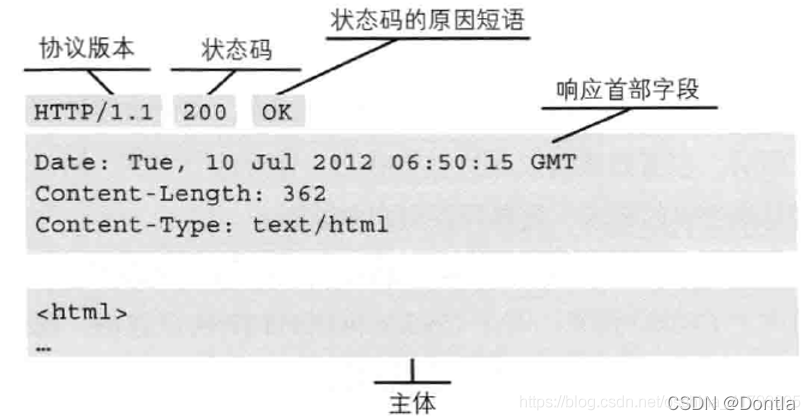

**TCP/IP 协议集中的一个应用层协议，客户端与服务端进行交互规则。**
**定义 web 浏览器与 web 服务器之间交换数据的过程以及数据本身的格式，底层依赖 TCP 进行可靠信息传输。**

**TCP 是通过序列号、确认应答、重发控制、连接管理以及窗口控制等机制实现可靠性传输的。**

## 数据在各层之间是怎样传输的

对于发送方而言，从上层到下层层层包装，对于接收方而言，从下层到上层，层层解开包装。

- 发送方的应用进程向接收方的应用进程传送数据
- AP 先将数据交给本主机的应用层，应用层加上本层的控制信息 H5 就变成了下一层的数据单元
- 传输层收到这个数据单元后，加上本层的控制信息 H4，再交给网络层，成为网络层的数据单元
- 到了数据链路层，控制信息被分成两部分，分别加到本层数据单元的首部（H2）和尾部（T2）
- 最后的物理层，进行比特流的传输


### 从输入 url 网址到网页显示的过程是怎样的/你了解吗？

从浏览器地址栏输入 URL 到显示网页的过程包括多个步骤，
涵盖了 DNS 解析、TCP 连接、发送 HTTP 请求、服务器处理请求并返回 HTTP 响应、浏览器处理响应并渲染页面等多个环节。

1.  **DNS 解析**：浏览器发起一个 DNS 请求到 DNS 服务器，将域名解析为服务器的 IP 地址。
2.  **TCP 连接**：浏览器通过解析得到的 IP 地址与服务器建立 TCP 连接（通常是通过 443 端口进行 SSL 加密的 HTTPS 连接）。
    1.  这一步涉及到 TCP 的<b>三次握手（这包括客户端发送 SYN 包、服务器返回 SYN+ACK 包、客户端发送 ACK 包完成连接。）</b>过程，确保双方都准备好进行数据传输。
3.  **发送 HTTP 请求**：浏览器构建 HTTP 请求消息，包括请求行、请求头和请求体（如果有）；然后将请求发送到服务器。
4.  **服务器处理请求**：服务器接收到 HTTP 请求后，根据请求的资源路径，经过后端处理（可能包括数据库查询等），生成 HTTP 响应消息；响应消息包括状态行、响应头和响应体（请求的资源内容）。
5.  **浏览器接收 HTTP 响应**：浏览器接收到服务器返回的 HTTP 响应数据后，开始解析响应体中的 HTML 内容；然后构建 DOM 树、解析 CSS 和 JavaScript 文件等，最终渲染页面。
6.  **断开连接**：TCP 四次挥手，连接结束。

## 域名解析
### 一、核心概念：它是什么？
域名解析就是互联网的“电话簿”或“导航系统”。

它的工作是将我们人类容易记住的域名（比如 www.google.com）翻译成计算机在网络中能找到彼此的唯一标识——IP 地址（比如 142.251.42.206）。

- 域名 (Domain Name)：就像是一个公司的名字或一个商店的招牌，比如“北京市海淀区人民广场”。对人类来说很友好，容易记。

- IP 地址 (IP Address)：就像是这个公司的精确经纬度坐标（如 116.404, 39.915）。对计算机（路由器、服务器）来说，它需要这个精确的坐标才能把数据包准确地送达目的地。

<b>所以，域名解析的过程就是：输入一个名字，查到一个地址。</b>

### 域名解析是如何工作的？（核心过程）
当你浏览器里输入 www.example.com 并按下回车后，背后发生了一系列复杂的查询过程。这个过程通常是**分层和递归**的。

#### 第 1 步：询问根域名服务器
递归解析器首先会去问根域名服务器：“你知道 www.example.com 的IP吗？”
根服务器不直接知道答案，但它会说：“我不知道 .com 的地址，但我可以告诉你管理 .com 的顶级域（TLD）服务器的地址。”

#### 第 2 步：询问顶级域（TLD）服务器
递归解析器拿着根服务器给的地址，去问 .com TLD 服务器：“你知道 www.example.com 的IP吗？”
.com TLD 服务器会说：“我不知道 www 的地址，但我可以告诉你管理 example.com 这个域的权威域名服务器的地址。”

#### 第 3 步：询问权威域名服务器
递归解析器最后去问 example.com 的权威服务器：“你知道 www.example.com 的IP吗？”
这次，权威服务器查了一下自己的记录，回答道：“知道！它的IP地址是 93.184.216.34。”

#### 第 4 步：返回结果并缓存
递归解析器终于拿到了IP地址！它非常高兴地：

将这个结果返回给你的操作系统，操作系统再交给浏览器。

同时，它会把这个结果在自己的缓存里保存一段时间（根据TTL值设定）。下次再有人问它同样的问题，它就可以直接回答，而不用再走一遍完整的流程，这大大提高了效率。

最终，浏览器拿到了 93.184.216.34 这个IP地址，就可以向该服务器的80或443端口发起HTTP/HTTPS请求，获取网页内容了。

## HTTP1.1

- 增加了 PATCH、OPTIONS、DELETE 命令
- **持久连接**，**即 TCP 连接默认不关闭，可以被多个请求复用**
  - 每一个 TCP 持久连接，操作系统内核都必须维护对应的 **连接状态信息（TCP 控制块：TCB）**。
  - **接收/发送缓冲区**
  - 线程/协程上下文（部分模型）
- 管道机制，在一个 TCP 连接里，客户端可以同时发送多个请求。例如浏览器同时发出 A 和 B 请求，但是服务器还是按照顺序，先回应 A 请求，在回应 B
- 增加 Host 字段，可以将请求发送同一个服务器的不同网站，即同一个物理服务器可以同时部署多个 web 服务

### 持久连接什么时候关闭？

在高并发服务器中，不能无限持久连接，必须设计**连接关闭策略**，避免资源泄漏。
**常见的持久连接关闭时机：**
| **触发条件** | **描述** |
|--------------------|------------------------------------------------|
| **客户端主动关闭** | 客户端调用 close()，触发 EPOLLHUP 或 read = 0 |
| **服务器主动关闭** | 服务器检测连接空闲过久，定时器触发关闭 |
| **超时未活跃** | 如 60 秒没有收到数据，视为断开，调用 close() |
| **读写错误** | 如 recv() 返回 -1 且 errno != EAGAIN，表示异常 |
| **资源保护机制** | 达到最大连接数，优先关闭低优先级连接 |
| **业务协议结束** | 如 WebSocket、HTTP Keep-Alive 超时或请求完成 |
| | |
**服务端出现大量 TIME_WAIT 的根本原因是：**

- **服务端主动关闭了大量连接**（无论是长连接还是短连接）；
- 每次关闭一个连接，都会触发一次 TIME_WAIT；
- 如果并发高，连接数多，**关闭的频率高**，就会造成 TIME_WAIT 数量激增。

## HTTP2

**解决了传输性能的问题**

- **二进制传输**：HTTP1.1 中数据以文本形式传输，HTTP2 中，所有数据以二进制传输，统称为帧
- **多路复用**：在一个连接里发送多个请求不在需要按照顺序来进行返回处理，而是同时返回。
- **头部压缩**：HTTP1.1 中，每次发送请求和返回，对 HTTP 头信息总是完整发送和返回，占用的带宽较大
- **服务器推送**：允许服务器未经请求，主动向客户端发送资源。

## TCP/IP 协议中使用到的系统调用

1.  套接字创建与管理 - 创建 socket()
```c++
int sockfd = socket(AF_INET,SOCK_STREAM)
```
- 关闭套接字

2.  绑定与监听（服务端）
    - bind()：将套接字绑定到本地 IP 和端口
    - listen()：将套接字设为监听模式
    - accept()：接收客户端连接，返回新套接字用于通信
3.  连接（客户端）
    - connect()：客户端发起连接
4.  数据传输
    - send()：发送数据（TCP）
    - recv()：接收数据（TCP）
5.  地址转换与辅助函数
6.  多路复用


## URI、URL 和 URN

**URI**
同一资源标识符，定位某一类特定资源，包括 URL 和 URN。
**URL**
统一资源定位符，找到资源所在的位置，并访问和得到


**URN**
永久统一资源定位符。如果某一类资源改变了位置，导致 URL 无法访问到资源，使用 URN 依然可以访问

## HTTP 报文格式

分为请求报文（客户端）和响应报文（服务端）
**请求报文**
主要由请求方法、请求 URI、协议版本、可选的请求首部字段和内容实体构成


**响应报文**
由协议版本、状态码、解释状态码的原因短语、可选的响应首部字段以及实体


## HTTP 方法

用来定义对资源的操作，从定义上有各自的语义

**GET：获取资源**
GET 方法用来请求访问已被 URL 识别的资源。

**POST：传输实体主体**
PSOT 方法用来传输实体的主体。

#### GET 和 POST 的区别

| 对比项     | GET                                           | POST                                                    |
| ---------- | --------------------------------------------- | ------------------------------------------------------- |
| 定义       | 获取资源                                      | 提交数据                                                |
| 请求头     | 请求头中包含请求参数（URL 编码）              | 请求头中包含请求参数（表单数据）                        |
| 安全性     | 参数直接暴露在 URL 中，可被拦截或篡改，不安全 | 参数在请求体中，不会暴露在 URL 中，相对安全，但可被拦截 |
| 应用场景   | 获取数据（如查询、分页等）                    | 提交数据（如注册、登录、提交表单等）                    |
| 幂等性     | 支持幂等性，即多次请求同一资源，结果相同      | 不支持幂等性，即多次请求同一资源，结果可能不同          |
| 请求限制   | 请求参数长度限制（URL 长度限制）              | 无请求参数长度限制                                      |
| 适用范围   | 适用于获取数据、查询等操作                    | 适用于提交数据、更新等操作                              |


#### PUT 请求

PUT 请求是 HTTP 协议中的一种请求方法，**通常用于更新或替换服务器上的资源。**
使用 PUT 请求时，客户端需要将整个资源的新版本发送到服务器。如果服务器上已存在该资源，则用客户端提交的新版本替换原有的资源。如果该资源不存在，则会创建一个新的资源。

**PUT 请求的一些特点：**

- 可以更新整个资源。
- 客户端需要发送完整的资源内容。
- 如果服务器上不存在该资源，则会创建一个新的资源。
- PUT 请求具有幂等性，即执行多次 PUT 请求的结果应该相同。

#### POST 请求

POST 请求是 HTTP 协议中的一种请求方法，**通常用于创建新的资源或提交数据到服务器进行处理**。使用 POST 请求时，客户端将数据提交到服务器，服务器根据数据进行处理，并返回响应。通常情况下，POST 请求会在服务器上创建新的资源，并返回该资源的 URI。

**POST 请求的一些特点：**
- 可以创建新的资源或提交数据到服务器进行处理。
- 客户端可以只发送部分资源内容。
- 如果请求成功，服务器会返回一个表示新资源的 URI。
- POST 请求不具有幂等性。

## HTTP 的状态码有什么

- ==**1xx（信息性状态码）**：表示接收的请求正在处理。==
- ==**2xx（成功状态码）**：表示请求正常处理完毕。==
- ==**3xx（重定向状态码）**：需要后续操作才能完成这一请求。==
- ==**4xx（客户端错误状态码）**：表示请求包含语法错误或无法完成。==
- ==**5xx（服务器错误状态码）**：服务器在处理请求的过程中发生了错误。==
  | **状态码** | **状态码英文名称** | **中文描述** |
  |----|----|----|
  | 100 | Continue | 继续。客户端应继续其请求 |
  | 200 | OK | 请求成功。一般用于 GET 与 POST 请求 |
  | 201 | Created | 已创建。成功请求并创建了新的资源 |
  | 400 | Bad Request | 客户端请求的语法错误，服务器无法理解 |
  | 401 | Unauthorized | 请求要求用户的身份认证 |
  | 402 | Payment Required | 保留，将来使用 |
  | 403 | Forbidden | 服务器理解请求客户端的请求，但是拒绝执行此请求 |
  | 404 | Not Found | 服务器无法根据客户端的请求找到资源（网页）。通过此代码，网站设计人员可设置"您所请求的资源无法找到"的个性页面 |
  | 405 | Method Not Allowed | 客户端请求中的方法被禁止 |
  | 406 | Not Acceptable | 服务器无法根据客户端请求的内容特性完成请求 |
  | 407 | Proxy Authentication Required | 请求要求代理的身份认证，与 401 类似，但请求者应当使用代理进行授权 |
  | 408 | Request Time-out | 服务器等待客户端发送的请求时间过长，超时 |
  | 409 | Conflict | 服务器完成客户端的 PUT 请求时可能返回此代码，服务器处理请求时发生了冲突 |
  | 411 | Length Required | 服务器无法处理客户端发送的不带 Content-Length 的请求信息 |
  | 413 | Request Entity Too Large | 由于请求的实体过大，服务器无法处理，因此拒绝请求。为防止客户端的连续请求，服务器可能会关闭连接。如果只是服务器暂时无法处理，则会包含一个 Retry-After 的响应信息 |
  | 414 | Request-URI Too Large | 请求的 URI 过长（URI 通常为网址），服务器无法处理 |
  | 500 | Internal Server Error | 服务器内部错误，无法完成请求 |
  | 501 | Not Implemented | 服务器不支持请求的功能，无法完成请求 |
  | 502 | Bad Gateway | 作为网关或者代理工作的服务器尝试执行请求时，从远程服务器接收到了一个无效的响应 |
  | 503 | Service Unavailable | 由于超载或系统维护，服务器暂时的无法处理客户端的请求。延时的长度可包含在服务器的 Retry-After 头信息中 |
  | 504 | Gateway Time-out | 充当网关或代理的服务器，未及时从远端服务器获取请求 |
  | 505 | HTTP Version not supported | 服务器不支持请求的 HTTP 协议的版本，无法完成处理 |

## 为什么说 TCP 是可靠传输，UDP 是不可靠传输

TCP（Transmission Control Protocol）通过一系列机制，**确保数据完整、有序、无重复地从一端传输到另一端**：

**TCP 的可靠机制包括：**
| **特性** | **描述** |
|--------------------------|--------------------------------------|
| **连接管理（三次握手）** | 传输前建立连接，双方确认状态正常 |
| **顺序保证** | 每个数据包有序号，接收方按顺序重组 |
| **数据重传** | 丢包时会自动重发，确保数据不丢 |
| **流量控制** | 防止发送方发送过快导致接收方缓存溢出 |
| **拥塞控制** | 防止网络过载导致大范围丢包 |
| **完整性校验** | 使用校验和检测传输中数据是否损坏 |

UDP（User Datagram Protocol）是**无连接的、尽力发送的协议**，它**不保证数据到达、不保证顺序、不检测完整性**。

**UDP 的特点：**
| **特性** | **描述** |
|-------------|----------------------------------|
| 无连接 | 没有握手、没有状态管理 |
| 不保证顺序 | 数据包可能乱序到达 |
| 不重传 | 丢了就丢了，不会自动补发 |
| 无流控/拥控 | 不限制发送速度，可能造成网络爆炸 |
| 有限校验 | 只检测简单数据损坏，不保证完整性 |

#### 使用 UDP 也可以实现可靠传输

**可以自己实现一些可靠机制，模仿 TCP**
| **协议/框架** | **特点** |
|----|----|
| **QUIC** | 基于 UDP 的可靠传输 + TLS + 多路复用（Google 开发） |
| **RUDP**（Reliable UDP） | 简化版 TCP，用于音视频/传感器数据传输 |
| **KCP**（金山快传协议） | 开源 UDP 可靠协议，适用于游戏/直播 |
| **ENet** | 高性能可靠 UDP 框架（游戏常用） |
| **WebRTC DataChannel** | 使用 UDP 实现可靠数据通道（DTLS + SCTP） |
