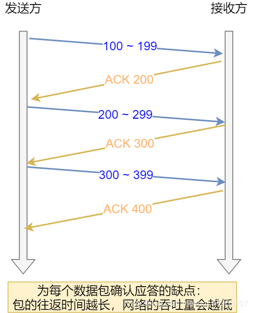
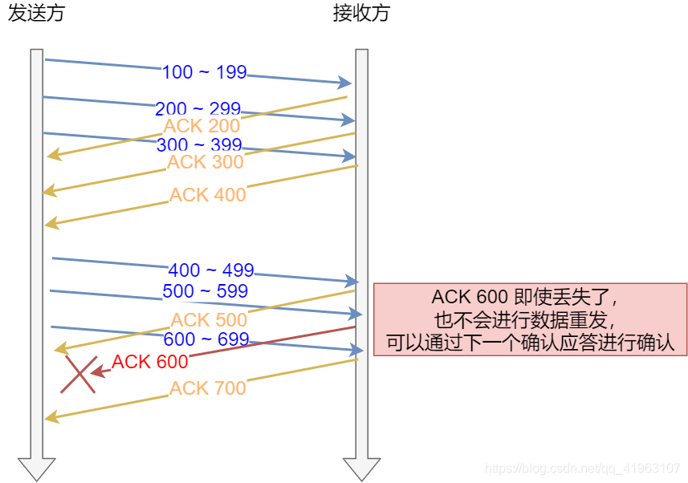
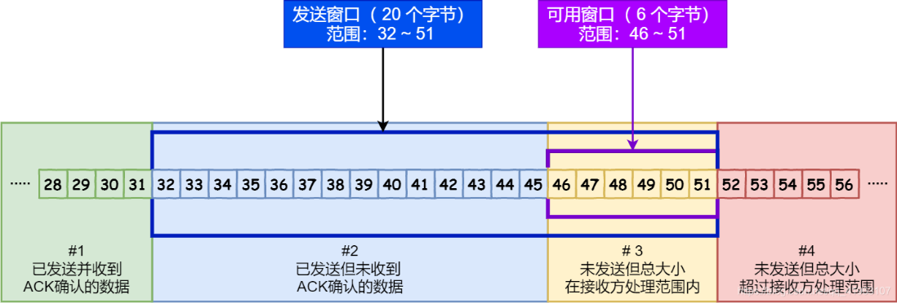
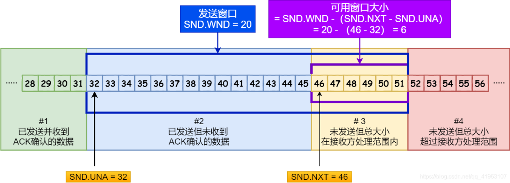
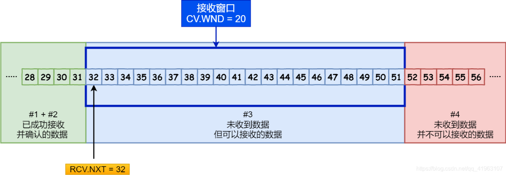

# 窗口
我们都知道**TCP是每发送一个数据，都要进行一次确认应答。当上一个数据包收到了应答了， 再发送下一个。**
但这种方式的缺点是效率比较低的。

所以，这样的传输方式有一个缺点：**数据包的往返时间越长，通信的效率就越低。**

为解决这个问题，TCP 引入了窗口这个概念。即使在往返时间较长的情况下，它也不会降低网络通信的效率。
## 窗口大小
**窗口大小就是指无需等待确认应答，而可以继续发送数据的最大值。**

## 窗口的实现
实际上是操作系统开辟的一个缓存空间，发送方主机在等到确认应答返回之前，必须在缓冲区中保留已发送的数据。如果按期收到确认应答，此时数据就可以从缓存区清除。

假设窗口大小为 3 个 TCP 段，那么发送方就可以「连续发送」 3 个 TCP 段，并且中途若有 ACK 丢失，可以通过「下一个确认应答进行确认」。如下图：

图中的 ACK 600 确认应答报文丢失，也没关系，因为可以通过下一个确认应答进行确认，只要发送方收到了 ACK 700 确认应答，就意味着 700 之前的所有数据「接收方」都收到了。这个模式就叫**累计确认或者累计应答**。
## 窗口大小由哪一方决定？
TCP 头里有一个字段叫 Window，也就是窗口大小。
这个字段是接收端告诉发送端自己还有多少缓冲区可以接收数据。于是发送端就可以根据这个接收端的处理能力来发送数据，而不会导致接收端处理不过来。

所以，**通常窗口的大小是由接收方的窗口大小来决定的。**

发送方发送的数据大小不能超过接收方的窗口大小，否则接收方就无法正常接收到数据。
## 发送方的滑动窗口
我们先来看看发送方的窗口，下图就是发送方缓存的数据，根据处理的情况分成四个部分，其中深蓝色方框是发送窗口，紫色方框是可用窗口：

`1` 是已发送并收到 ACK确认的数据：1~31 字节 
`2` 是已发送但未收到 ACK确认的数据：32~45 字节 
`3` 是未发送但总大小在接收方处理范围内（接收方还有空间）：46~51字节 
`4` 是未发送但总大小超过接收方处理范围（接收方没有空间）：52字节以后 

在下图，当发送方把数据「全部」都一下发送出去后，可用窗口的大小就为 0 了，表明可用窗口耗尽，在没收到 ACK 确认之前是无法继续发送数据了。

在下图，当收到之前发送的数据 32~36 字节的 ACK 确认应答后，如果发送窗口的大小没有变化，则滑动窗口往右边移动 5 个字节，因为有 5 个字节的数据被应答确认，接下来 52~56 字节又变成了可用窗口，那么后续也就可以发送 52~56 这 5 个字节的数据了。

## 程序是如何表示发送方的四个部分的呢？
TCP 滑动窗口方案使用三个指针来跟踪在四个传输类别中的每一个类别中的字节。其中两个指针是绝对指针（指特定的序列号），一个是相对指针（需要做偏移）。

`SND.WND`：表示发送窗口的大小（大小是由接收方指定的）； 
`SND.UNA`：是一个绝对指针，它指向的是已发送但未收到确认的第一个字节的序列号，也就是 `#2` 的第一个字节。 
`SND.NXT`：也是一个绝对指针，它指向未发送但可发送范围的第一个字节的序列号，也就是 `#3` 的第一个字节。 
指向 `#4` 的第一个字节是个相对指针，它需要 `SND.UNA` 指针加上 `SND.WND` 大小的偏移量，就可以指向 `#4` 的第一个字节了。 

那么可用窗口大小的计算就可以是：
可用窗口 = `SND.WND -（SND.NXT - SND.UNA）`
## 接收方的滑动窗口
接下来我们看看接收方的窗口，接收窗口相对简单一些，根据处理的情况划分成三个部分：

`1 + 2` 是已成功接收并确认的数据（等待应用进程读取）；

`3` 是未收到数据但可以接收的数据；

`4` 未收到数据并不可以接收的数据；

其中三个接收部分，使用两个指针进行划分:

`RCV.WND`：表示接收窗口的大小，它会通告给发送方。

`RCV.NXT`：是一个指针，它指向期望从发送方发送来的下一个数据字节的序列号，也就是 `#3` 的第一个字节。

指向 `#4` 的第一个字节是个相对指针，它需要 `RCV.NXT` 指针加上 `RCV.WND` 大小的偏移量，就可以指向 `#4` 的第一个字节了。
## 接收窗口和发送窗口的大小是相等的吗？
并不是完全相等，**接收窗口的大小是约等于发送窗口的大小的**。

因为滑动窗口并不是一成不变的。比如，当接收方的应用进程读取数据的速度非常快的话，这样的话接收窗口可以很快的就空缺出来。那么新的接收窗口大小，是通过 TCP 报文中的Windows字段来告诉发送方。

那么这个传输过程是存在时延的，所以接收窗口和发送窗口是约等于的关系。
