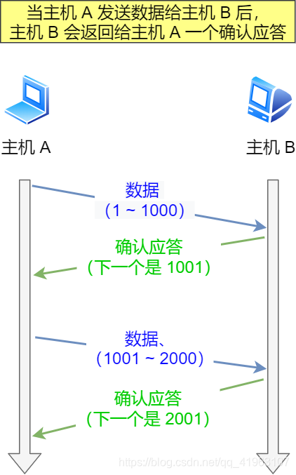

**TCP 重传策略的核心机制主要包括以下几种：**
| **类型**     | **名称**                     | **说明**                                        |
| ------------ | ---------------------------- | ----------------------------------------------- |
| 基础重传     | **超时重传（RTO）**          | 最基础的方式，根据超时判断未确认就重传          |
| 快速重传     | **Fast Retransmit**          | 只要收到 3 个重复 ACK，就马上重传，无需等待超时 |
| 拥塞控制配合 | **拥塞避免 + 重传调整**      | 发送窗口缩小，重传变慢，避免网络恶化            |
| SACK 支持    | **Selective Acknowledgment** | 告诉发送方哪些包到了，哪些没到，避免盲目重传    |

<b>无论是 TCP 连接建立还是连接关闭，只要关键阶段的“确认 ACK”没有收到，对应的“标志性包”都会被自动重传。</b>

TCP 实现可靠传输的方式之一，是通过**序列号与确认应答**。
在 TCP 中，当发送端的数据到达接收主机时，接收端主机会返回一个确认应答消息，表示已收到消息。

但在错综复杂的网络，并不一定能如上图那么顺利能正常的数据传输，万一数据在传输过程中丢失了呢？
所以 TCP 针对数据包丢失的情况，会用重传机制解决。

## 超时重传

超时重传，是 TCP 协议保证数据可靠性的另一个重要机制，其原理是`在发送某一个数据以后就开启一个计时器，在一定时间内如果没有得到发送的数据报的 ACK 报文，那么就重新发送数据，直到发送成功为止`。
**超时时间设置为多少合适捏？**

RTT 就是数据完全发送完，到收到确认信号的时间，即数据包的一次往返时间。

超时重传时间，就是 RTO（Retransmission Timeout)。那么，**RTO 到底设置多大呢？**

- 如果 RTO 设置很大，等了很久都没重发，这样肯定就不行。
- 如果 RTO 设置很小，那很可能数据都没有丢失，就开始重发了，这会导致网络阻塞，从而恶性循环，导致更多的超时出现。

超时重传不是十分完美的重传方案，它有这些**缺点**：

- 当一个报文丢失时，会等待一定的超时周期，才重传分组，增加了端到端的时延。
- 当一个报文丢失时，在其等待超时的过程中，可能会出现这种情况：其后的报文段已经被接收端接收但却迟迟得不到确认，发送端会认为也丢失了，从而引起不必要的重传，既浪费资源也浪费时间。

## 快速重传

TCP 还有另外⼀种快速重传（**Fast Retransmit**）机制，它不以时间为驱动，⽽是以数据驱动重传。

**它是基于接收端的反馈信息来引发重传的。**

可以用它来解决超时重发的时间等待问题，快速重传流程如下：

在上图，发送⽅发出了 1，2，3，4，5 份数据：

- 第⼀份 Seq1 先送到了，于是就 Ack 回 2；
- 结果 Seq2 因为某些原因没收到，Seq3 到达了，于是还是 Ack 回 2；
- 后⾯的 Seq4 和 Seq5 都到了，但还是 Ack 回 2，因为 Seq2 还是没有收到；
- 发送端收到了三个**Ack = 2**的确认，知道了**Seq2**还没有收到，就会在定时器过期之前，重传丢失的**Seq2**。
- 最后，收到了 Seq2，此时因为 Seq3，Seq4，Seq5 都收到了，于是 Ack 回 6 。

**快速重传机制只解决了⼀个问题，就是超时时间的问题，但是它依然⾯临着另外⼀个问题。就是重传的时候，是重传之前的⼀个，还是重传所有的问题。**
