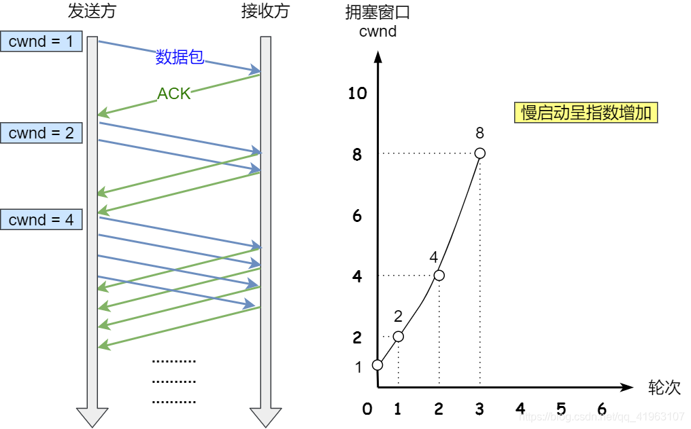
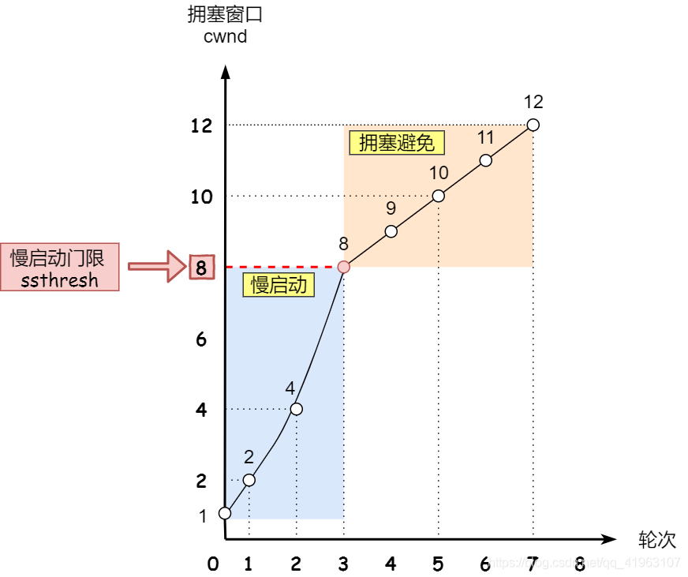
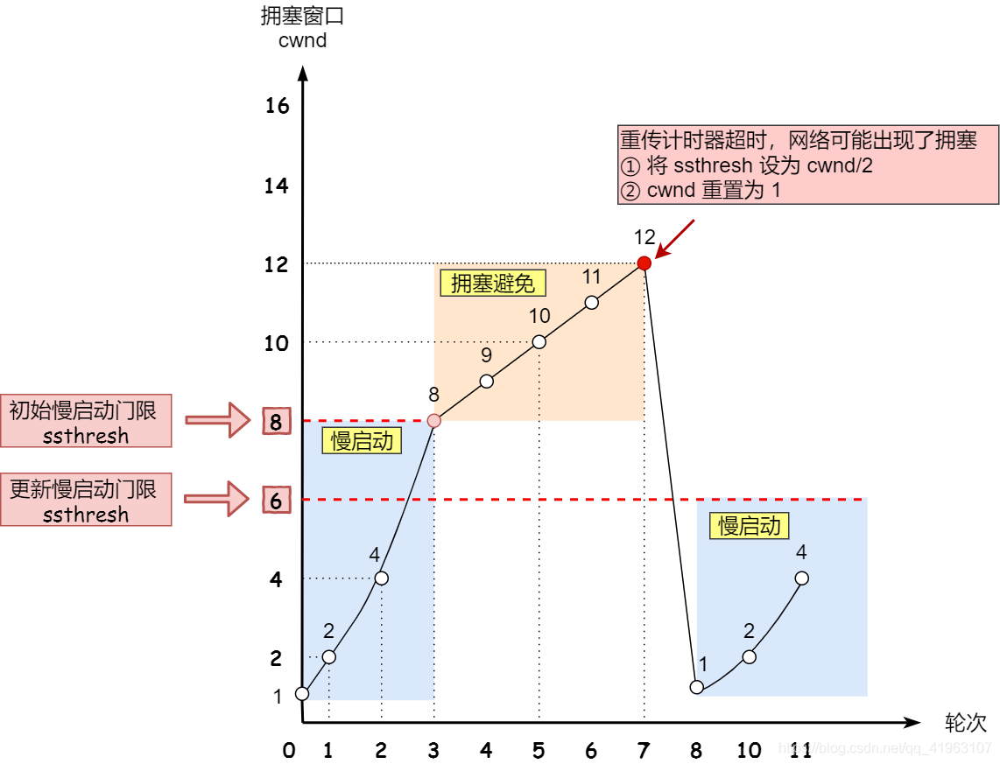
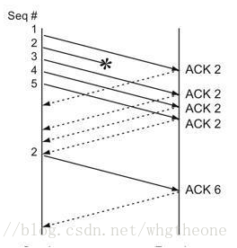
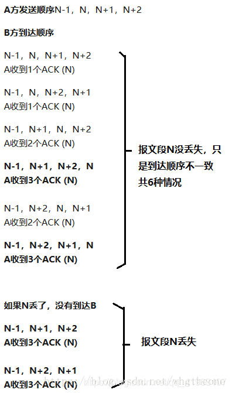
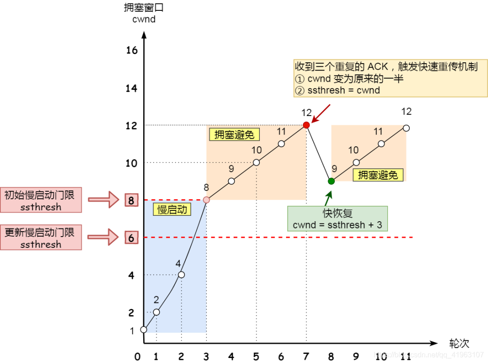

### 为什么要有拥塞控制呀，不是有流量控制了吗？

前面的流量控制**是避免「发送方」的数据填满「接收方」的缓存**，但是并不知道网络的中发生了什么。
一般来说，计算机网络都处在一个共享的环境。因此也有可能会因为其他主机之间的通信使得网络拥堵。
**在网络出现拥堵时，如果继续发送大量数据包，可能会导致数据包时延、丢失等，这时 TCP 就会重传数据，但是一重传就会导致网络的负担更重，于是会导致更大的延迟以及更多的丢包，这个情况就会进入恶性循环被不断地放大…**
所以，TCP 不能忽略网络上发生的事，它被设计成一个无私的协议，当网络发送拥塞时，TCP 会自我牺牲，**降低发送的数据量**。
于是，就有了**拥塞控制**，控制的目的就是`避免「发送方」的数据填满整个网络`。
为了在「==发送方==」调节所要发送数据的量，定义了一个叫做「==拥塞窗口==」的概念。
**拥塞控制是发送方根据网络“反馈”调整发送速率**

- 路由器限流会造成：
  - 丢包
  - 延迟增加
  - ACK 延迟返回
- 这些都会触发 TCP 的 **拥塞控制机制**，如：
  - **慢开始（Slow Start）**
  - **拥塞避免（Congestion Avoidance）**
  - **快速重传与快速恢复**

### 什么是拥塞窗口？和发送窗口有什么关系呢？

拥塞窗口 cwnd 是发送方维护的一个的状态变量，它会根据网络的拥塞程度动态变化的。
我们在前面提到过发送窗口 swnd 和接收窗口 rwnd 是约等于的关系，那么由于加入了拥塞窗口的概念后，此时发送窗口的值是 swnd = min(cwnd, rwnd)，也就是拥塞窗口和接收窗口中的最小值。
拥塞窗口 cwnd 变化的规则：

1.  只要网络中没有出现拥塞，cwnd 就会增大；
2.  但网络中出现了拥塞，cwnd 就减少；

### 怎么知道当前网络是否出现了拥塞呢？

其实只要「发送方」没有在规定时间内接收到 ACK 应答报文，也就是发生了**超时重传**，就会认为网络出现了用拥塞。

### 拥塞控制有哪些控制算法？

#### 慢启动

TCP 在刚建立连接完成后，首先是有个慢启动的过程，这个慢启动的意思就是一点一点的提高发送数据包的数量，如果一上来就发大量的数据，这不是给网络添堵吗？
慢启动的算法记住一个规则就行：**当发送方每收到一个 ACK，拥塞窗口 cwnd 的大小就会加 1。**
这里假定拥塞窗口 cwnd 和发送窗口 swnd 相等，下面举个栗子：

1.  连接建立完成后，一开始初始化 cwnd = 1，表示可以传一个 MSS 大小的数据。
2.  当收到一个 ACK 确认应答后，cwnd 增加 1，于是一次能够发送 2 个
3.  当收到 2 个的 ACK 确认应答后， cwnd 增加 2，于是就可以比之前多发 2 个，所以这一次能够发送 4 个
4.  当这 4 个的 ACK 确认到来的时候，每个确认 cwnd 增加 1， 4 个确认 cwnd 增加 4，于是就可以比之前多发 4 个，所以这一次能够发送 8 个。
    
    可以看出慢启动算法，发包的个数是**指数性**的增长。
    慢启动涨到什么时候是个头呢？
    有一个叫慢启动门限**ssthresh**（slow start threshold）状态变量。
    当 cwnd \< ssthresh 时，使用慢启动算法。
    当 cwnd \>= ssthresh 时，就会使用「**拥塞避免算法**」。

#### 拥塞避免

前面说道，当拥塞窗口 cwnd 「超过」慢启动门限 ssthresh 就会进入拥塞避免算法。
一般来说 ssthresh 的大小是 65535 字节。
那么进入拥塞避免算法后，它的规则是：**每当收到一个 ACK 时，cwnd 增加 1/cwnd**。
接上前面的慢启动的栗子，现假定 ssthresh 为 8
当 8 个 ACK 应答确认到来时，每个确认增加 1/8，8 个 ACK 确认 cwnd 一共增加 1，于是这一次能够发送 9 个 MSS 大小的数据，变成了线性增长。

所以，我们可以发现，拥塞避免算法就是将原本慢启动算法的指数增长变成了线性增长，还是增长阶段，但是增长速度缓慢了一些。
就这么一直增长着后，网络就会慢慢进入了拥塞的状况了，于是就会出现丢包现象，这时就需要对丢失的数据包进行重传。
当触发了重传机制，也就进入了「拥塞发生算法」。

### 拥塞发生

当网络出现拥塞，也就是会发生数据包重传，重传机制主要有两种：
超时重传和快速重传，这两种使用的拥塞发送算法是不同的，接下来分别来说说。

### 发生超时重传的拥塞发生算法

当发生了「超时重传」，则就会使用拥塞发生算法。
这个时候，ssthresh 和 cwnd 的值会发生变化：

1.  ssthresh 设为 cwnd/2，
2.  cwnd 重置为 1
    
    接着，就重新开始慢启动，慢启动是会突然减少数据流的。
    ==这真是一旦「超时重传」，马上回到解放前。但是这种方式太激进了，反应也很强烈，会造成网络卡顿。==
    ==就好像本来在秋名山高速漂移着，突然来个紧急刹车，轮胎受得了吗。。。==

### 发生快速重传的拥塞发生算法

TCP 认为这种情况不严重，因为大部分没丢，只丢了一小部分，则 ssthresh 和 cwnd 变化如下：

1.  cwnd = cwnd/2 ，也就是设置为原来的一半;
2.  ssthresh = cwnd;
    进入**快速恢复**算法
    更详细的解释：
    超时重传往往会带来许多微妙的问题，比如说：
3.  当一个报文段丢失时，会等待一定的超时周期然后才重传分组，增加了端到端的时延。
4.  当一个报文段丢失时，在其等待超时的过程中，可能会出现这种情况：其后的报文段已经被接收端接收但却迟迟得不到确认，发送端会认为也丢失了，从而引起不必要的重传，既浪费资源也浪费时间。
    幸运的是，由于 TCP 采用的是累计确认机制，即当接收端收到比期望序号大的报文段时，便会重复发送最近一次确认的报文段的确认信号，我们称之为冗余 ACK（duplicate ACK）。
    如图所示，报文段 1 成功接收并被确认 ACK 2，接收端的期待序号为 2，当报文段 2 丢失，报文段 3 失序到来，与接收端的期望不匹配，接收端重复发送冗余 ACK 2。
    
    这样，如果在超时重传定时器溢出之前，接收到连续的三个重复冗余 ACK（其实是收到 4 个同样的 ACK，第一个是正常的，后三个才是冗余的），发送端便知晓哪个报文段在传输过程中丢失了，于是重发该报文段，不需要等待超时重传定时器溢出，大大提高了效率。这便是快速重传机制。
    还有更好的方式，前面我们讲过「快速重传算法」。当接收方发现丢了一个中间包的时候，发送三次前一个包的 ACK，于是发送端就会快速地重传，不必等待超时再重传。
    为什么是 3 次冗余 ACK
    首先要明白一点，即使发送端是按序发送，由于 TCP 包是封装在 IP 包内，IP 包在传输时乱序，意味着 TCP 包到达接收端也是乱序的，乱序的话也会造成接收端发送冗余 ACK。那发送冗余 ACK 是由于乱序造成的还是包丢失造成的，这里便需要好好权衡一番，因为把 3 次冗余 ACK 作为判定丢失的准则其本身就是估计值。
    假定通信双方如下：
5.  A 为发送端，B 为接收端
6.  A 的待发报文段序号为 N-1,N,N+1,N+2
7.  假设报文段 N-1 成功到达
    
    从以上罗列的情况可以看出，
8.  在没丢失的情况下，有 40%的可能出现 3 次冗余 ACK
9.  在乱序的情况下必定是 2 次冗余 ACK
10. 在丢失的情况下，必定出现 3 次冗余 ACK
    基于这样的概率，选定 3 次冗余 ACK 作为阈值也算是合理的。在实际抓包中，大多数的快速重传都会在大于 3 次冗余 ACK 后发生。
    快速恢复
    快速重传和快速恢复算法一般同时使用，快速恢复算法是认为，你还能收到 3 个重复 ACK 说明网络也不那么糟糕，所以没有必要像 RTO 超时那么强烈。
    正如前面所说，进入快速恢复之前，cwnd 和 ssthresh 已被更新了：
11. cwnd = cwnd/2 ，也就是设置为原来的一半;
12. ssthresh = cwnd;
    然后，进入快速恢复算法如下：
13. 拥塞窗口 cwnd = ssthresh + 3 （ 3 的意思是确认有 3 个数据包被收到了）
14. 重传丢失的数据包
15. 如果再收到重复的 ACK，那么 cwnd 增加 1
16. 如果收到新数据的 ACK 后，设置 cwnd 为 ssthresh，接着就进入了拥塞避免算法
    
    也就是没有像「超时重传」一夜回到解放前，而是还在比较高的值，后续呈线性增长。
