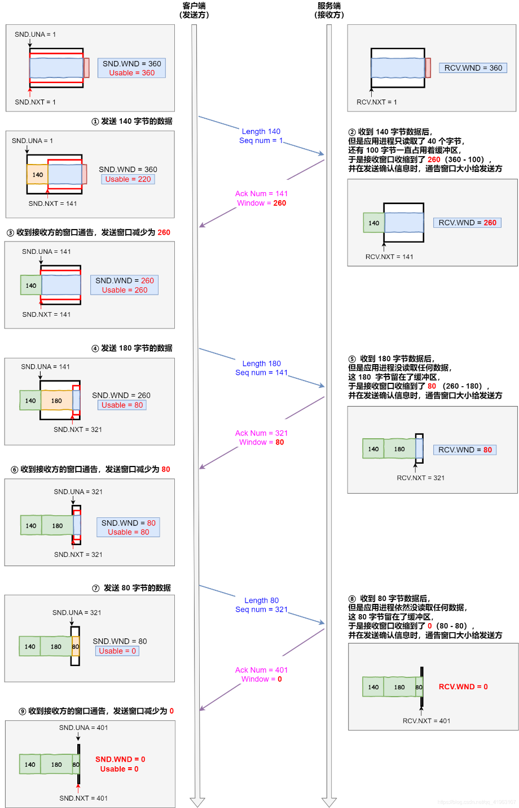
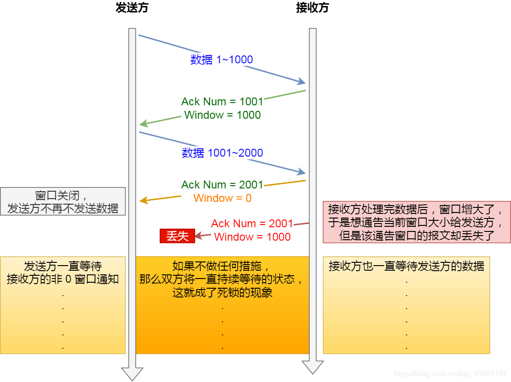
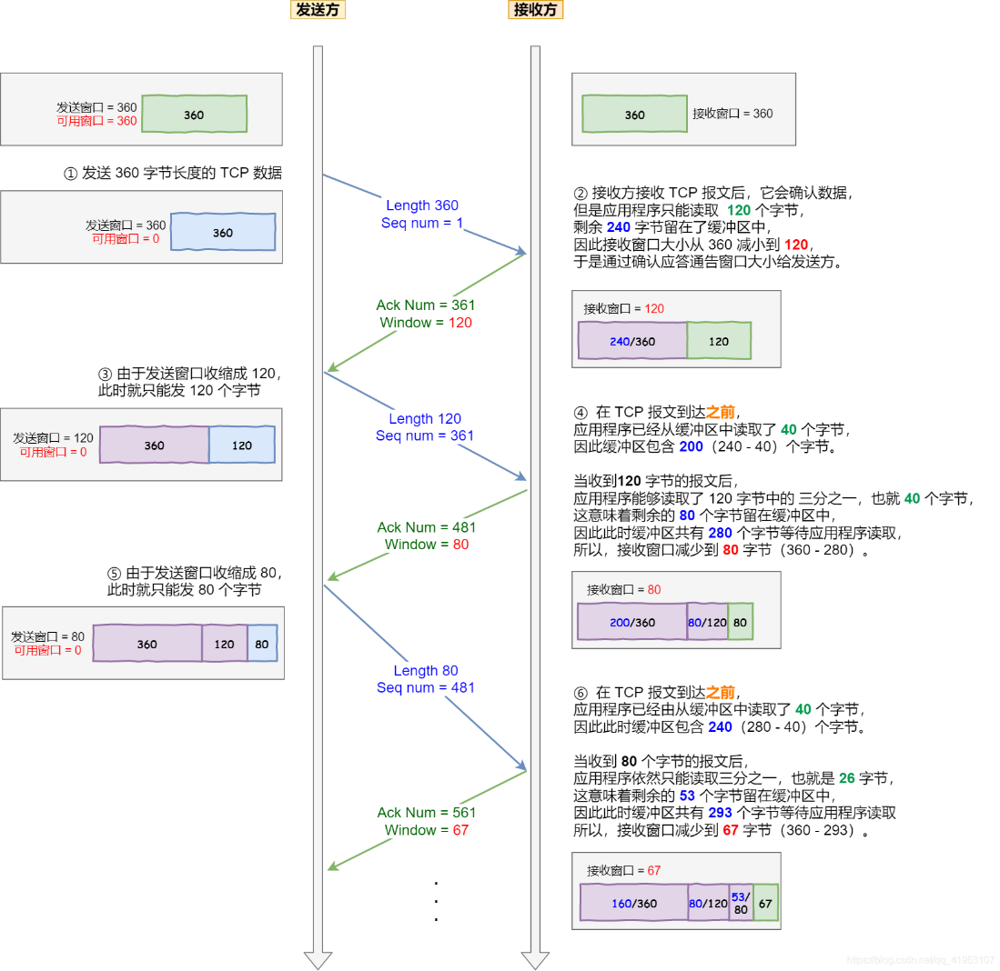

### 操作系统缓冲区与滑动窗口的关系

流量控制是<strong style="color:red">接收方控制发送方，不涉及网络中间设备</strong>

- **流量控制**（Flow Control）由接收方通过 rwnd 告诉发送方“我这边缓冲区快满了，别发太快”；
- 它**不关心网络**，**不关心路由器是否限流或丢包**；
- 所以：**如果接收方仍能处理数据，就不会触发流量控制**。

前面的流量控制例子，我们假定了发送窗口和接收窗口是不变的，但是实际上，发送窗口和接收窗口中所存放的字节数，都是放在操作系统内存缓冲区中的，而**操作系统的缓冲区，会被操作系统调整。**
当应用进程没办法及时读取缓冲区的内容时，也会对我们的缓冲区造成影响。

### 操作系统的缓冲区，是如何影响发送窗口和接收窗口的呢？

#### 当应用程序没有及时读取缓存时

当应用程序没有及时读取缓存时，发送窗口和接收窗口的变化。
考虑以下场景：
客户端作为发送方，服务端作为接收方，发送窗口和接收窗口初始大小为 360；
服务端非常的繁忙，当收到客户端的数据时，应用层不能及时读取数据。

根据上图的流量控制，说明下每个过程：

1.  客户端发送 140 字节数据后，可用窗口变为 220 （360 - 140）。
2.  服务端收到 140 字节数据，但是服务端非常繁忙，应用进程只读取了 40 个字节，还有 100 字节占用着缓冲区，于是接收窗口收缩到了 260 （360 - 100），最后发送确认信息时，将窗口大小通告给客户端。
3.  客户端收到确认和窗口通告报文后，发送窗口减少为 260。
4.  客户端发送 180 字节数据，此时可用窗口减少到 80。
5.  服务端收到 180 字节数据，但是应用程序没有读取任何数据，这 180 字节直接就留在了缓冲区，于是接收窗口收缩到了 80 （260 - 180），并在发送确认信息时，通过窗口大小给客户端。
6.  客户端收到确认和窗口通告报文后，发送窗口减少为 80。
7.  客户端发送 80 字节数据后，可用窗口耗尽。
8.  服务端收到 80 字节数据，但是应用程序依然没有读取任何数据，这 80 字节留在了缓冲区，于是接收窗口收缩到了 0，并在发送确认信息时，通过窗口大小给客户端。
9.  客户端收到确认和窗口通告报文后，发送窗口减少为 0。
    可见最后窗口都收缩为 0 了，也就是发生了窗口关闭。当发送方可用窗口变为 0 时，发送方实际上会定时发送窗口探测报文，以便知道接收方的窗口是否发生了改变，这个内容后面会说，这里先简单提一下。

#### 当服务端系统资源非常紧张的时候

当服务端系统资源非常紧张的时候，操心系统可能会直接减少了接收缓冲区大小，这时应用程序又无法及时读取缓存数据，那么这时候就有严重的事情发生了，会出现数据包丢失的现象。

说明下每个过程：

1.  客户端发送 140 字节的数据，于是可用窗口减少到了 220。
2.  服务端因为现在非常的繁忙，操作系统于是就把接收缓存减少了 120 字节，当收到 140 字节数据后，又因为应用程序没有读取任何数据，所以 140 字节留在了缓冲区中，于是接收窗口大小从 360 收缩成了 100，最后发送确认信息时，通告窗口大小给对方。
3.  此时客户端因为还没有收到服务端的通告窗口报文，所以不知道此时接收窗口收缩成了 100，客户端只会看自己的可用窗口还有 220，所以客户端就发送了 180 字节数据，于是可用窗口减少到 40。
4.  服务端收到了 180 字节数据时，发==现数据大小超过了接收窗口的大小，于是就把数据包丢失了==。
5.  客户端收到第 2 步时，服务端发送的确认报文和通告窗口报文，尝试减少发送窗口到 100，把窗口的右端向左收缩了 80，此时可用窗口的大小就会出现诡异的负值。
    所以，如果发生了先减少缓存，再收缩窗口，就会出现丢包的现象。
    为了防止这种情况发生，TCP 规定是**不允许同时减少缓存又收缩窗口的，而是采用先收缩窗口，过段时间再减少缓存，这样就可以避免了丢包情况**。

### 窗口关闭

在前面我们都看到了，TCP 通过让接收方指明希望从发送方接收的数据大小（窗口大小）来进行流量控制。
如果窗口大小为 0 时，就会阻止发送方给接收方传递数据，直到窗口变为非 0 为止，这就是**窗口关闭**。

#### 窗口关闭潜在的危险

接收方向发送方通告窗口大小时，是通过 ACK 报文来通告的。
那么，当发生窗口关闭时，接收方处理完数据后，会向发送方通告一个窗口非 0 的 ACK 报文，如果这个通告窗口的 ACK 报文在网络中**丢失**了，那麻烦就大了。

这会导致发送方一直等待接收方的非 0 窗口通知，接收方也一直等待发送方的数据，如不采取措施，这种相互等待的过程，会造成了[死锁](https://so.csdn.net/so/search?q=%E6%AD%BB%E9%94%81&spm=1001.2101.3001.7020)的现象。

### TCP 是如何解决窗口关闭时，潜在的死锁现象呢？

为了解决这个问题，TCP 为每个连接设有一个持续定时器，**只要 TCP 连接一方收到对方的零窗口通知，就启动持续计时器**。
如果持续计时器超时，就会发送**窗口探测 ( Window probe ) 报文**，而对方在确认这个探测报文时，给出自己现在的接收窗口大小。

1.  如果接收窗口仍然为 0，那么收到这个报文的一方就会重新启动持续计时器；
2.  如果接收窗口不是 0，那么死锁的局面就可以被打破了。
    窗口探测的次数一般为 3 次，每次大约 30-60 秒（不同的实现可能会不一样）。如果 3 次过后接收窗口还是 0 的话，有的 TCP 实现就会发**RST**报文来中断连接。

#### 糊涂窗口综合症

如果接收方太忙了，来不及取走接收窗口里的数据，那么就会导致发送方的发送窗口越来越小。
到最后，**如果接收方腾出几个字节并告诉发送方现在有几个字节的窗口，而发送方会义无反顾地发送这几个字节，这就是糊涂窗口综合症**。
要知道，我们的 TCP + IP 头有 40 个字节，为了传输那几个字节的数据，要达上这么大的开销，这太不经济了。
==就好像一个可以承载 50 人的大巴车，每次来了一两个人，就直接发车。除非家里有矿的大巴司机，才敢这样玩，不然迟早破产。要解决这个问题也不难，大巴司机等乘客数量超过了 25 个，才认定可以发车。==
现举个糊涂窗口综合症的栗子，考虑以下场景：
接收方的窗口大小是 360 字节，但接收方由于某些原因陷入困境，假设接收方的应用层读取的能力如下：
接收方每接收 3 个字节，应用程序就只能从缓冲区中读取 1 个字节的数据；
在下一个发送方的 TCP 段到达之前，应用程序还从缓冲区中读取了 40 个额外的字节；

每个过程的窗口大小的变化，在图中都描述的很清楚了，可以发现窗口不断减少了，并且发送的数据都是比较小的了。
所以，糊涂窗口综合症的现象是可以发生在发送方和接收方：

1.  接收方可以通告一个小的窗口
2.  而发送方可以发送小数据
    于是，要解决糊涂窗口综合症，就解决上面两个问题就可以了
3.  让接收方不通告小窗口给发送方
4.  让发送方避免发送小数据

### 怎么让接收方不通告小窗口呢？

接收方通常的策略如下:
当「窗口大小」小于 min( MSS，缓存空间/2 ) ，也就是小于 MSS 与 1/2 缓存大小中的最小值时，就会向发送方通告窗口为 0，也就阻止了发送方再发数据过来。
等到接收方处理了一些数据后，窗口大小 \>= MSS，或者接收方缓存空间有一半可以使用，就可以把窗口打开让发送方发送数据过来。

### 怎么让发送方避免发送小数据呢？

发送方通常的策略:
使用 Nagle 算法，该算法的思路是延时处理，它满足以下两个条件中的一条才可以发送数据：

1.  要等到窗口大小 \>= MSS 或是 数据大小 \>= MSS
2.  收到之前发送数据的 ack 回包
    只要没满足上面条件中的一条，发送方一直在囤积数据，直到满足上面的发送条件。
    另外，Nagle 算法默认是打开的，如果对于一些需要小数据包交互的场景的程序，比如，telnet 或 ssh 这样的交互性比较强的程序，则需要关闭 Nagle 算法。
    可以在 Socket 设置 TCP_NODELAY 选项来关闭这个算法（关闭 Nagle 算法没有全局参数，需要根据每个应用自己的特点来关闭）
