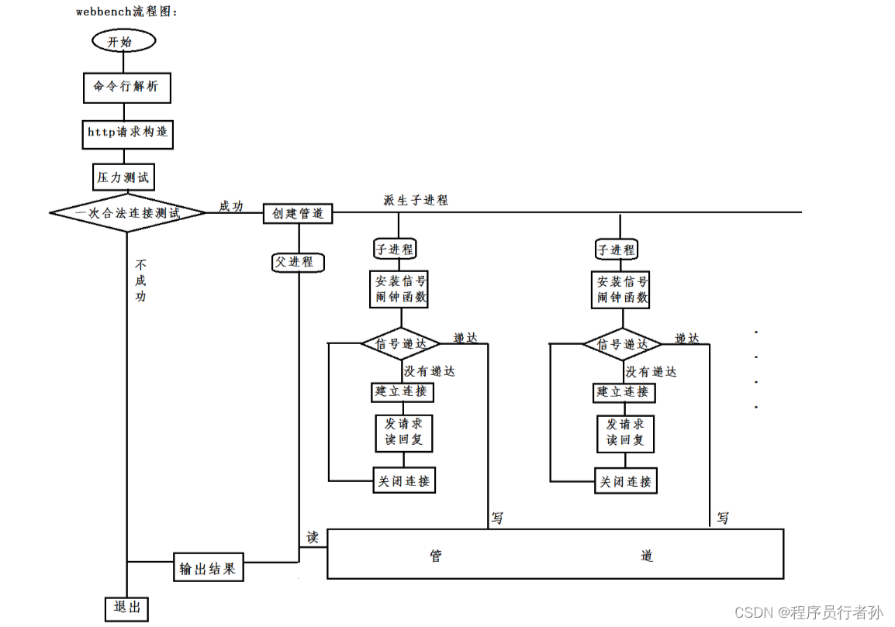

### web 压力测试工具 webbench 介绍

webbench 最多可以模拟 3 万个并发连接去测试网站的负载能力，并发能力比较高，可以测试 https 及动态静态页面。

#### 核心原理

父进程 fork 若干个子进程，每个子进程在用户要求时间或默认的时间内对目标 web 循环发出实际访问请求，父子进程通过**管道**进行通信，子进程通过管道写端向父进程传递在若干次请求访问完毕后记录到的总信息，父进程通过管道读端读取子进程发来的相关信息，子进程在时间到后结束，父进程在所有子进程退出后统计并给用户显示最后的测试结果，然后退出。

#### webbench 的主要压测流程：

1.解析参数：用户通过命令行参数指定目标网址、并发连接数、测试时长等参数。webbench 首先会解析这些参数，确定压测的目标和条件。 2.创建并发连接：webbench 根据用户指定的并发连接数，在测试开始时创建相应数量的并发连接。这些连接将模拟多个客户端同时访问目标网站。 3.建立连接：对于每个并发连接，webbench 发起一个 HTTP 请求并尝试与目标服务器建立连接。这些连接可能是非阻塞的，允许同时处理多个连接。 4.发送请求：一旦连接建立成功，webbench 就会向目标服务器发送 HTTP 请求。这些请求可以是简单的 GET 请求，也可以包含其他 HTTP 方法和自定义的请求头信息。 5.接收响应：webbench 在发送请求后会等待目标服务器的响应。它可以根据用户指定的超时时间来确定是否需要等待响应，或者在超时后放弃等待并关闭连接。 6.记录结果：在测试过程中，webbench 会记录每个请求的响应时间、状态码等信息。这些信息将用于后续的性能分析和结果报告。 7.重复测试：根据用户指定的测试时长，webbench 会在一定时间内不断重复发送请求和接收响应，以模拟持续的并发访问情况。 8.汇总结果：在测试结束后，webbench 会汇总所有请求的结果，并计算出一些统计信息，如平均响应时间、成功率等。这些信息将作为压测结果向用户展示。 9.生成报告：最后，webbench 会根据测试结果生成一份报告，包括压测的详细信息、性能指标和可能的改进建议。用户可以根据这份报告来评估服务器的性能表现和优化方向。
