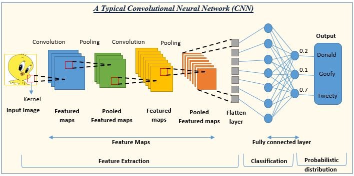

# Pytorch卷积神经网络
PyTorch 卷积神经网络 (Convolutional Neural Networks, CNN) 是一类专门用于处理具有网格状拓扑结构数据（如图像）的深度学习模型。



- 输入图像（Input Image）：网络接收的原始图像数据。

- 卷积（Convolution）：使用卷积核（Kernel）在输入图像上滑动，提取特征，生成特征图（Feature Maps）。

- 池化（Pooling）：通常在卷积层之后，通过最大池化或平均池化减少特征图的尺寸，同时保留重要特征，生成池化特征图（Pooled Feature Maps）。

- 特征提取（Feature Extraction）：通过多个卷积和池化层的组合，逐步提取图像的高级特征。

- 展平层（Flatten Layer）：将多维的特征图转换为一维向量，以便输入到全连接层。

- 全连接层（Fully Connected Layer）：类似于传统的神经网络层，用于将提取的特征映射到输出类别。

- 分类（Classification）：网络的输出层，根据全连接层的输出进行分类。

- 概率分布（Probabilistic Distribution）：输出层给出每个类别的概率，表示输入图像属于各个类别的可能性

## 卷积神经网络的基本结构
### 1、输入层（Input Layer）

接收原始图像数据，图像通常被表示为一个三维数组，其中两个维度代表图像的宽度和高度，第三个维度代表颜色通道（例如，RGB图像有三个通道）。

### 2、卷积层（Convolutional Layer）

用卷积核提取局部特征，如边缘、纹理等。

### 3、激活函数（Activation Function）
通常在卷积层之后应用非线性激活函数，如 ReLU（Rectified Linear Unit），以引入非线性特性，使网络能够学习更复杂的模式。

ReLU 函数定义为 ：f(x)=max(0,x)，即如果输入小于 0 则输出 0，否则输出输入值。

### 4、池化层（Pooling Layer）

用于降低特征图的空间维度，减少计算量和参数数量，同时保留最重要的特征信息。
最常见的池化操作是最大池化（Max Pooling）和平均池化（Average Pooling）。
最大池化选择区域内的最大值，而平均池化计算区域内的平均值。
### 5、归一化层（Normalization Layer，可选）

例如，局部响应归一化（Local Response Normalization, LRN）或批归一化（Batch Normalization）。
这些层有助于加速训练过程，提高模型的稳定性。
### 6、全连接层（Fully Connected Layer）

在 CNN 的末端，将前面层提取的特征图展平（Flatten）成一维向量，然后输入到全连接层。
全连接层的每个神经元都与前一层的所有神经元相连，用于综合特征并进行最终的分类或回归。
### 7、输出层（Output Layer）

根据任务的不同，输出层可以有不同的形式。

对于分类任务，通常使用 Softmax 函数将输出转换为概率分布，表示输入属于各个类别的概率。

### 8、损失函数（Loss Function）

用于衡量模型预测与真实标签之间的差异。

常见的损失函数包括交叉熵损失（Cross-Entropy Loss）用于多分类任务，均方误差（Mean Squared Error, MSE）用于回归任务。

### 9、优化器（Optimizer）

用于根据损失函数的梯度更新网络的权重。常见的优化器包括随机梯度下降（SGD）、Adam、RMSprop等。

### 10、正则化（Regularization，可选）

包括 Dropout、L1/L2 正则化等技术，用于防止模型过拟合。

这些层可以堆叠形成更深的网络结构，以提高模型的学习能力。

CNN 的深度和复杂性可以根据任务的需求进行调整。


```python
import torch
import torch.nn as nn
import torch.nn.functional as F
import torch.optim as optim
```

```python
class SimpleCNN(nn.Module):
    def __init__(self):
        super(SimpleCNN, self).__init__()
        # 定义卷积层：输入1通道，输出32通道，卷积核大小3x3
        self.conv1 = nn.Conv2d(1, 32, kernel_size=3, stride=1, padding=1)
        # 定义卷积层：输入32通道，输出64通道
        self.conv2 = nn.Conv2d(32, 64, kernel_size=3, stride=1, padding=1)
        # 定义全连接层
        self.fc1 = nn.Linear(64 * 7 * 7, 128)  # 输入大小 = 特征图大小 * 通道数
        self.fc2 = nn.Linear(128, 10)  # 10 个类别

    def forward(self, x):
        x = F.relu(self.conv1(x))  # 第一层卷积 + ReLU
        x = F.max_pool2d(x, 2)     # 最大池化
        x = F.relu(self.conv2(x))  # 第二层卷积 + ReLU
        x = F.max_pool2d(x, 2)     # 最大池化
        x = x.view(-1, 64 * 7 * 7) # 展平操作
        x = F.relu(self.fc1(x))    # 全连接层 + ReLU
        x = self.fc2(x)            # 全连接层输出
        return x

# 创建模型实例
model = SimpleCNN()
```
