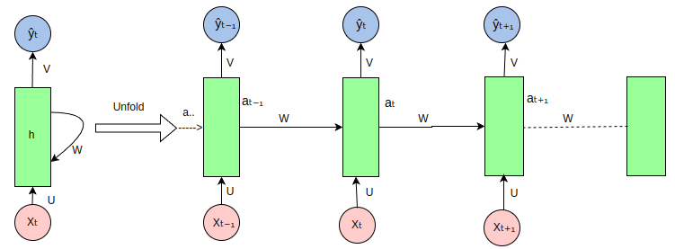

# PyTorch 循环神经网络（RNN）
循环神经网络（Recurrent Neural Networks, RNN）是一类神经网络架构，专门用于处理序列数据，能够捕捉时间序列或有序数据的动态信息，能够处理序列数据，如文本、时间序列或音频。

RNN 在自然语言处理（NLP）、语音识别、时间序列预测等任务中有着广泛的应用。

RNN 的关键特性是其能够保持隐状态（hidden state），使得网络能够记住先前时间步的信息，这对于处理序列数据至关重要。

**梯度问题：梯度消失和爆炸**

由于RNN的循环结构，在训练中可能会出现梯度消失或梯度爆炸的问题。长序列可能会导致训练过程中的梯度变得非常小（消失）或非常大（爆炸），从而影响模型的学习效率。

## RNN 的基本结构
在传统的前馈神经网络（Feedforward Neural Network）中，数据是从输入层流向输出层的，而在 RNN 中，数据不仅沿着网络层级流动，还会在每个时间步骤上传播到当前的隐层状态，从而将之前的信息传递到下一个时间步骤。

隐状态（Hidden State）： RNN 通过隐状态来记住序列中的信息。

隐状态是通过上一时间步的隐状态和当前输入共同计算得到的。

### 循环单元的结构如下：
- **输入$x_t$**：在时间步t的输入向量。
- **隐藏状态$h_t$**：在时间步t的隐藏状态向量，用于存储之前时间步的信息。
- **输出$y_t$**：在时间步 t的输出向量（可选，取决于具体任务）。

公式：
$$
h_t=f(W_{hh}h_{t-1} + W_{xh}x_t + b)
$$

- $h_t$:当前时刻的隐状态。
- $h_{t-1}$:前一时刻的隐状态。
- $x_t$:当前时刻的输入
  
输出（Output）： RNN 的输出不仅依赖当前的输入，还依赖于隐状态的历史信息。
$$
y_t=W_{hy}h_t+b_y
$$

### RNN 如何处理序列数据
循环神经网络（RNN）在处理序列数据时的展开（unfold）视图如下


RNN 是一种处理序列数据的神经网络，它通过循环连接来处理序列中的每个元素，并在每个时间步传递信息，以下是图中各部分的说明：
- 输入序列($x_t,x_{t-1},...$):图中的粉色圆圈代表输入序列中的各个元素，如$x_t$表示当前时间步的输入，$x_{t-1}$表示前一个时间步的输入，以此类推。

### PyTorch 实现一个简单的 RNN 实例
以下是一个简单的 PyTorch 实现例子，使用 RNN 模型来处理序列数据并进行分类。

```python
import torch
import torch.nn as nn
import torch.optim as optim
from torch.utils.data import DataLoader, TensorDataset
import numpy as np
```
```python
class SimpleRNN(nn.Module):
    def __init__(self, input_size, hidden_size, output_size):
        super(SimpleRNN, self).__init__()
        # 定义 RNN 层
        self.rnn = nn.RNN(input_size, hidden_size, batch_first=True)
        # 定义全连接层
        self.fc = nn.Linear(hidden_size, output_size)

    def forward(self, x):
        # x: (batch_size, seq_len, input_size)
        out, _ = self.rnn(x)  # out: (batch_size, seq_len, hidden_size)
        # 取序列最后一个时间步的输出作为模型的输出
        out = out[:, -1, :]  # (batch_size, hidden_size)
        out = self.fc(out)  # 全连接层
        return out
```


# LSTM
长短时记忆网络（Long Short-Term Memory，LSTM）是一种特殊的RNN结构，由Hochreiter和Schmidhuber在1997年提出。LSTM旨在解决传统RNN在训练长序列时遇到的梯度消失问题。

LSTM的结构
LSTM的核心是其复杂的记忆单元结构，包括以下组件：

- 遗忘门:控制哪些信息从单元状态中被丢弃。
  $$
  f_t = \sigma(W_f \cdot [h_{t-1}, x_t] + b_f)
  $$

- 输入门:控制新信息的哪些部分要存储在单元状态中。
  $$
  i_t = \sigma(W_i \cdot [h_{t-1}, x_t] + b_i)
  $$

- 单元状态:储存过去的信息，通过遗忘门和输入门的调节进行更新。
$$
\tilde{C}_t = \text{tanh}(W_C \cdot [h_{t-1}, x_t] + b_C)\\
C_t = f_t \cdot C_{t-1} + i_t \cdot \tilde{C}_t
$$

- 输出门:控制单元状态的哪些部分要读取和输出。
$$
o_t = \sigma(W_o \cdot [h_{t-1}, x_t] + b_o)
$$

## 实现
```python
# LSTM的PyTorch实现
import torch.nn as nn

class LSTM(nn.Module):
    def __init__(self, input_size, hidden_size, output_size):
        super(LSTM, self).__init__()
        self.lstm = nn.LSTM(input_size, hidden_size, batch_first=True)
        self.fc = nn.Linear(hidden_size, output_size)

    def forward(self, x, (h_0, c_0)):
        out, (h_n, c_n) = self.lstm(x, (h_0, c_0)) # 运用LSTM层
        out = self.fc(out) # 运用全连接层
        return out
```

# 门控循环单元（GRU）
门控循环单元（Gated Recurrent Unit，GRU）是一种特殊的RNN结构，由Cho等人于2014年提出。GRU与LSTM相似，但其结构更简单，计算效率更高。

## GRU的结构
GRU通过将忘记和输入门合并，减少了LSTM的复杂性。GRU的结构主要由以下组件构成：

- 重置门:控制过去的隐藏状态的哪些信息应该被忽略。
$$
r_t = \sigma(W_r \cdot [h_{t-1}, x_t] + b_r) 
$$
- 更新门:控制隐藏状态的哪些部分应该被更新。
$$
z_t = \sigma(W_z \cdot [h_{t-1}, x_t] + b_z) 
$$


- 新的记忆内容:计算新的候选隐藏状态，可能会与当前隐藏状态结合。
$$
\tilde{h}_t = \text{tanh}(W \cdot [r_t \odot h_{t-1}, x_t] + b) 
$$

- 最终隐藏状态：
$$
h_t = (1 - z_t) \cdot h_{t-1} + z_t \cdot \tilde{h}_t
$$

## 实现
```python
# GRU的PyTorch实现
import torch.nn as nn

class GRU(nn.Module):
    def __init__(self, input_size, hidden_size, output_size):
        super(GRU, self).__init__()
        self.gru = nn.GRU(input_size, hidden_size, batch_first=True)
        self.fc = nn.Linear(hidden_size, output_size)

    def forward(self, x, h_0):
        out, h_n = self.gru(x, h_0) # 运用GRU层
        out = self.fc(out) # 运用全连接层
        return out
```