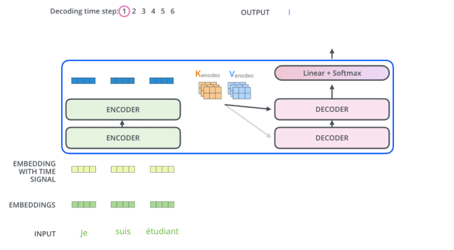

# Transformer模型
谷歌在2017年提出的继卷积神经网络（CNN）模型之后新一代网络架构，最初用于自然语言处理（NLP），如今在计算机视觉领域的很多下游任务（如图像分类，目标检测，图像分割等）及其他领域也有很出色的表现

# Transformer结构细节
## 1.词编码（Word Embedding）
计算机不会直接理解我们人类的语言，在计算机中，信息的存储都是以0，1的形式进行表示的，单词，句子，图像，音乐等等都是如此。因此，我们要<b>先将单词进行编码，用向量进行表示，</b>通俗来说就是将单词变成计算机看得懂的语言。

词编码的手段有很多，比如独热编码（One-Hot 编码），他用以下形式进行编码，假设要编码的单词有4个（dog, apple, banana, cat）:

dog: [1, 0, 0, 0]

apple: [0, 1, 0, 1]

banana: [0, 0, 1, 0]

cat: [0, 0, 0, 1]

用这种方法进行编码方法简单，但缺点也有很多，比如：

1. <b>无法表达两个单词之间的相关性（距离）。</b>
以人类的视角来看，apple和banana，dog和cat都属于同一类的事物，apple距离banana应该比dog更近一些，但从向量上却无法反映出来。
2. <b>词向量维度过大，要编码的向量的维度等于单词的个数。</b>
单单是英语就有成千上万个单词，如果每一个单词都采用这种形式进行编码，那么所产生的向量的维度将和单词个数一致，这显然是无法接受的（上述维度是4，因为有4个单词）。

现在常用的编码手段依据**word2vec算法**对单词进行编码

## 2. 位置编码（Positional Encoding, 简称PE）
首先解释一下为什么Transformer需要位置编码，所谓的位置编码就是对一个句子中的每个单词贴上标签，标明他们在句子中的位置（1，2，3，4，…）。

假设我们输入一个句子不对它进行位置编码，那么 I am a student, 和 Student am a I 将被计算机认为是同一个句子，这显然不符合认知。（后续也有研究发现位置编码其实在注意力层的处理以后就消失了，这里不展开叙述。）

RNN模型中是按顺序处理一个序列，Ht 时刻的状态取决于 Ht-1 时刻，因此天生就包含了句子中的位置信息，而<b>Transformer模型是一次处理整个句子的信息，将句子中的单词进行词编码后全部同时送入模型，因此不包含位置信息。</b>（这也是为什么Transformer模型更擅于处理长文本序列，因为Transformer更关注全局信息，而RNN模型将模型状态储存在一个Hidden State里，因此更关注相邻几个单词之间的关系。）

那么位置编码具体是怎么操作的呢，肯定不是简单的将1，2，3，4加进去。论文中所使用的方法如下：
$$
PE_{pos,2i}= \sin(pos/10000^{2i/d_{model}})\\
PE_{pos,2i+1}= \cos(pos/10000^{2i/d_{model}})
$$

其中，pos是单词的位置，$d_{model}$ 是位置向量的维度，和词编码的维度相等。$i\in [0, d_{model})$代表位置向量的第 i 维。根据上述公式我们可以得到第pos个位置的 $d_{model}$  向量。

下图展示了一种位置向量在第4、5、6、7维度、不同位置的的数值大小。横坐标表示位置下标，纵坐标表示数值大小。

### 2.1 PE中的数学原理
为什么用三角函数，为什么偶数维（2i）用sin，奇数维（2i+1）用cos？

由三角函数性质公式：
$$
sin(α + β) = sin α cosβ + cos α sin β\\
cos(α + β) = cos α cosβ - sin α sin β
$$

代入上述公式有：
$$
PE(M+N，2i) = PE(M，2i) × PE(N，2i+1) + PE(M，2i+1) × PE(N，2i)\\
PE(M+N，2i+1) = PE(M，2i+1) × PE(N，2i+1) - PE(M，2i) × PE(N，2i)
$$

也就是说，$PE(M+N)$ 可由$PE(M)$ 与$PE(N)$ 相互计算得到，即各个位置间可以相互计算得到，绝对位置编码中包含了相对位置的信息。

到此，我们理解了位置编码的意义以及背后的数学规律。

## 3. 编码器（Encoder）
首先说明一点，除了第一个编码器外，其余编码器的输入皆为前一个编码器的输出，除了最后一个编码器外，第i个编码器的输出是第i+1个编码器的输入。

第一个编码器的输入为词编码与位置编码相加的和，所得到的新的向量可以为模型提供更多有意义的信息，比如词的位置，词之间的距离等。

## 3.1 Self-Attention层
假设我们想要翻译的句子是：

The animal didn’t cross the street because it was too tired

这个句子中的 it 是一个指代词，那么 it 指的是什么呢？它是指 animal 还是street？这个问题对人来说，是很简单的，但是对模型来说并不是那么容易。但是，如果模型引入了Self Attention机制之后，便能够让模型把it和animal关联起来了。同样的，当模型处理句子中其他词时，Self Attention机制也可以使得模型不仅仅关注当前位置的词，还会关注句子中其他位置的相关的词，进而可以更好地理解当前位置的词。

### 3.1.1 自注意力细节
我们先看如何使用向量计算自注意力，然后再看它的矩阵实现。

注意力（attention）有加法注意力和点乘注意力，为了方便使用矩阵乘法加速运算，论文中使用的是缩放点乘注意力（Scaled Dot-Product), Scaled后边再讲。
$$
Attention(Q,K,V)=softmax(\frac{QK^T}{\sqrt{d_k}})V
$$

图为Attention计算公式

先通过一个简单的例子来理解一下：什么是“self-attention自注意力机制”？

假设一句话包含两个单词：Thinking Machines。自注意力的一种理解是：Thinking-Thinking，Thinking-Machines，Machines-Thinking，Machines-Machines，共22种两两attention。那么，具体该如何计算呢？

假设Thinking、Machines这两个单词经过词向量算法得到向量是$x_1,x_2$ ,我们将self-attention计算的6个步骤进行可视化。

#### 1. 创建Q, K, V向量
从每个编码器的输入向量中创建三个向量，对于每个单词，创建一个查询向量（Q）、一个键向量（K）和一个值向量（V）。这些向量是通过将词嵌入向量 (X) 乘以训练过程中训练的三个矩阵（$W^Q, W^K, W^V$）来创建的。

注意，这些Q, K, V 向量的维度小于词嵌入向量，原文中Q, K, V向量的维度$d_k = 64$，而词嵌入和编码器输入/输出向量的维度$d_model = 512$。这是一种架构选择，可以使多头注意力（大部分）的计算保持不变。

#### 2. 计算注意力分数
假设我们正在计算本例中第一个单词“Thinking”的自注意力。我们需要根据这个词对输入句子的每个词进行评分。当我们在某个位置对单词进行编码时，分数决定了对输入句子其他部分的关注程度。

分数是通过 查询向量（Q） 与我们正在评分的各个单词的 键向量（K） 的点积来计算的。因此，如果我们正在处理位置#1中单词的自注意力，第一个分数将是q1和k1的点积，第二个分数是q1和k2的点积。

#### 3. 缩放（Scaled）
将分数除以 8（论文中使用的 键向量（K） 维度的平方根$\sqrt {64}= 8。$这会让梯度更稳定。这里可能还有其他可能的值，但默认是使用$\sqrt{dk}$

#### 4. Softmax
将结果进行Softmax操作。Softmax 将分数归一化，因此它们都是正数并且和为 1

#### 5. 乘以Value向量
在第4步进行完，得到每个词向量的分数后，将分数分别与对应的Value向量相乘。
这样做的意义在于：对于分数高的位置，相乘后的值就越大，我们把更多的注意力放到了它们身上；对于分数低的位置，相乘后的值就越小，这些位置的词可能是相关性不大的。

#### 6. 加权求和
把第5步得到的Value向量相加，就得到了Self Attention在当前位置（这里的例子是第1个位置）对应的输出。

### 3.1.2 自注意力的矩阵计算
首先，我们把所有词向量放到一个矩阵X中，然后分别和3个权重矩阵$W^Q, W^K, W^V$, 相乘，得到 Q，K，V 矩阵。矩阵X中的每一行，表示句子中的每一个词的词向量。Q，K，V 矩阵中的每一行表示 Query向量，Key向量，Value 向量，向量维度是dk。

### 3.1.3 多头注意力机制（Multi-Head Attention）
Transformer 的论文通过增加多头注意力机制（一组注意力称为一个 attention head），进一步完善了Self-Attention。这种机制从如下两个方面增强了attention层的能力。

1. <b>它扩展了模型关注不同位置的能力。</b>在上面的例子中，第一个位置的输出​包含了句子中其他每个位置的很小一部分信息，但​仅仅是单个向量，所以可能仅由第1个位置的信息主导了。而当我们翻译句子：The animal didn’t cross the street because it was too tired时，我们不仅希望模型关注到"it"本身，还希望模型关注到"The"和“animal”，甚至关注到"tired"。这时，多头注意力机制会有帮助。
2. <b>多头注意力机制赋予attention层多个“子表示空间”。</b> 下面我们会看到 ，多头注意力机制会有多组​WQ, WK, WV的权重矩阵（在 Transformer 的论文中，使用了 8 组注意力),，因此可以将​变换到更多种子空间进行表示。接下来我们也使用8组注意力头（attention heads））。每一组注意力的权重矩阵都是随机初始化的，但经过训练之后，每一组注意力的权重​ 可以把输入的向量映射到一个对应的”子表示空间“。<b>通俗来讲就是，同一件事找8个不同的人去做比只找1个人去做更好。</b>

在多头注意力机制中，我们为每组注意力设定单独的$​W^Q, W^K, W^V$参数矩阵。将输入 X 和每组注意力的$​W^Q, W^K, W^V$ 相乘，得到8组 Q, K, V 矩阵。

接着，我们把每组 K, Q, V 计算得到每组的 Z 矩阵，就得到8个Z矩阵。

由于前馈神经网络层接收的是 1 个矩阵（其中每行的向量表示一个词），而不是 8 个矩阵，所以我们直接把8个子矩阵拼接（concat）起来得到一个大的矩阵，然后和另一个权重矩阵 WO 相乘做一次变换，映射到前馈神经网络层所需要的维度。

总结一下就是：

- 把8个矩阵 {Z0,Z1…,Z7} 拼接起来。
- 把拼接后的矩阵和 WO 权重矩阵相乘。
- 得到最终的矩阵Z，这个矩阵包含了所有 attention heads（注意力头） 的信息。这个矩阵会输入到FFNN (Feed Forward Neural Network)层。

## 3.2 残差连接和层归一化
到目前为止，我们计算得到了self-attention的输出向量。而单层encoder里后续还有两个重要的操作：残差链接、层归一化。

### 3.2.1 残差连接
残差连接是由何恺明等人为了缓解网络退化问题而提出
- **一般认为**： 网络越深，表达能力越强，性能越好。
- **实际现象**： 在神经网络可以收敛的前提下，随着网络深度增加，网络的表现先是逐渐增加至饱和，然后迅速下降。

残差连接本质是将网络的输出与最初的输入相加。如下图所示，将X输入网络，可将该网络看作是对X的函数F(X)，将F(X)的结果与X相加作为下一层网络的输入。

这样做可以缓解随着网络加深，模型梯度在传递过程中逐渐变得很小直至消失，导致模型参数更新缓慢的问题。

### 3.2.2 层归一化
编码器的每个子层（Self Attention 层和 FFNN）都有一个残差连接和层归一化（layer-normalization），如下图所示。

#### 3.2.2.1 使用Normalization的目的
当我们使用梯度下降法做优化时，随着网络深度的增加，输入数据的特征分布会不断发生变化，为了保证数据特征分布的稳定性，会加入Normalization。从而可以使用更大的学习率，从而加速模型的收敛速度。同时，Normalization也有一定的抗过拟合作用，使训练过程更加平稳。

具体地，Normalization的主要作用就是把每层特征输入到激活函数之前，对它们进行normalization，使其转换为均值为1，方差为0的数据，从而可以避免数据落在激活函数的饱和区，以减少梯度消失的问题。

#### 3.2.2.2 LayerNorm & BatchNorm
BN（BatchNorm）和LN（LayerNorm）是两种最常用的Normalization的方法，它们都是将输入特征转换为均值为1，方差为0的数据

$$
BN(x_i) = \alpha \times \frac{x_i-\mu_b}{\sqrt{\sigma_B^2+\epsilon}}+\beta \\
LN(x_i) = \alpha \times \frac{x_i-\mu_L}{\sqrt{\sigma_L^2+\epsilon}}+\beta
$$
只不过，BN是对一个batch-size样本内的每个特征做归一化，LN是对每个样本的所有特征做归一化。以一个二维矩阵为例，它的行数代表batch_size，列数代表fea_nums。BN就是竖着进行归一化，LN则是横着进行归一化。

所以，BN抹平了不同特征之间的大小关系，而保留了不同样本之间的大小关系。这样，如果具体任务依赖于不同样本之间的关系，BN更有效，尤其是在CV领域，例如不同图片样本进行分类，不同样本之间的大小关系得以保留。
LN抹平了不同样本之间的大小关系，而保留了不同特征之间的大小关系。所以，LN更适合NLP领域的任务，其中，一个样本的特征实际上就是不同word embedding，通过LN可以保留特征之间的这种时序关系。

## 3.3 Attention中的数学原理
### 3.3.1 键值对注意力
$$
Attention(Q,K,V)=softmax(\frac{QK^T}{\sqrt{d_k}})V
$$

假如上面的公式很难理解，那么下面的公式读者能否知道其意义是什么呢？
$$
Softmax(XX^T)X
$$
我们先抛开Q K V三个矩阵不谈，self-Attention最原始的形态其实长上面这样。那么这个公式到底是什么意思呢？

我们一步一步讲

$XX^T$ 代表什么？

一个矩阵乘以它自己的转置，会得到什么结果，有什么意义？

<b>投影的值大，说明两个向量相关度高。</b>

我们考虑，如果两个向量夹角是九十度，那么这两个向量线性无关，完全没有相关性！

更进一步，这个向量是词向量，是词在高维空间的数值映射。词向量之间相关度高表示什么？是不是在一定程度上（不是完全）表示，在关注词A的时候，应当给予词B更多的关注？

上图展示了一个行向量运算的结果，那么矩阵 $XX^T$ 的意义是什么呢？

矩阵 $XX^T$ 是一个方阵，我们以行向量的角度理解，里面保存了每个向量与自己和其他向量进行内积运算的结果。

至此，我们理解了公式 $Softmax(XX^T)X$ 中，$XX^T$ 的意义。我们进一步，Softmax的意义何在呢？

回想Softmax函数的公式：
$$
S_i=\frac{e^i}{\sum_{j=1}^ne^j}
$$

<b>答：归一化。准确来说是，将数据映射到[0, 1]，并归一化，和为1。</b>

观察上图，行向量与 X 的第一个列向量相乘，得到了一个新的行向量，且这个行向量与 X 的维度相同。

在新的向量中，每一个维度的数值都是由三个词向量在这一维度的数值加权求和得来的，这个新的行向量就是"早"字词向量经过注意力机制加权求和之后的表示。

### 3.3.2 Q K V 矩阵
其实，所谓的Q K V矩阵、查询向量之类的字眼，其来源是 X 与矩阵的乘积，本质上都是X 的线性变换。

为什么不直接使用 X 而要对其进行线性变换？

当然是为了提升模型的拟合能力，<b>矩阵 W 都是可以训练的，起到一个缓冲的效果。</b>

### 3.3.3 $\sqrt{dk}$的意义

假设 Q, K 里的元素的均值为0，方差为1，那么$A^T = Q^TK$ 中元素的均值为0，方差为d. 当d变得很大时，A中的元素的方差也会变得很大，如果 A 中的元素方差很大，那么 Softmax(A) 的分布会趋于陡峭(分布的方差大，分布集中在绝对值大的区域)。

总结一下就是Softmax(A) 的分布会和 d 有关。因此A 中每一个元素除以d 后，方差又变为1。这使得Softmax(A) 的分布“陡峭”程度与d 解耦，从而使得训练过程中梯度值保持稳定。

## 4. 解码器（Decoder）
现在我们已经介绍了编码器中的大部分概念，我们也基本知道了编码器的原理。现在让我们来看下， 编码器和解码器是如何协同工作的。

编码器一般有多层，第一个编码器的输入是一个序列文本，最后一个编码器输出是一组序列向量，这组序列向量会作为解码器的K、V输入，其中K=V=解码器输出的序列向量表示。这些注意力向量将会输入到每个解码器的Encoder-Decoder Attention层，这有助于解码器把注意力集中到输入序列的合适位置，如下图所示。

解码器中的 Self Attention 层，和编码器中的 Self Attention 层的区别：

1.在解码器里，Self Attention 层只允许关注到输出序列中早于当前位置之前的单词（Masked）。
具体做法是：在 Self Attention 分数经过 Softmax 层之前，屏蔽当前位置之后的那些位置（将attention score设置成-inf）。<b>这样做的目的是为了符合因果关系，即在解码时应当遮住未来的单词，只关注过去已经编码的单词。</b>

2.解码器 Attention层是使用前一层的输出来构造Query 矩阵，而Key矩阵和 Value矩阵来自于编码器最终的输出。

## 5. 线性层和softmax
Decoder 最终的输出是一个向量，其中每个元素是浮点数。我们怎么把这个向量转换为单词呢？这是线性层和softmax完成的。

线性层就是一个普通的全连接神经网络，可以把解码器输出的向量，映射到一个更大的向量，这个向量称为 logits 向量：假设我们的模型有 10000 个英语单词（模型的输出词汇表），此 logits 向量便会有 10000 个数字，每个数表示一个单词的分数。

然后，Softmax 层会把这些分数转换为概率（把所有的分数转换为正数，并且加起来等于 1）。然后选择最高概率的那个数字对应的词，就是这个时间步的输出单词。

# VIT
## 3.1 图像块嵌入 (Patch Embeddings)
标准 Transformer 使用 一维标记嵌入序列 (Sequence of token embeddings) 作为输入。

为处理 2D 图像，将图像 $x\in \mathbb{R}^{H×W×C}$reshape 为一个展平 (flatten) 的 2D patches 序列 $x_p\in \mathbb{R}{N×(P^2⋅C)}$，其中 (H,W)为原始图像分辨率，C是原始图像通道数 (RGB 图像 C=3)，(P,P)是每个图像 patch 的分辨率，由此产生的图像 patch 数 $N=HW/P^2$亦为 Vision Transformer 的有效输入序列长度。

Transformer 在其所有层中使用恒定的隐向量 (latent vector) 大小 D，将图像 patches 展平，并使用 `可训练的线性投影 (FC 层) `将维度 $P^2⋅C$映射为 D维，同时保持图像 patches 数 N
不变 (等式 1)。

上述投影输出即 图像块嵌入 (Patch Embeddings) (本质就是对每一个展平后的 patch vector $x_p\in\mathbb{R}^{N×(P^2⋅C)}$做一个线性变换 / 全连接层 
，由 $P^2⋅C$维降维至D维，得到 $x_p\in \mathbb{R}^{N×D}$
，好比于 NLP 中的 词嵌入 (Word Embeddings)。

## 3.2 可学习的嵌入 (Learnable Embedding)
类似于 BERT 的类别 token [class]，此处 为图像 patch 嵌入序列预设一个 可学习的嵌入$z_0^0=x_class$，该嵌入在 Vision Transformer 编码器输出的状态/特征 $z_L^0$用作 图像表示 y
(等式 4)。无论是预训练还是微调，都有一个 分类头 (Classification Head) 附加在$z_L^0$之后，从而用于图像分类。在预训练时，分类头为 一个单层 MLP；在微调时，分类头为 单个线性层 (多层感知机与线性模型类似，区别在于 MLP 相对于 FC 层数增加且引入了非线性激活函数，例如 FC + GELU + FC 形式的 MLP)。

## 3.3 位置嵌入 (Position Embeddings)

也被加入图像块嵌入，以保留输入图像块之间的空间位置信息。不同于 CNN，Transformer 需要位置嵌入来编码 patch tokens 的位置信息，这主要是由于 自注意力 的 扰动不变性 (Permutation-invariant)，即打乱 Sequence 中 tokens 的顺序并不会改变结果。

相反，若不给模型提供图像块的位置信息，那么模型就需要通过图像块的语义来学习拼图，这就额外增加了学习成本。ViT 论文中对比了几种不同的位置编码方案：

- 无位置嵌入
- 1-D 位置嵌入 (1D-PE)：考虑把 2-D 图像块视为 1-D 序列
- 2-D 位置嵌入 (2D-PE)：考虑图像块的 2-D 位置 (x, y)
- 相对位置嵌入 (RPE)：考虑图像块的相对位置

最后发现如果 **不提供位置编码效果会差**，但其它各种类型的编码效果效果都接近，这主要是因为 ViT 的输入是相对较大的图像块而非像素，所以学习位置信息相对容易很多。

Transformer 原文中默认采用 **固定位置编码**，ViT 则采用 **标准可学习/训练的 1-D 位置编码嵌入**，因为尚未观察到使用更高级的 2-D-aware 位置嵌入 (附录 D.4) 能够带来显著的性能提升 (当然，后续的很多 ViT 变体也使用了 2-D 位置嵌入)。在输入 Transformer 编码器之前直接 **将图像块嵌入和位置嵌入按元素相加**