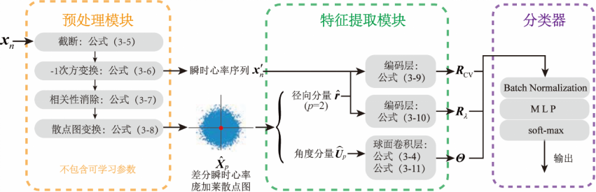
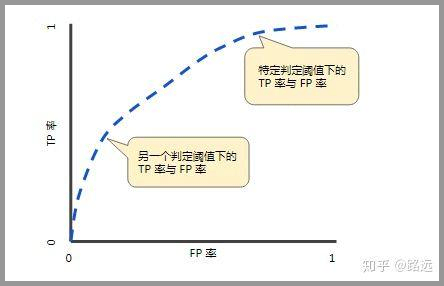

# 算法构建
## 球面卷积
### 传统卷积

离散卷积算子的计算原理
$$
(f*g)[n] = \sum_{m = -M}^{m=M}f[n-m]g[m]
$$
```python
def conv1d_direct(input_signal, kernel):
    """
    一维直接卷积
    Args:
        input_signal: 输入信号, 长度为 N
        kernel: 卷积核, 长度为 K
    Returns:
        output: 输出信号, 长度为 N - K + 1
    """
    N = len(input_signal)
    K = len(kernel)
    output_len = N - K + 1
    output = [0.0] * output_len # 初始化输出数组

    # 外层循环：遍历输出信号的每一个位置
    for i in range(output_len):
        sum_val = 0.0
        # 内层循环：在当前位置i，计算输入信号片段与核的点积
        for j in range(K):
            # 注意：有时核需要翻转（深度学习通常不翻转）
            # sum_val += input_signal[i + j] * kernel[K - 1 - j] # 翻转核（信号处理风格）
            sum_val += input_signal[i + j] * kernel[j]          # 不翻转核（深度学习风格，互相关）
        output[i] = sum_val

    return output
```

###
使用球面卷积，进行特征提取
基于RR间期绝对不齐这样的特性，发掘的新算法




因此，高维的庞加莱散点图不仅同样具有径向分量的幅度反映 RRI 的变异度以及角度分量反映 RRI 不规则性的特性，而且其角度分量所蕴含的信息量更为丰富。因此，结合高维散点图对散点图特征进行进一步的量化表征有望提升房颤检测的性能。

计算复杂度1.6kflops

可学习参数600+

此外，由于其模型输入为 30 秒长的 ECG 片段，因此在计算复杂度上，其模型的 FLOPs 远远高于我们的模型——他们模型第二层的估计 FLOPs 大约为 6,720 千次，这已经大大超过了我们所有模型的总和。

综上所述，我们的方法在处理不同长度 RRI 序列时，在多种数据库中均展现出了较同类方法更加优秀和稳定的性能。同时，相较于其他基于深度学习的方法，我们的方法具有更低的计算复杂度。这些结果充分证明了我们模型的优越性。


# 分类指标
TP – True Positive：实际为正类，且判断为正类（正确）

FN – False Negative：实际为正类，但判断为负类（错误）

TN – True Negative：实际为负类，且判断为负类（正确）

FP – False Positive：实际为负类，但判断为正类（错误）

### ACC：准确率

$$
ACC=\frac {TP + TN}{TP + FN + TN + FP}
$$

虽然准确率可以判断总的正确率，但是在**样本不平衡**的情况下，并不能作为很好的指标来衡量结果。

举个简单的例子，比如在一个总样本中，正样本占 90%，负样本占 10%，样本是严重不平衡的。对于这种情况，我们只需要将全部样本预测为正样本即可得到 90% 的高准确率，但实际上我们并没有很用心的分类，只是随便无脑一分而已。这就说明了：<b>由于样本不平衡的问题，导致了得到的高准确率结果含有很大的水分。即如果样本不平衡，准确率就会失效。</b>

### Precision:所有被预测为正的样本中实际为正的样本的概率
$$
Pre=\frac{TP}{TP + FP}
$$

<b>精准率代表对正样本结果中的预测准确程度，</b>而准确率则代表整体的预测准确程度，既包括正样本，也包括负样本。

### Recall:实际为正的样本中被预测为正样本的概率
$$
Recall = \frac{TP}{TP + FN}
$$
召回率的应用场景： 比如拿网贷违约率为例，相对好用户，我们更关心坏用户，不能错放过任何一个坏用户。因为如果我们过多的将坏用户当成好用户，这样后续可能发生的违约金额会远超过好用户偿还的借贷利息金额，造成严重偿失。召回率越高，代表实际坏用户被预测出来的概率越高，它的含义类似：宁可错杀一千，绝不放过一个。
### F1分数
如果我们把精确率（Precision）和召回率（Recall）之间的关系用图来表达，就是下面的PR曲线：
$$
F1 = \frac{2\times Pre \times Recall}{Pre + Recall}
$$

## ROC曲线和AUC曲线
#### Sp（特异性）
指的是模型识别出所有真实负类的能力。在所有实际为“负”的样本中，有多少被正确预测为“负”。（误诊率）
$$
特异性(Specificity) = \frac{TN}{FP + TN}
$$
- 如果一个测试的特异性是 95%，意味着在100个健康的人中，有95人被正确识别为健康，5人被误诊为患病。

#### Se（敏感性）
指的是模型识别出所有真实正类的能力。换句话说，在所有实际为“正”的样本中，有多少被正确预测为“正”
$$
灵敏度(Sensitivity) = \frac{TP}{TP + FN}
$$

- 如果一个疾病测试的敏感性是 90%，意味着在100个实际患病的人中，有90人被测试正确识别出来（10人漏诊）。

#### 真正率
$$
真正率(TPR) = \frac{TP}{TP + FN}
$$

#### 假正率
$$
假正率(FPR) =1 - 特异度 =\frac{FP}{FP + TN}
$$

<b>TPR 和 FPR 分别是基于实际表现 1 和 0 出发的，也就是说它们分别在实际的正样本和负样本中来观察相关概率问题。</b> 正因为如此，所以无论样本是否平衡，都不会被影响。还是拿之前的例子，总样本中，90% 是正样本，10% 是负样本。我们知道用准确率是有水分的，但是用 TPR 和 FPR 不一样。这里，TPR 只关注 90% 正样本中有多少是被真正覆盖的，而与那 10% 毫无关系，同理，FPR 只关注 10% 负样本中有多少是被错误覆盖的，也与那 90% 毫无关系，所以可以看出：如果我们从实际表现的各个结果角度出发，就可以避免样本不平衡的问题了，这也是为什么选用 TPR 和 FPR 作为 ROC/AUC 的指标的原因。

### ROC（接受者操作特征曲线）

ROC（Receiver Operating Characteristic）曲线，又称接受者操作特征曲线。该曲线最早应用于雷达信号检测领域，用于区分信号与噪声。后来人们将其用于评价模型的预测能力，ROC 曲线是基于混淆矩阵得出的。

ROC 曲线中的主要两个指标就是真正率和假正率， 上面也解释了这么选择的好处所在。其中横坐标为假正率（FPR），纵坐标为真正率（TPR），下面就是一个标准的 ROC 曲线图。



#### 如何判断 ROC 曲线的好坏？

改变阈值只是不断地改变预测的正负样本数，即 TPR 和 FPR，但是曲线本身是不会变的。那么如何判断一个模型的 ROC 曲线是好的呢？这个还是要回归到我们的目的：FPR 表示模型虚报的响应程度，而 TPR 表示模型预测响应的覆盖程度。我们所希望的当然是：虚报的越少越好，覆盖的越多越好。所以总结一下就是TPR 越高，同时 FPR 越低（即 ROC 曲线越陡），那么模型的性能就越好。 

### AUC（曲线下的面积）

为了计算 ROC 曲线上的点，我们可以使用不同的分类阈值多次评估逻辑回归模型，但这样做效率非常低。幸运的是，有一种基于排序的高效算法可以为我们提供此类信息，这种算法称为曲线下面积（Area Under Curve）。

比较有意思的是，如果我们连接对角线，它的面积正好是 0.5。对角线的实际含义是：随机判断响应与不响应，正负样本覆盖率应该都是 50%，表示随机效果。 ROC 曲线越陡越好，所以理想值就是 1，一个正方形，而最差的随机判断都有 0.5，所以一般 AUC 的值是介于 0.5 到 1 之间的。

**AUC 的一般判断标准**：

0.5 – 0.7： 效果较低，但用于预测股票已经很不错了

0.7 – 0.85： 效果一般

0.85 – 0.95： 效果很好

0.95 – 1： 效果非常好，但一般不太可能

#### AUC 的物理意义

曲线下面积对所有可能的分类阈值的效果进行综合衡量。曲线下面积的一种解读方式是看作模型将某个随机正类别样本排列在某个随机负类别样本之上的概率。以下面的样本为例，逻辑回归预测从左到右以升序排列：