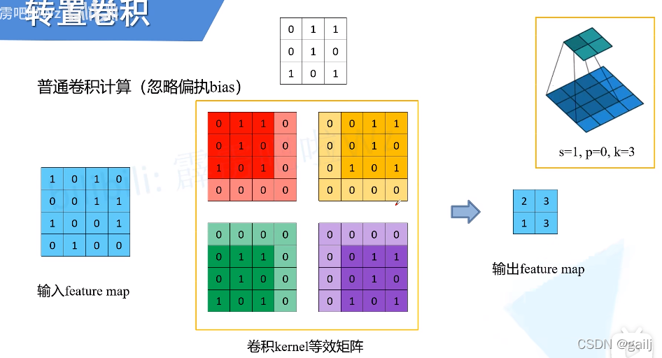
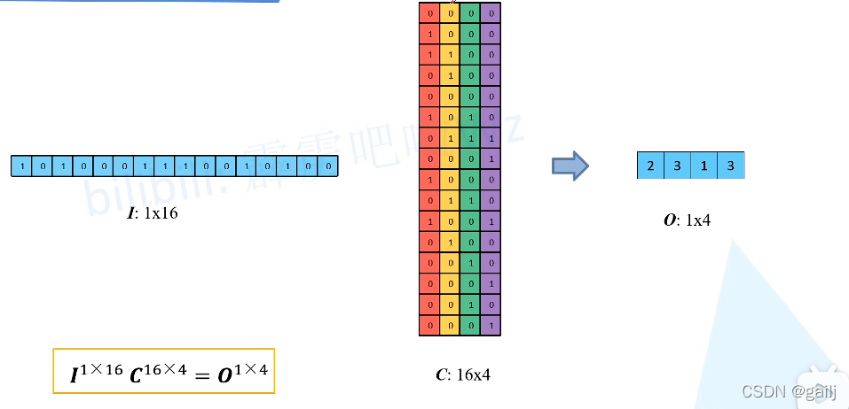
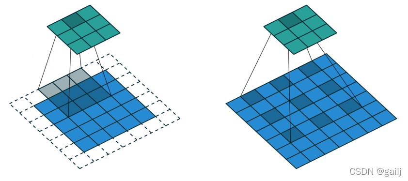
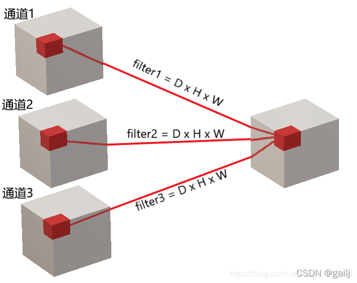

## 普通卷积
### 1.卷积核参数量
假设现在有一张单通道的灰度图，卷积核大小是3×3，输出通道是10。那么参数量就是3×3×1×10

假设现在有一张三通道的彩色图，卷积核大小是3×3，输出通道是10。那么参数量就是3×3×3×10

<b>因此要搞清楚一个概念：不是一个卷积核对三个通道做运算，而是三个卷积核对三通道做运算（即每个卷积核只对一个通道运算）</b>。因此一幅图有3个通道，就需要3个卷积核，每个卷积核大小又是3×3，这3个卷积核对3个通道计算完后，会合并成一张新的图（把原先这3个通道分别运算的结果，再加起来，合成一个新通道），因此输出通道是10，因此就需要重复10次这样的过程。也就是再×10。

### 2.如何高效的并行运算卷积滑窗？
我们计算卷积时，不可能一张张滑动吧，原理是这个原理，但是要考虑GPU并行运算啊，一张张滑动，那么运算就太慢了，所以在实际的程序里是将其转换为矩阵的形式并行处理。什么意思呢，看下面这张图

输入一个4×4的图片，卷积核是3×3，那么每次就有一部分取不到，取不到的那部分就用0代替，如上图的红黄绿紫矩阵。把这四个矩阵拉成向量，就如下图所示，将输入的图片拉成向量，将卷积核及补0的图片也拉成向量，然后就可以当成一个矩阵运算了，这样运算效率就高了。

假设本来是4×4是输入图片，就被拉成了1×16，然后卷积核及补零后，也被拉成了16维，总共有4组（总共可以滑动4次），所以就成了上图这样。这就是实际计算的方法，因为计算时不可能用一张张滑动的方式，这样太低效了。

## 1×1卷积
1×1卷积很常见的，比如在Resnet中。它通常有两个作用，

- **降维**（ dimension reductionality ）。比如，一张500 * 500且厚度depth为100 的图片在20个filter上做1*1的卷积，那么结果的大小为500×500×20。就是改变了输入和输出的通道数，可以减少参数。
- **增加非线性**。卷积层之后经过激励层，1*1的卷积在前一层的学习表示上添加了非线性激励（ non-linear activation ），提升网络的表达能力；很明显，增加了非线性，因为相当于又进行了一次运算呗。

## 可分离卷积
任何看过MobileNet架构的人都会遇到可分离卷积（separable convolutions）这个概念。但什么是“可分离卷积”，它与标准的卷积又有什么区别？可分离卷积主要有两种类型：空间可分离卷积和深度可分离卷积。

### 空间可分离卷积：
将一个卷积核分为两部分（降低计算复杂度，但并非所有的卷积核都可以分，如下图，必须得合适才行）最常见的情况是将3x3的卷积核划分为3x1和1x3的卷积 核，例如在Inception V3中就用到了

普通的3x3卷积在一个5x5的feature map上的计算方式如下图，每个位置需要9次乘法，一共9个位置，整个操作要**81**次做乘法。

同样的状况在空间可分离卷积中的计算方式如下图，第一步先使用3x1的filter，所需计算量为：**15x3=45**；第二步使用1x3的filter，所需计算量为：**9x3=27**；总共需要**72**次乘法就可以得到最终结果，要小于普通卷积的81次乘法。

### 深度可分离卷积：
深度可分离卷积，其实只对常规卷积做了一个很小的改动，但是带来的确是参数量的下降，这无疑为网络的轻量化带来了好处。深度可分离卷积主要分为两部分：<b>逐通道卷积（Depthwise Convolution）、逐点卷积（pointwise）</b>

逐通道卷积是在`空间特征融合`，逐点卷积是在`通道特征融合`（通过1*1卷积将通道之间的关系连接了起来）

1、假设输入通道数是3，第一步用三个卷积和对三个通道分别做卷积，这样在一次卷积后，输出3个数。（回想一下常规卷积方法，也是用三个卷积核对三个通道分别做卷积，但是会将这三个卷积的结果合成一个新通道，并切进而将这一步骤重复N次，N就是输出通道数）

2、这输出的三个数，再通过一个1x1x3的卷积核（pointwise核），得到一个数。

## 膨胀（空洞、扩张）卷积
  扩张卷积（Dilated Convolution）也被称为空洞卷积或者膨胀卷积，是在标准的卷积核中注入空洞，**以此来增加模型的感受野**（reception field）。

相比原来的正常卷积操作，除了卷积核大小，步长和填充外，扩张卷积多了一个参数： `dilation rate`，指的是卷积核的点的间隔数量，比如常规的卷积操作dilatation rate为1。扩张的卷积为卷积层引入另一个参数，称为扩张率。这定义了卷积核中值之间的间距。扩张率为2的3x3内核与5x5内核具有相同的视野，而仅使用9个参数。想象一下，获取一个5x5内核并删除每一个第二列和第二行（间隔删除）。

<b>下面两张图解释了标准卷积（Standard Convolution）和膨胀卷积（Dilated Convolution）之间的区别（膨胀卷积是间隔取点的）</b>

这就在不丢失特征分辨率的情况下扩大了感受野，进而对检测大物体有比较好的效果。所以总的来说，空洞卷积主要作用：<b>不丢失分辨率的情况下扩大感受野；调整扩张率获得多尺度信息。但是对于一些很小的物体，本身就不要那么大的感受野来说，这就不那么友好了。</b>

**Dilated Convolution存在的问题**：

  1、`Dilated Convolution的kernel并不连续`，也就是并不是所有的像素都用来计算了，因此这里将信息看作checker-board的方式将会损失信息的连续性。(即栅格效应，膨胀卷积不能覆盖所有的图像特征）

  2、Dilated Convolution的设计更像是用于获取long-range information，这样或许对一些大物体有较好的分隔效果，而对于小物体来说可能是有弊无利了。如何同时处理好大小物体的关系，则是设计好dilated convolution网络的关键。

## 转置卷积
  转置卷积又叫反卷积、逆卷积。不过转置卷积是目前最为正规和主流的名称，因为这个名称更加贴切的描述了卷积的计算过程，而其他的名字容易造成误导。因此，以后统一叫做转置卷积，而不是反卷积。
  那么转置卷积和反卷积的区别在哪里？<b>转置卷积只是将形状变回去了，但是数值变不回去；反卷积是指形状数值都变回去了。</b>
  我们先从转置卷积的用途来理解下，转置卷积作用是上采样（由少变多），通常用于几个方面：

  1、CNN可视化，通过反卷积将卷积得到的feature map还原到像素空间，来观察feature map对哪些pattern相应最大，即可视化哪些特征是卷积操作提取出来的；

  2、FCN全卷积网络中，由于要对图像进行像素级的分割，需要将图像尺寸还原到原来的大小，类似upsampling的操作，所以需要采用反卷积，用于语义分割；

  3、GAN对抗式生成网络中，由于需要从输入图像到生成图像，自然需要将提取的特征图还原到和原图同样尺寸的大小，即也需要反卷积操作。

## 3D卷积
  3D卷积的对象是三维图像，因此卷积核变成了depth×height×width，简写为D × H × W

  多通道的3D卷积核shape为D × H × W × Channels Channels就是输出的通道数（滤波器的个数）

  比如说一下子是10帧，10张RGB图片，每张提取出RGB三个通道，如下图所示，比如通道1中是10个图片的R，通道2是10个图片的G，通道3是10个图片的B，然后这些分别与3D卷积核做运算，运算后得到3个结果嘛，3个结果再求和累加起来。其实过程和2D的差不多（回想，2D其实也是RGB，只不过每个RGB通道只有一张图）

