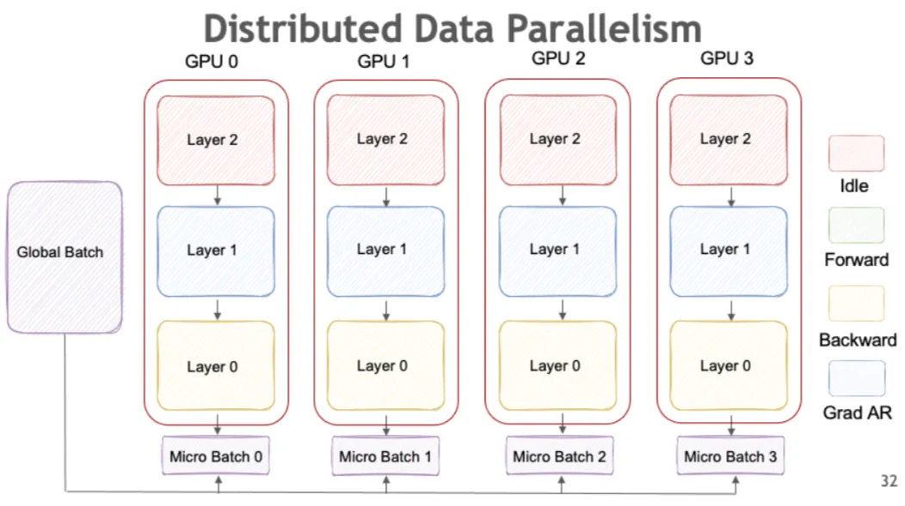
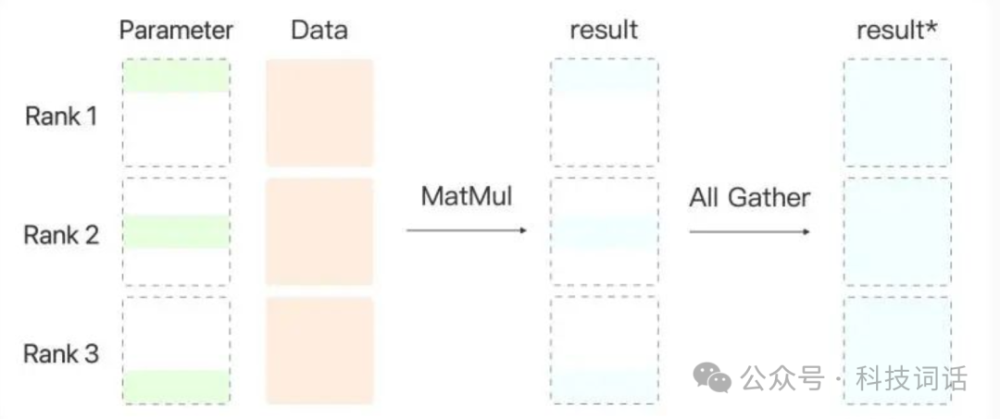
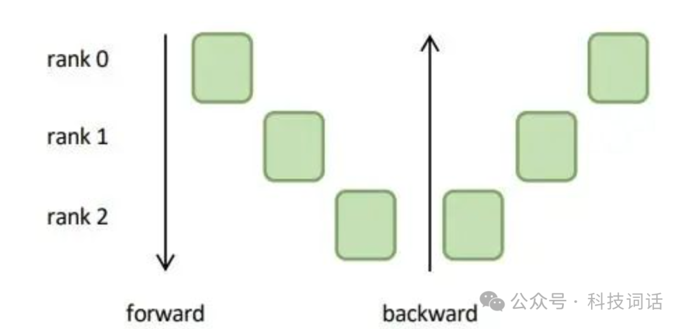

## 一、数据并行（Data Parallelism）
定义：
数据并行是**将训练数据集划分为多个子集**，每个子集被分配到不同的GPU上，每个GPU上运行完整的模型副本，进行前向传播和反向传播，最后通过**梯度聚合**（如AllReduce）更新模型参数。

**实现方式**：

- 每个GPU持有完整的模型参数、梯度和优化器状态。
- 数据被划分为多个mini-batch，每个GPU处理一个mini-batch。
- 梯度在所有GPU之间聚合后，更新模型参数。

**优点**：

- 实现简单，易于理解和部署。
- 通信开销相对较低，适合大规模数据集的训练。
- 适用于模型参数量较小、硬件资源有限的场景。

**缺点**：

- 模型参数在每个GPU上重复存储，导致显存冗余。
- 当模型参数量过大时，无法在单个GPU上运行，限制了模型规模。

**适用场景**：

- 小到中等规模的模型训练。
- 适用于CV、NLP等任务中的小模型训练。

## 二、张量并行（Tensor Parallelism）
定义：
张量并行是将模型的参数矩阵（如权重矩阵）沿特定维度（行或列）进行切分，分配到不同的GPU上，每个GPU只处理部分参数，通过通信操作（如AllGather）合并结果。

比如**某个线性层（特定的层）**权重$W\in\mathbb{R}^{d_{out}\times d_{in}}$，我们可以：

- 按列切分（Column Parallel）：
每块 GPU 存一部分输入特征的权重列，独立做矩阵乘，再合并结果。

- 按行切分（Row Parallel）：
每块 GPU 存输出特征的一部分权重行，输入同一份，算出部分输出，再拼接。

这样所有 GPU 同时算同一层的一部分矩阵乘，最后再做 all-reduce 或 all-gather 拼回去。

实现方式：

将模型的每一层（如Transformer层中的MLP或自注意力模块）的参数矩阵进行切分。
每个GPU只存储部分参数，通过通信操作完成前向和反向传播。
常见的切分方式包括**行并行**（Row Parallelism）和**列并行**（Column Parallelism）。

**优点**：

- 可以训练单个GPU无法容纳的超大模型。
- 通过切分参数，减少显存占用，提高设备利用率。
- 适用于深度模型（如Transformer）的训练。

**缺点**：

- 实现复杂，需要在前向和反向传播中进行通信和依赖管理。
- 通信开销较大，可能成为瓶颈。

**适用场景**：

- 超大规模模型（如GPT-3、LLaMA等）的训练。
- 需要减少显存占用的场景。

## 三、流水线并行（Pipeline Parallelism）
定义：
流水线并行是将模型划分为多个阶段（Stage），每个阶段由一个GPU负责，前向传播和反向传播在不同阶段之间依次进行，形成流水线结构。

<b>“不同层块并行”并不是说同一个样本在第1层和第2层能同时算，而是说不同的样本（micro-batch）</b>在不同层块同时算。关键就是“错开”喂数据，让每个 GPU 都有活干。

把 batch 切成多个 micro-batch：

- GPU1（stage1）先算 micro-batch1 的前向。

- 当 GPU1 把 micro-batch1 的激活传给 GPU2 后，GPU1 立刻开始算 micro-batch2 的前向。

- GPU2 同时算 micro-batch1 的 stage2。

- GPU3、GPU4 以此类推。

于是同一时刻：

|时间片|	GPU1|	GPU2|	GPU3|	GPU4|
|-------|-------|-------|------|------|
|t1	|MB1 Stage1|	空	|空	|空|
|t2|	MB2 Stage1|	MB1 Stage2|	空|	空
t3|	MB3 Stage1	|MB2 Stage2	|MB1 Stage3	|空
t4	|MB4 Stage1|	MB3 Stage2	|MB2 Stage3|	MB1 Stage4

这样<b>不同 GPU 在同一时刻处理不同 micro-batch 的不同层</b>，所有 GPU 都有活干，就形成并行。

然而，流水线并行仍然存在 bubble 时间，即各设备等待前一个设备处理完成的时间。为了减少 bubble 时间所占比例，可以使 micro-batch 拆分的数量远大于流水线并行数。此外，像 Pipedream 和 Megatron-LM 提出的非交错式和交错式 1f1b 等策略进一步提高了效率
**实现方式**：

- 将模型的每一层分配到不同的GPU上，每个GPU只处理一部分层。
- 前向传播和反向传播在不同阶段之间依次进行，形成流水线。
- 通过重计算（Re-materialization）减少显存占用。

**优点**：

- 可以训练非常大的模型，甚至超过单个GPU的显存限制。
- 通过流水线结构，可以隐藏通信延迟，提高计算效率。

**缺点**：

- 实现复杂，需要处理前向和反向传播的依赖关系。
- 通信开销较大，可能影响训练效率。

**适用场景**：

- 超大规模模型的训练。
- 需要隐藏通信延迟的场景。