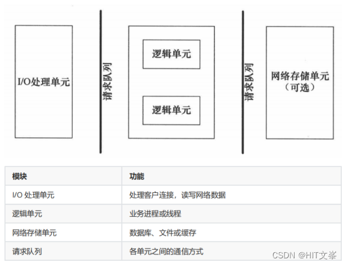

服务器基本框架：
主要由**I/O单元**、**逻辑单元**和**网络存储单元**组成，
其中每个单元之间通过请求队列进行通信，从而协同完成任务。
- I/O单元用于处理客户端连接，读写网络数据；
- 逻辑单元用于处理业务逻辑的线程；
- 网络存储单元指本地数据库和文件等。

项目基于Linux的轻量级多线程Web服务器，应用层实现了一个简单的HTTP服务器，利用多路I/O复用，可以同时监听多个请求，使用线程池处理请求，使用Reactor模式，使用状态机解析HTTP请求报文，实现异步日志系统。
