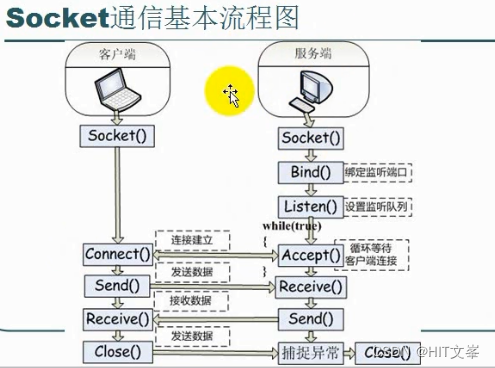

# 1、为什么使用线程池
为每个请求创建一个新线程的开销很大；为每个请求创建新线程的服务器在**创建和销毁**线程上花费的时间和**消耗的系统资源**要比花在处理实际的用户请求的时间和资源更多。
线程池是**为了避免创建和销毁线程所产生的开销，避免活动的线程消耗的系统资源；**
**提高响应速度，任务到达时，无需等待线程即可立即执行；**
提高线程的可管理性：线程的不合理分布导致资源调度失衡，降低系统的稳定性。使用线程池可以进行统一的分配、调优和监控。

# 2、怎么创建线程池（线程池运行逻辑）
该项目使用线程池（半同步半反应堆模式）并发处理用户请求，**主线程负责读写，工作线程（线程池中的线程）负责处理逻辑（HTTP请求报文的解析等）**。
具体的：主线程为异步线程，负责监听文件描述符，接收socket新连接，若当前监听的socket发生了读写事件，然后将任务插入到请求队列。工作线程从请求队列中取出任务，完成读写数据的处理。
线程池是空间换时间,浪费服务器的硬件资源,**换取运行效率**.
当服务器进入正式运行阶段,开始处理客户请求的时候,如果它需要相关的资源,可以直接从池中获取,无需动态分配
当服务器处理完一个客户连接后,可以把相关的资源放回池中,无需执行系统调用释放资源.

**线程池的实现还需要依靠 锁机制 以及 信号量 机制来实现线程同步，保证操作的原子性。**
信号量来标识请求队列中的请求数

# 3、线程的同步机制
（1）同步I/O
**同步I/O指内核向应用程序通知的是就绪事件，比如只通知有客户端连接，要求用户代码自行执行I/O操作**
a )**阻塞IO**:调用者调用了某个函数，等待这个函数返回，期间什么也不做，不停的去检查这个函数有没有返回，必须等这个函数返回才能进行下一步动作
b )**非阻塞IO**:非阻塞等待，每隔一段时间就去检测IO事件是否就绪。没有就绪就可以做其他事。非阻塞I/O执行系统调用总是立即返回，不管事件是否已经发生，若事件没有发生，则返回-1，此时可以根据errno区分这两种情况，对于accept，recv和send，事件未发生时，errno通常被设置成eagain
c )**信号驱动IO**: linux用套接口进行信号驱动IO，安装一个信号处理函数，进程继续运行并不阻塞，当IO时间就绪，进程收到SIGIO信号。然后处理IO事件。
d )**IO复用**: linux用select/poll函数实现IO复用模型，这两个函数也会使进程阻塞，但是和阻塞IO所不同的是这两个函数可以同时阻塞多个IO操作。而且可以同时对多个读操作、写操作的IO函数进行检测。直到有数据可读或可写时，才真正调用IO操作函数
多路IO复用是一种同步IO模型，，它可以实现一个线程可以同时监视多个文件描述符，一旦有某个文件描述符准备就绪，就会通知应用程序，对该文件描述符进行操作。在监视的各个文件描述符没有准备就绪的时候，应用程序线程就会阻塞，交出cpu，让cpu去执行其他的任务，以此提高cpu的利用率。

# 4、线程池中的工作线程是一直等待吗？
在run函数中，我们为了能够处理高并发的问题，将线程池中的工作线程都设置为阻塞等待在请求队列是否不为空的条件上，因此项目中线程池中的工作线程是处于**一直阻塞等待**的模式下的。

# 5、你的线程池工作线程处理完一个任务后的状态是什么？
（1） 当处理完任务后如果请求队列为空时，则这个线程重新回到阻塞等待的状态
（2） 当处理完任务后如果请求队列不为空时，那么这个线程将处于与其他线程竞争资源的状态，谁获得锁谁就获得了处理事件的资格。

# 6、如果同时1000个客户端进行访问请求，线程数不多，怎么能及时响应处理每一个呢？
本项目是通过**对子线程循环调用来解决高并发**的问题的。
首先在创建线程的同时就调用了pthread_detach将线程进行分离，不用单独对工作线程进行回收，资源自动回收。
让每一个线程池中的线程永远都不会停止，访问请求被封装到请求队列(list)中，如果没有任务线程就一直阻塞等待，有任务线程就抢占式进行处理，直到请求队列为空，表示任务全部处理完成。
# 7、如果一个客户请求需要占用线程很久的时间，会不会影响接下来的客户请求呢，有什么好的策略呢?
会，因为线程池内**线程的数量时有限**的，如果客户请求占用线程时间过久的话会影响到处理请求的**效率**，当请求处理过慢时会造成后续接受的请求只能在请求队列中等待被处理，从而影响接下来的客户请求。
应对策略：
我们可以为线程处理请求对象**设置处理超时时间**, 超过时间先发送信号告知线程处理超时，然后设定一个时间间隔再次检测，若此时这个请求还占用线程则直接将其断开连接。

# 8、什么是虚假唤醒？
举个例子，我们现在有一个生产者-消费者队列和三个线程。
1） 1号线程从队列中获取了一个元素，此时队列变为空。
2） 2号线程也想从队列中获取一个元素，但此时队列为空，2号线程便只能进入阻塞(cond.wait())，等待队列非空。
3） 这时，3号线程将一个元素入队，并调用cond.notify()唤醒条件变量。
4） 处于等待状态的2号线程接收到3号线程的唤醒信号，便准备解除阻塞状态，执行接下来的任务(获取队列中的元素)。
5） 然而可能出现这样的情况：当2号线程准备获得队列的锁，去获取队列中的元素时，此时1号线程刚好执行完之前的元素操作，返回再去请求队列中的元素，1号线程便获得队列的锁，检查到队列非空，就获取到了3号线程刚刚入队的元素，然后释放队列锁。
6） 等到2号线程获得队列锁，判断发现队列仍为空，1号线程“偷走了”这个元素，所以对于2号线程而言，这次唤醒就是“虚假”的，它需要再次等待队列非空。
# 9、介绍一下几种典型的锁？
线程池的实现还需要依靠**锁机制以及信号量**机制来**实现线程同步，保证操作的原子性**
（1）读写锁
 多个读者可以同时进行读
 写者必须互斥（只允许一个写者写，也不能读者写者同时进行）
 写者优先于读者（一旦有写者，则后续读者必须等待，唤醒时优先考虑写者）
（2）互斥锁
一次只能一个线程拥有互斥锁，其他线程只有等待
互斥锁是在抢锁失败的情况下主动放弃CPU进入睡眠状态直到锁的状态改变时再唤醒，而操作系统负责线程调度，为了实现锁的状态发生改变时唤醒阻塞的线程或者进程，需要把锁交给操作系统管理，所以互斥锁在加锁操作时涉及上下文的切换。
**（3）条件变量**
互斥锁一个明显的缺点是他只有两种状态：锁定和非锁定。而条件变量通过允许线程阻塞和等待另一个线程发送信号的方法弥补了互斥锁的不足，他常和互斥锁一起使用，以免出现竞态条件。当条件不满足时，线程往往解开相应的互斥锁并阻塞线程然后等待条件发生变化。一旦其他的某个线程改变了条件变量，他将通知相应的条件变量唤醒一个或多个正被此条件变量阻塞的线程。总的来说互斥锁是线程间互斥的机制，条件变量则是同步机制。
（4）自旋锁
如果进线程无法取得锁，进线程不会立刻放弃CPU时间片，而是一直循环尝试获取锁，直到获取为止。如果别的线程长时期占有锁，那么自旋就是在浪费CPU做无用功，但是自旋锁一般应用于加锁时间很短的场景，这个时候效率比较高。

# 11、detach和join有什么区别
（1）当调用join()，主线程等待子线程执行完之后，主线程才可以继续执行，此时主线程会释放掉执行完后的子线程资源。主线程等待子线程执行完，可能会造成性能损失。
（2）当调用detach()，主线程与子线程分离，他们成为了两个独立的线程**遵循cpu的时间片调度分配策略**。子线程执行完成后会自己释放掉资源。分离后的线程，主线程将对它没有控制权。
当你确定程序没有使用共享变量或引用之类的话，可以使用detch函数，分离线程。

# 13、线程池中有多少个线程，线程池数量如何设定
默认**8**个
调整线程池中的线程数量的最主要的目的是为了充分并合理地使用 CPU 和内存等资源，从而最大限度地提高程序的性能。
***N*cpu**表示 CPU的数量。
**如果是CPU密集型任务，就需要尽量压榨CPU，参考值可以设为*N*cpu+1**能够实现最优的CPU利用率，+1是保证当线程由于页缺失故障（操作系统）或其它原因 导致暂停时，额外的这个线程就能顶上去，保证CPU时钟周期不被浪费
**如果是IO密集型任务，参考值可以设置为 2 \**N*cpu。**因为线程间竞争的不是CPU的计算资源而是IO，IO的处理一般较慢，多于cores数的线程将为CPU争取更多的任务，不至在线程处理IO的过程造成CPU空闲导致资源浪费
最佳线程数量 = （（线程等待时间+线程CPU时间）／ 线程CPU时间）\* CPU个数。
由公式可得，线程等待时间所占比例越高，需要越多的线程，线程CPU时间所占比例越高，所需的线程数越少。
# 14、socket 通信的基本流程（客户端和服务端的通信协议）

简单描述一下Socket的通信流程：
（1）服务端这边首先创建一个Socket（Socket()），然后绑定IP地址和端口号（Bind()），之后注册监听（Listen()），这样服务端就可以监听指定的Socket地址了；
（2）客户端这边也创建一个Socket（Socket()）并打开，然后根据服务器IP地址和端口号向服务器Socket发送连接请求（Connect()）；
（3） 服务器Socket监听到客户端Socket发来的连接请求之后，被动打开，并调用Accept()函数接收请求，这样客户端和服务器之间的连接就建立好了；
（4）成功建立连接之后，客户端和服务器就可以进行数据交互（Receive()、Send()）；
（5）在数据交互完之后，各自关闭连接（Close()），交互结束
# 17、send函数在发送的数据长度大于发送缓冲区大小，或者大于发送缓冲区剩余大小时，socket会怎么反应
不管是windows还是linux，阻塞还是非阻塞，**send都会分帧发送，分帧到缓冲区能够接收的大小**

# 18、多线程中线程越多越好吗
不是
（1）假设现有8个CPU、8个线程，每个线程占用一个CPU，同一时间段内，若8个线程都运行往前跑，相比较5/6/7个线程，8个线程的效率高。
（2）但若此时有9个线程，只有8个CPU，9个线程同时运行，则此时牵扯到线程切换，而线程切换是需要消耗时间的。
（3）**所以随着线程数越多，效率越来越高，但到一个峰值，再增加线程数量时，就会出现问题。线程太多要来回的切换，最终可能线程切换所用时间比执行时间业务所用时间还大。**
（4） 随着线程数越多,由于线程执行的时序的问题，程序可能会崩溃或产生二义性。

